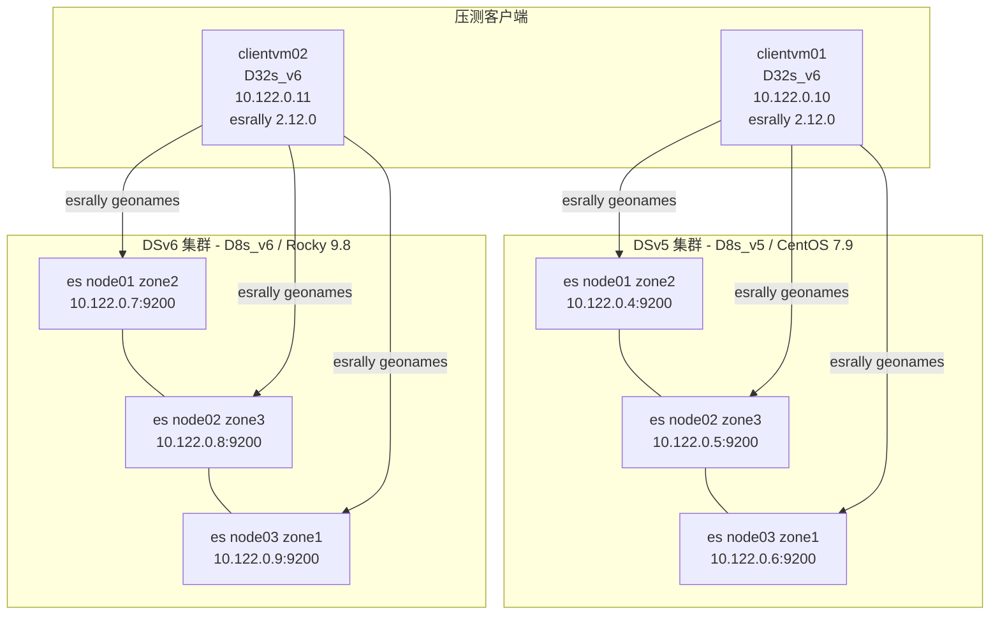
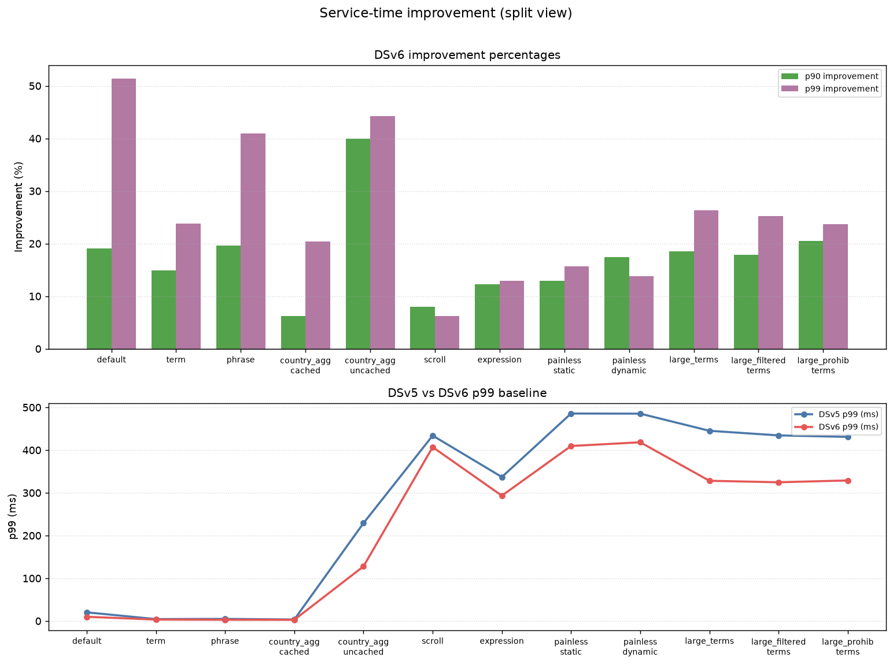
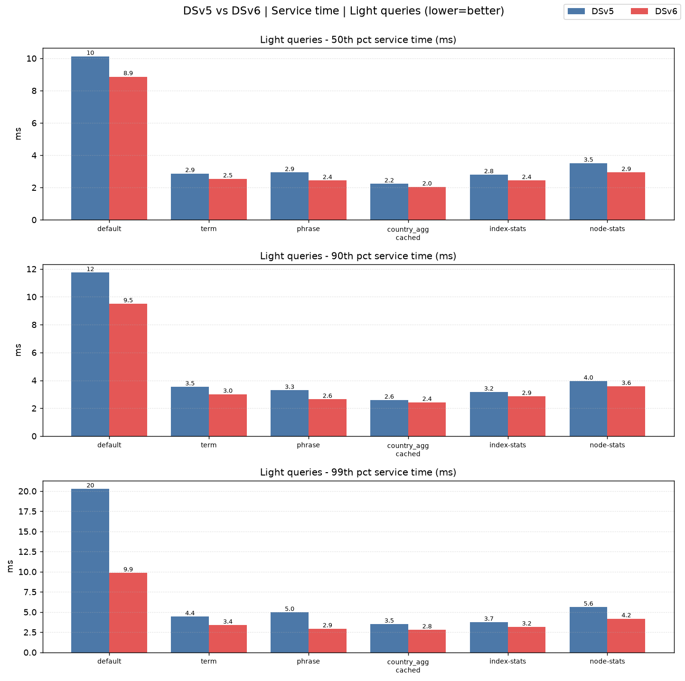
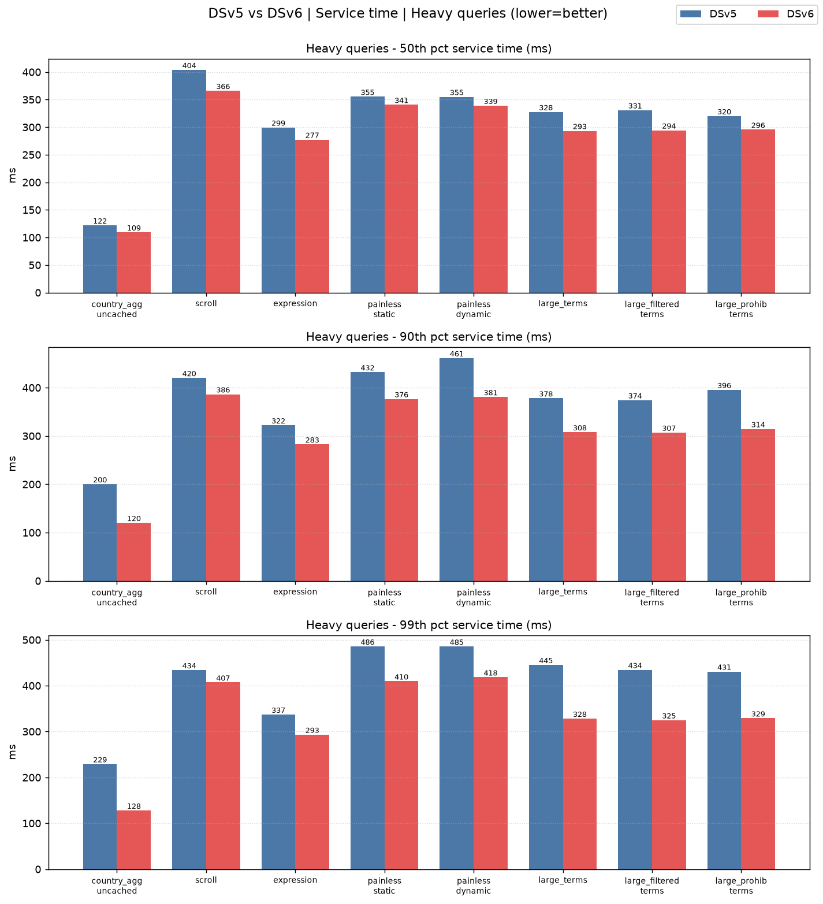
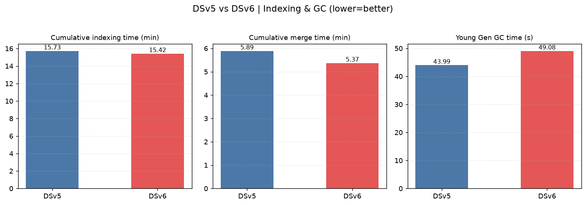
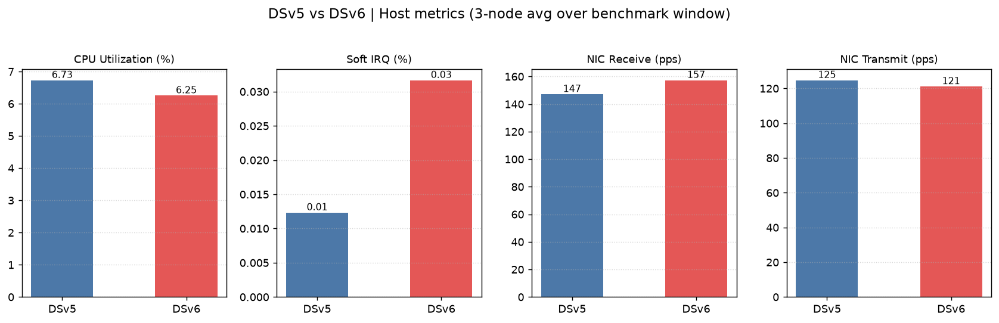
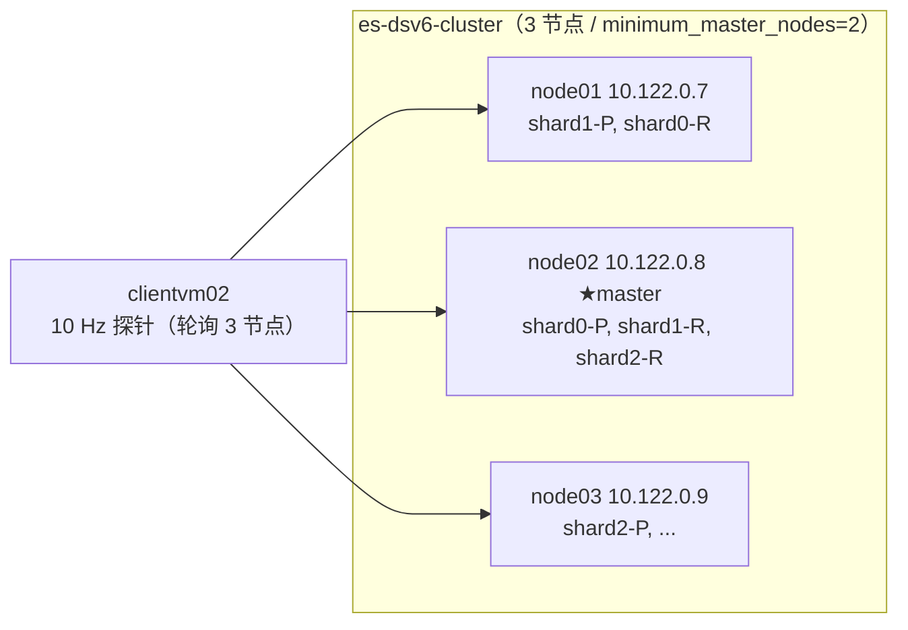
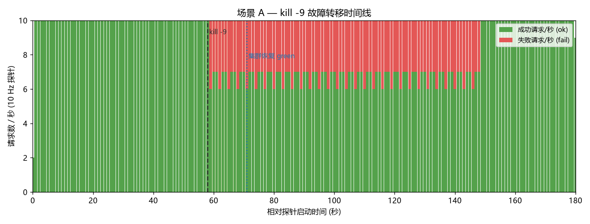
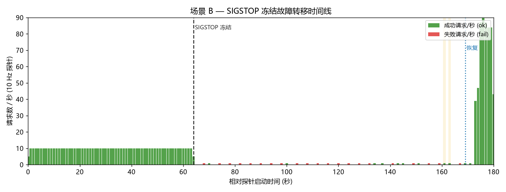
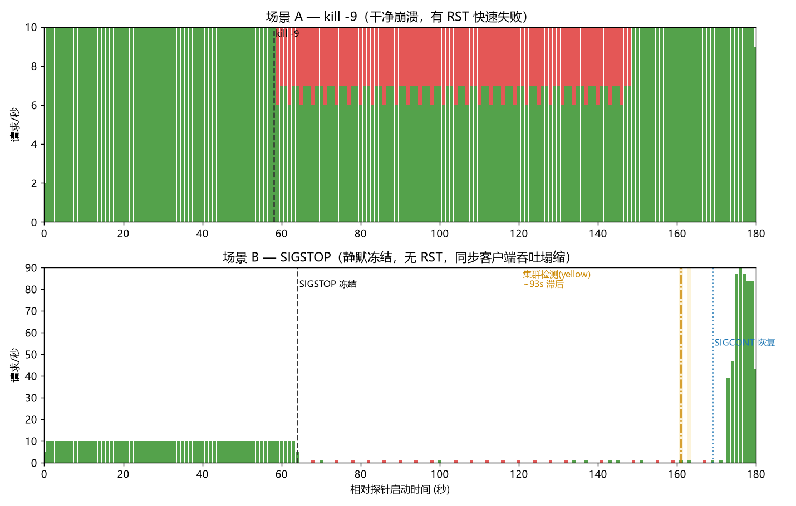

# Elasticsearch DSv5 与 DSv6 集群 esrally 压测对比报告

> 报告日期：2026-06-17  
> Elasticsearch 版本：6.8.1（两套集群版本一致）  
> 压测工具：esrally 2.12.0（track：geonames，challenge：append-no-conflicts）  
> 区域：Azure Germany West Central（germanywestcentral）

---

## 1. 测试环境说明

本次测试在 Azure 上部署了两套拓扑相同、主要变量为虚拟机系列的 Elasticsearch 集群，用于对比 **Dsv5（上一代）** 与 **Dsv6（新一代）** 计算实例在相同 esrally `geonames` 负载下的性能差异。两套集群使用各自独立的压测客户端，**完全并行**运行同一 track / challenge / 参数。

### 1.1 集群规格

| 项目 | DSv5 集群 | DSv6 集群 |
|---|---|---|
| 数据节点 VM 系列 | Standard_D8s_v5 | Standard_D8s_v6 |
| 单节点 vCPU / 内存 | 8 vCPU / 32 GB | 8 vCPU / 32 GB |
| 节点数量 | 3（master+data 合一） | 3（master+data 合一） |
| 压测客户端 | clientvm01（Standard_D32s_v6） | clientvm02（Standard_D32s_v6） |
| 操作系统 | CentOS 7.9 | Rocky Linux 9.8 |
| ES 版本 | 6.8.1 | 6.8.1 |
| JVM 堆 | 16 GB | 16 GB |
| 数据盘 | Premium SSD v2，200 GB / 3000 IOPS / 125 MB/s | Premium SSD v2，200 GB / 3000 IOPS / 125 MB/s |
| 数据盘设备 | `/dev/sdb` → `/esdata` | `/dev/nvme0n2` → `/esdata` |

> ⚠️ **变量说明**：两套集群的 ES 版本、堆大小、节点数、磁盘规格、track / challenge / 压测参数完全一致；但 **操作系统不同**（DSv5 = CentOS 7.9，DSv6 = Rocky Linux 9.8）。因此本对比的差异来源为 **VM 系列 + 操作系统/内核** 的组合，并非单纯 VM 代际。结论中已对此做出标注。

### 1.2 网络与拓扑参数

- VNet：`10.122.0.0/16`，子网 `vm-subnet 10.122.0.0/24`
- DSv5 集群节点私网 IP：`10.122.0.4 / 10.122.0.5 / 10.122.0.6`
- DSv6 集群节点私网 IP：`10.122.0.7 / 10.122.0.8 / 10.122.0.9`
- 压测客户端：clientvm01 = `10.122.0.10`，clientvm02 = `10.122.0.11`
- 可用区分布：node01 → zone2，node02 → zone3，node03 → zone1（两套集群一致）
- esrally 经 `--target-hosts` 直连 3 个节点做请求分发，无负载均衡器

### 1.3 压测参数

| 参数 | 取值 |
|---|---|
| track | geonames（约 1100 万文档地理名称数据集） |
| challenge | append-no-conflicts（先批量索引，再执行多类查询） |
| pipeline | benchmark-only（不由 rally 管理 ES 进程） |
| 索引阶段 | 批量写入，全速无节流（unthrottled） |
| 查询阶段 | 各查询任务按 track 预设**固定目标吞吐**节流（如 term=100 ops/s、default=50 ops/s 等） |
| 错误处理 | `--on-error=abort` |
| 执行方式 | 两套集群**并行**压测，互不干扰 |
| 单次时长 | DSv5 = 2247 s，DSv6 = 2223 s |

### 1.4 指标采集

- **esrally 指标**：每端以 `--report-format=csv` 输出完整结果（索引耗时、各查询任务吞吐与 p50/p90/p99/p100 延迟及服务时间、错误率、GC、段大小等）。
- **主机指标**：在 6 个 ES 节点各运行一个无依赖的 `/proc` 采样器（每 5 秒读取 `/proc/stat`、`/proc/net/dev`），覆盖整个压测窗口（每节点约 560 个样本 ≈ 47 分钟），按集群分组对 3 节点取均值。采样指标包括 CPU idle/利用率、软中断（softirq）占比、网卡 RX/TX PPS。

> 说明：geonames `append-no-conflicts` 的查询阶段为**固定目标吞吐**模型——各查询任务以预设速率发压，因此两套集群的查询**吞吐基本相同**，真正反映硬件差异的是**相同吞吐下的延迟 / 服务时间**（尤其尾延迟 p90/p99）。索引阶段为全速写入，反映在**累计索引耗时**上。

---

## 2. 部署架构

- 每套集群 3 个 master+data 合一节点，按可用区跨 zone1/2/3 打散
- 每个客户端经 `--target-hosts` 同时连接本集群 3 个节点，由 esrally 自身做请求分发
- 两端并行压测，各自独立的 race，互不影响

---

## 3. esrally 测试结果

> 服务时间降低% 均以 DSv5 为基线：降低% =（DSv5 − DSv6）/ DSv5 × 100。  
> 查询阶段为固定目标吞吐模型，故以**服务时间（service time）**反映硬件性能差异。

### 3.1 索引阶段（全速写入，越低越好）

| 指标 | DSv5 | DSv6 | 优劣 |
|---|---:|---:|---|
| 累计索引耗时（primary shards） | 15.726 min | 15.424 min | DSv6 -1.9% |
| 累计 merge 耗时 | 5.891 min | 5.373 min | DSv6 -8.8% |
| Young Gen GC 总耗时 | 43.99 s | 49.08 s | DSv5 略低 |
| Store size | 3.202 GB | 3.227 GB | 基本一致 |
| Segment count | 86 | 91 | 基本一致 |
| 索引错误率 | 0.00% | 0.00% | 一致 |

> **索引差异较小的原因（含磁盘瓶颈验证）**：为确认两端索引耗时仅相差约 2% 是否因数据盘写入打满,额外做了一次"纯索引"复测（仅 `index-append` 任务），并在 6 个节点开启 1 秒粒度的磁盘 I/O 采样（`/proc/diskstats`）。结论：**磁盘平均利用率很低，不是持续瓶颈**；索引主要受 **CPU + 单客户端 bulk 并发** 限制，因此 VM 代际差异被摊薄。

### 3.1.1 索引阶段磁盘 I/O 实测（纯索引复测，1s 采样）

> 复测仅运行 `index-append`：DSv5 耗时 115 s、DSv6 耗时 110 s（差异约 4%）。下表为各节点在索引窗口内的磁盘统计。数据盘均为 Premium SSD v2（标称 125 MB/s / 3000 IOPS）。

| 节点 | 平均 %util | 平均写 MB/s | 平均写 IOPS | 平均 CPU% | 峰值 %util | 峰值写 MB/s | 峰值 IOPS |
|---|---:|---:|---:|---:|---:|---:|---:|
| dsv5-node01 | 13.3 | 23.0 | 123 | 35.9 | 76.6 | 349.6 | 1032 |
| dsv5-node02 | 23.9 | 48.4 | 234 | 67.3 | 97.0 | 329.3 | 921 |
| dsv5-node03 | 26.6 | 46.0 | 233 | 68.5 | 99.3 | 416.0 | 1223 |
| dsv6-node01 | 21.7 | 49.6 | 464 | 73.9 | 100.6 | 326.4 | 1726 |
| dsv6-node02 | 10.8 | 25.0 | 240 | 29.3 | 51.5 | 250.6 | 1277 |
| dsv6-node03 | 23.4 | 51.2 | 480 | 69.2 | 101.4 | 372.5 | 2054 |

> 注：瞬时写 MB/s 可超过标称 125 MB/s（峰值 250–416 MB/s），源于 Premium SSD v2 突发能力 + 主机侧 page cache / 写合并。

**磁盘瓶颈判定：**

- **平均不是磁盘瓶颈**：索引窗口内磁盘平均 `%util` 仅 11%~27%、平均写 23~51 MB/s，大部分时间磁盘处于空闲等待；两端 `Cumulative indexing throttle time = 0`，ES 从未因磁盘背压触发写入节流。
- **仅存在秒级峰值打满**：merge / flush 集中爆发时 `%util` 短暂冲到 ~100%、写盘 250~416 MB/s，但仅占窗口很小一部分，不构成持续瓶颈。
- **真正的限制是 CPU + 客户端发压**：多个节点平均 CPU 已达 67%~74%（明显高于磁盘 util），说明文档解析 / 分析 / 索引构建的 CPU 开销才是主导因素。
- **结论**：索引耗时两端仅差约 2%~4%，**并非因数据盘写满限制了两端**，而是因为索引为 CPU 主导的轻量混合负载、两端硬件均未被持续压满，VM 代际优势自然不明显。两套集群磁盘规格与行为一致，磁盘不构成区分变量。

### 3.2 查询吞吐（Mean Throughput，ops/s）

> 各任务吞吐由 track 预设速率节流，两端基本一致,说明两端均稳定达成目标负载、无降速。

| 查询任务 | DSv5 | DSv6 |
|---|---:|---:|
| default | 49.91 | 49.89 |
| term | 99.94 | 99.97 |
| phrase | 109.87 | 109.93 |
| country_agg_cached | 99.19 | 99.28 |
| country_agg_uncached | 3.60 | 3.60 |
| scroll | 20.05 | 20.05 |
| expression | 2.00 | 2.00 |
| painless_static | 1.40 | 1.40 |
| painless_dynamic | 1.40 | 1.40 |
| large_terms | 1.10 | 1.10 |
| large_filtered_terms | 1.10 | 1.10 |
| large_prohibited_terms | 1.10 | 1.10 |

### 3.3 p50 服务时间（ms，越低越好）

| 查询任务 | DSv5 | DSv6 | 降低 |
|---|---:|---:|---:|
| default | 10.13 | 8.87 | **-12.4%** |
| term | 2.87 | 2.54 | **-11.5%** |
| phrase | 2.93 | 2.43 | **-16.9%** |
| country_agg_cached | 2.23 | 2.04 | **-8.6%** |
| country_agg_uncached | 122.02 | 109.36 | **-10.4%** |
| scroll | 403.86 | 365.82 | **-9.4%** |
| expression | 299.45 | 277.45 | **-7.3%** |
| painless_static | 355.22 | 340.62 | **-4.1%** |
| painless_dynamic | 355.01 | 338.79 | **-4.6%** |
| large_terms | 327.51 | 293.29 | **-10.4%** |
| large_filtered_terms | 330.74 | 294.17 | **-11.1%** |
| large_prohibited_terms | 320.03 | 295.52 | **-7.7%** |

### 3.4 p90 服务时间（ms，越低越好）

| 查询任务 | DSv5 | DSv6 | 降低 |
|---|---:|---:|---:|
| default | 11.74 | 9.50 | **-19.1%** |
| term | 3.54 | 3.01 | **-14.9%** |
| phrase | 3.29 | 2.65 | **-19.6%** |
| country_agg_cached | 2.59 | 2.43 | **-6.3%** |
| country_agg_uncached | 200.17 | 120.10 | **-40.0%** |
| scroll | 420.07 | 386.35 | **-8.0%** |
| expression | 322.23 | 282.73 | **-12.3%** |
| painless_static | 432.07 | 376.40 | **-12.9%** |
| painless_dynamic | 461.10 | 380.61 | **-17.5%** |
| large_terms | 378.04 | 307.78 | **-18.6%** |
| large_filtered_terms | 374.08 | 307.02 | **-17.9%** |
| large_prohibited_terms | 395.54 | 314.37 | **-20.5%** |

### 3.5 p99 服务时间（ms，越低越好）

| 查询任务 | DSv5 | DSv6 | 降低 |
|---|---:|---:|---:|
| default | 20.28 | 9.86 | **-51.4%** |
| term | 4.44 | 3.38 | **-23.8%** |
| phrase | 4.96 | 2.93 | **-41.0%** |
| country_agg_cached | 3.51 | 2.79 | **-20.4%** |
| country_agg_uncached | 229.08 | 127.84 | **-44.2%** |
| scroll | 434.00 | 407.05 | **-6.2%** |
| expression | 337.04 | 293.32 | **-13.0%** |
| painless_static | 485.63 | 409.62 | **-15.7%** |
| painless_dynamic | 485.35 | 418.35 | **-13.8%** |
| large_terms | 445.22 | 328.19 | **-26.3%** |
| large_filtered_terms | 434.47 | 324.73 | **-25.3%** |
| large_prohibited_terms | 430.87 | 328.98 | **-23.6%** |

### 3.6 结论小结

- **延迟全面降低：** 在完全相同的目标吞吐下，DSv6 在全部 12 个查询任务的 p50 / p90 / p99 服务时间均低于 DSv5。
- **尾延迟收益最大：** 改善幅度随分位升高而放大——p50 平均约 -9%、p90 平均约 -17%、**p99 平均约 -25%~30%**。其中 `default`（p99 -51.4%）、`country_agg_uncached`（p99 -44.2%）、`phrase`（p99 -41.0%）的尾延迟改善最为显著,说明 DSv6 在高负载抖动下的稳定性明显更好。
- **索引与 merge：** DSv6 的累计 merge 耗时降低约 8.8%、索引耗时略低约 1.9%，整体写入路径更快。
- **吞吐：** 查询为固定目标吞吐模型,两端吞吐一致且均无降速,错误率均为 0。

**图：轻量查询服务时间对比（p50/p90/p99）**

**图：重型查询服务时间对比（p50/p90/p99）**

**图：索引与 GC 对比**

---

## 4. 主机系统指标（压测窗口内均值）

下列数据为整个压测窗口内、各节点 `/proc` 采样的均值。`CPU idle`、`CPU 利用率`、`软中断(softirq)` 单位为 %（全核口径）；`RX/TX PPS` 为主网卡每秒收/发包数。

### 4.1 DSv5 集群（D8s_v5 / CentOS 7.9）

| 节点 | 可用区 | CPU idle% | CPU 利用% | softirq% | RX PPS | TX PPS | 峰值利用% | 样本数 |
|---|---|---:|---:|---:|---:|---:|---:|---:|
| node01 | zone2 | 95.61 | 4.39 | 0.009 | 136.9 | 117.2 | 53.92 | 567 |
| node02 | zone3 | 92.20 | 7.80 | 0.015 | 153.9 | 132.0 | 92.77 | 564 |
| node03 | zone1 | 92.00 | 8.00 | 0.013 | 150.6 | 125.0 | 93.01 | 562 |
| **3 节点均值** | — | **93.27** | **6.73** | **0.012** | **147.1** | **124.7** | **79.9** | — |

### 4.2 DSv6 集群（D8s_v6 / Rocky 9.8）

| 节点 | 可用区 | CPU idle% | CPU 利用% | softirq% | RX PPS | TX PPS | 峰值利用% | 样本数 |
|---|---|---:|---:|---:|---:|---:|---:|---:|
| node01 | zone2 | 91.94 | 8.06 | 0.033 | 157.5 | 117.7 | 97.26 | 561 |
| node02 | zone3 | 96.52 | 3.48 | 0.028 | 141.2 | 116.7 | 46.48 | 561 |
| node03 | zone1 | 92.78 | 7.22 | 0.034 | 173.2 | 129.1 | 85.90 | 559 |
| **3 节点均值** | — | **93.75** | **6.25** | **0.032** | **157.3** | **121.2** | **76.5** | — |

**图：主机系统指标对比（3 节点均值）**

### 4.3 系统指标解读

- **CPU：** 两套集群的平均 CPU 利用率均较低（约 6%~7%），idle 约 93%。这是因为 geonames 查询阶段为**固定目标吞吐**节流模型——发压速率受限,集群整体远未跑满；真正区分硬件的是**相同负载下的服务时间**（见第 3 节）。CPU 峰值出现在索引阶段（DSv5 峰值约 93%、DSv6 node01 峰值约 97%）。
- **软中断（softirq）：** DSv6 的 softirq 占比（约 0.032%）略高于 DSv5（约 0.012%）。两者绝对值都极低（远小于 1%）,差异主要源于不同内核（CentOS 7 的 3.10 内核 vs Rocky 9 的 5.14 内核）在中断统计与网络栈处理上的口径差异,**不构成瓶颈**。
- **网卡 PPS：** DSv6 的 RX PPS 略高（157 vs 147）,与其更快完成请求、单位时间处理更多包相符；两套集群的 PPS 均处于极低水平,远未触及网卡能力上限。
- **瓶颈定位：** 本负载下集群 CPU/网络均有大量余量,瓶颈不在主机资源而在**单请求处理延迟**。因此 DSv6 的收益主要体现为**相同吞吐下更低的服务时间与尾延迟**,而非更高的峰值吞吐。

---

## 5. 总体结论

1. 在 ES 版本、堆大小、节点数、磁盘规格、track / challenge / 压测参数完全一致的前提下,**DSv6 集群在全部 12 个查询任务的 p50 / p90 / p99 服务时间上均优于 DSv5**,且索引与 merge 耗时也更低。
2. **延迟改善随分位升高而放大**：p50 平均约 -9%、p90 平均约 -17%、**p99 平均约 -25%~30%**,尾延迟收益尤为突出（最高 `default` p99 降低 51.4%）。这表明 DSv6 在高负载抖动下的稳定性显著更好。
3. 由于 geonames 查询阶段为固定目标吞吐模型,两端吞吐一致；DSv6 的价值体现在**相同负载下更低、更稳定的响应时间**,而非峰值 QPS。
4. **变量提示**：本次两套环境的操作系统不同（DSv5 = CentOS 7.9 / 3.10 内核,DSv6 = Rocky 9.8 / 5.14 内核）,因此观测到的差异是 **VM 代际升级 + 新内核** 的综合结果。若需隔离纯 VM 代际贡献,建议后续在两端统一为相同 OS 后复测。
5. 综合来看,对延迟敏感的 Elasticsearch 检索负载,**推荐采用 DSv6 系列**(配合新一代 OS/内核),可在不增加资源的情况下获得明显的尾延迟改善。

---

## 6. 故障转移测试（DSv6 集群自动故障转移验证）

为验证当前 DSv6 部署架构在节点故障时的**自动故障转移能力**与**客户端连续性**,在已部署的 `es-dsv6-cluster`（10.122.0.7 / .8 / .9）上追加两组故障注入测试。两组场景模拟两类典型节点失效模式：**进程级干净崩溃（kill -9，有 RST 快速失败）** 与 **整机静默冻结（SIGSTOP，无 RST，模拟 VM 静默挂死）**。

### 6.1 测试环境

| 项目 | 值 |
|---|---|
| 集群 | `es-dsv6-cluster`，3 节点（dsv6esmasterdata01/02/03 = 10.122.0.7/8/9），均为 master+data |
| ES 版本 | 6.8.1（堆 16g） |
| 测试索引 | `failover-test`，**3 primary + 1 replica**（共 6 分片，均匀分布于 3 节点） |
| 关键配置 | `discovery.zen.minimum_master_nodes=2`（法定人数），`index.unassigned.node_left.delayed_timeout=12s` |
| 故障目标节点 | dsv6esmasterdata01（10.122.0.7，持有 shard1-主、shard0-副） |
| 当前 master | dsv6esmasterdata02（10.122.0.8）——目标节点非 master，本测试聚焦数据分片故障转移 |
| 客户端 | clientvm02（10.122.0.11），Python 探针，10 Hz 轮询写入 3 节点，单请求超时 2s |
| 探针指标 | 逐请求记录 成功/失败/延迟/HTTP 码 + 逐秒采样 集群状态/当前 master/分片数 |

> **探针设计**：探针以 10 Hz（每秒 10 次）轮询方式将写请求**均匀分发到 3 个节点**，模拟客户端连接池；单请求超时设为 2s，使得"无 RST 的冻结节点"会挂起到超时才失败,从而真实捕捉客户端中断窗口。`number_of_replicas=1` 是故障转移的前提——生产 `geonames` 索引为 0 副本,不具备故障转移能力,故本测试使用独立的副本化索引,且**全程不触碰生产数据与 DSv5 集群**。

### 6.2 故障转移机制说明

- **副本升主**：node01 失效后,其 shard1 主分片的副本（在其它节点）被 master 提升为主,集群转 yellow → 在存活节点重建缺失副本 → 恢复 green。
- **故障检测路径差异**：
  - kill -9 → 进程退出 → 内核对该节点端口返回 **RST/Connection refused**,集群 master 的节点 fault-detection 立即感知（~1s）。
  - SIGSTOP → 进程冻结但 TCP 端口仍在,连接**挂起无响应**（无 RST）,只能依赖 `discovery.zen.fd`（ping_interval≈1s × ping_timeout≈30s × ping_retries≈3）超时链路检测,**耗时数十秒**。

### 6.3 基线（无故障）

| 指标 | 值 |
|---|---|
| 稳态吞吐 | 10 请求/秒（探针固定速率，120 请求） |
| 成功率 | 100%（0 失败） |
| 写入延迟 p50 / avg / max | 12.9 / 15.6 / 43.3 ms |
| 集群状态 | green（master = dsv6esmasterdata02，active_shards=6） |

### 6.4 场景 A — kill -9（干净崩溃，有 RST 快速失败）

在 dsv6esmasterdata01 上对 ES 进程执行 `kill -9`。

**时间线**（相对探针启动 t=0，探针 11:09:35 启动）：

| 事件 | 时刻 | 相对故障 |
|---|---|---|
| 注入 kill -9 | 11:10:33.816（t≈58s） | 0 |
| 客户端首次失败（连发往故障节点） | 11:10:34.036 | +0.22s |
| 集群检测到节点离开，转 **yellow**（副本升主） | 11:10:34.852 | **+1.0s** |
| 集群重建副本完成,恢复 **green** | 11:10:46.852 | +13s（≈delayed_timeout 12s） |
| 故障节点 ES 重启,端口恢复可连 | 11:12:04 | 重启后 |
| 节点重新加入,3 节点 green、分片再均衡 | 11:12:47 后 | — |

**客户端表现**：

- 故障后,发往**两个存活节点（node02 / node03）的请求 100% 成功**：各 600 请求、**0 失败**,延迟 p50=11.7ms（与基线 12.9ms 持平,无抖动）。
- 仅发往被杀节点 10.122.0.7 的请求失败,共 **300 次**,**全部为瞬时 `Connection refused`（RST 快速失败,无挂起）**。
- 总计 1801 请求 / 300 失败（16.7%），失败 100% 集中在故障节点；对**剔除坏节点的拓扑感知客户端,实际可用性中断 ≈ 1 秒**（副本升主时间）。
- **数据零丢失**（active_shards 在升主后恢复为 6,所有分片可用）。

> 结论：干净崩溃下,集群 ~1 秒完成副本升主,2/3 流量全程无影响,1/3 流量瞬时快速失败并可由客户端立即重试到健康节点。**架构支持自动故障转移,客户端可正常连接。**

### 6.5 场景 B — SIGSTOP（静默冻结 / 无 RST，模拟整机静默挂死）

在 dsv6esmasterdata01 上对 ES 进程执行 `kill -STOP`（冻结）,模拟 VM 整机静默无响应、不返回 RST 的"灰色故障"。约 105s 后 `kill -CONT` 解冻。

**时间线**（探针 11:17:20 启动）：

| 事件 | 时刻 | 相对故障 |
|---|---|---|
| 注入 SIGSTOP 冻结 | 11:18:24.490（t≈64s） | 0 |
| 客户端首次失败（2004ms 超时） | 11:18:28.511 | +4s |
| 集群检测到节点失联,转 **yellow**（副本升主） | 11:19:57.242 | **+93s** |
| 集群恢复 **green**（重建副本） | 11:20:09.354 | +105s |
| SIGCONT 解冻,节点恢复运行 | 11:20:09.897 | +105s |
| 吞吐回填恢复正常 | 11:20:13 起 | — |

**客户端表现**：

- 冻结后,客户端表现为 **2004ms 超时**（=客户端 2s 超时上限）而非瞬时拒绝；失败请求 **21 次,分散在全部 3 个节点**（node01:10、node02:5、node03:6）——因为冻结节点持有副本分片,任何协调节点转发到该冻结副本都会挂起到超时。
- **同步客户端吞吐塌缩**：冻结期间探针吞吐从 10 请求/秒 跌至 <1 请求/秒（每次命中冻结节点即阻塞 2s）,持续约 **93 秒**（直到集群检测并剔除该节点）。
- 集群在 11:19:57 才转 yellow（**检测滞后约 93 秒**,符合 zen fault-detection 超时×重试链路）,随后 12s 内恢复 green。
- 解冻后出现**吞吐回填尖峰**（恢复瞬间 39→90 请求/秒,积压清空）。
- **数据零丢失**。

> 结论：静默冻结下集群最终仍能自动故障转移、零数据丢失,但**故障检测耗时长达约 93 秒**,期间未剔除坏节点导致同步客户端吞吐严重退化——这是"无 RST 灰色故障"的固有风险。

**补充说明（为何约 93 秒后才转 yellow）**：

核心机制是 ES6 的 Zen FD（fault detection）：

- `ping_interval` 约 1s
- `ping_timeout` 默认约 30s
- `ping_retries` 默认约 3 次

在 SIGSTOP 场景下,进程被冻结但端口不一定立即返回 RST,连接更常见的是挂起直到超时,集群只能依赖 FD 超时链路确认节点失联。检测时间可近似估算为：

`T_detect ≈ ping_timeout × ping_retries + 调度/网络开销 ≈ 30 × 3 + 几秒 ≈ 93s`

这与本次观测（11:18:24 冻结，11:19:57 转 yellow）一致。

另外,`index.unassigned.node_left.delayed_timeout=12s` 只影响**节点已被判定离开后**副本何时开始重建（yellow 到 green 的阶段），不影响**何时转 yellow**。因此 93 秒主要由 Zen FD 检测窗口决定，而不是 delayed timeout 决定。

若业务不能接受该检测时长,可在网络稳定前提下调优 `discovery.zen.fd.ping_timeout` 与 `ping_retries`（例如 `10s` / `2`）以缩短静默故障检测窗口,但需权衡误判风险。

### 6.6 两场景对比

| 维度 | 场景 A（kill -9，有 RST） | 场景 B（SIGSTOP，无 RST） |
|---|---|---|
| 故障类型 | 进程干净崩溃 | 整机静默冻结（灰色故障） |
| 客户端首次失败延后 | +0.2s | +4s |
| **集群检测 + 副本升主（转 yellow）** | **~1 秒** | **~93 秒** |
| 集群恢复 green | +13s | +105s |
| 故障期失败请求数 | 300（全在故障节点） | 21（分散在 3 节点） |
| 失败模式 | 瞬时 Connection refused（RST） | 2004ms 超时（挂起） |
| 存活节点流量影响 | 无（2/3 流量 0 失败,延迟不变） | 同步客户端吞吐塌缩至 <1 req/s |
| 数据丢失 | 0 | 0 |
| 主导因素 | 内核 RST → 秒级检测 | zen fault-detection 超时链路（数十秒） |

### 6.7 关键发现与风险

1. **架构具备自动故障转移能力且零数据丢失**：在 1 副本配置下,两种故障模式集群均能自动完成副本升主并恢复 green,无需人工干预,无数据丢失。
2. **检测速度高度依赖故障是否产生 RST**：干净崩溃 ~1s 检测；静默冻结需 ~93s（默认 zen fault-detection 超时链路）。**灰色故障是可用性的主要风险点。**
3. **故障转移能力以副本为前提**：本测试的 `failover-test` 索引为 1 副本,故可自动升主；若某索引设置为 0 副本,则任一持有其主分片的节点失效将导致集群 RED 且该索引数据不可用,无法故障转移。**因此对可用性有要求的索引必须保证至少 1 副本。**
4. **同步客户端在无 RST 故障下吞吐塌缩**：未设合理超时/熔断的同步客户端,在冻结节点未被剔除的窗口内会被 2s 超时反复阻塞。

### 6.8 优化建议

- **ES 侧**：
  - 为可用性敏感的索引设置 `number_of_replicas >= 1`,确保具备副本升主的故障转移能力。
  - 缩短灰色故障检测窗口,调优 `discovery.zen.fd.ping_timeout`（如 10s）与 `ping_retries`,在网络抖动容忍与快速检测间取平衡。
- **客户端侧**：
  - 使用拓扑感知/嗅探客户端,故障后自动剔除坏节点并重路由（场景 A 可将中断压缩到 ~1s）。
  - 设置合理的连接/请求超时 + 熔断 + 重试到其它节点,避免单一冻结节点拖垮整体吞吐。
- **部署侧**：
  - 3 节点跨 3 AZ + `minimum_master_nodes=2` 的当前布局可正确容忍单节点/单 AZ 故障,建议保持。
  - 增加节点级存活探测（如 VM 健康探针 / 外部健康检查）以更快发现静默挂死的整机。

### 6.9 证据与可复现

- 探针脚本：`scripts/fo-probe.py`（10 Hz 轮询写入 + 逐秒集群状态采样）
- 编排脚本：`scripts/fo-create-index.sh`、`fo-start-A2.sh`、`fo-kill-A.sh`、`fo-restart-A2.sh`、`fo-start-B.sh`、`fo-stop-B.sh`、`fo-cont-B.sh`、`fo-collect-A.sh`、`fo-collect-B.sh`、`fo-aggregate.sh`
- 逐秒时间线数据：`report/data/failover_scenarioA.csv`、`report/data/failover_scenarioB.csv`
- 图表生成：`report/make_failover_charts.py`（输出 `images/failover_A.png`、`failover_B.png`、`failover_compare.png`）

---

## 附录：原始数据来源

- esrally 结果 CSV：`/tmp/rally-es-dsv5.csv`、`/tmp/rally-es-dsv6.csv`（客户端本地），本地副本见 `report/data/rally-dsv5.csv`、`report/data/rally-dsv6.csv`
- 主机指标采样器：`scripts/hostmetrics-sampler.sh`（每节点 `/tmp/hostmetrics.csv`），聚合结果见 `report/data/host-agg.txt`
- 磁盘 I/O 采样器（索引验证）：`scripts/diskmetrics-sampler.sh`（每节点 `/tmp/diskmetrics.csv`），聚合结果见 `report/data/disk-agg.txt`
- 纯索引复测脚本：`scripts/index-only-rally.sh`（仅 `index-append` 任务）
- 汇总 JSON：`report/data/summary.json`
- 解析脚本：`report/parse_results.py`、`report/compare.py`
- 图表生成脚本：`report/make_charts.py`（输出至 `report/images/`）
- 压测 / 采集脚本：`scripts/full-rally.sh`、`scripts/smoke-rally.sh`、`scripts/aggregate-host.sh`
