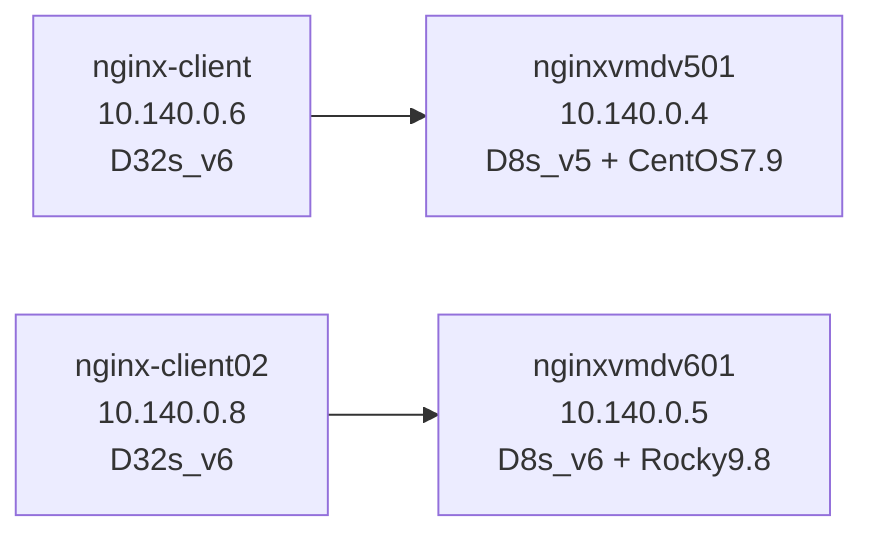

# Nginx 基准测试报告：DSv5 (CentOS 7.9) vs DSv6 (Rocky 9.8)

- 测试日期：2026-06-30
- 报告版本：v1.0
- 压测工具：wrk2（constant throughput，CO-corrected latency）
- 指标采集：自定义 `/proc` 采样器（5s 间隔，380 样本窗口）
- Azure 区域：germanywestcentral
- 资源组：nginx-rg

> 说明：报告文件名按你的指定为 `nginx-dsv6-vs-dsv6-report.md`，但本次实际对比对象为 DSv5 vs DSv6。

---

## 1. 测试环境说明

### 1.1 规格对比

| 维度 | DSv5 环境 (env1) | DSv6 环境 (env2) |
|---|---|---|
| 服务端 VM | nginxvmdv501 | nginxvmdv601 |
| VM 规格 | Standard_D8s_v5 | Standard_D8s_v6 |
| vCPU / 内存 | 8 / 32 GB | 8 / 32 GB |
| 可用区 | Zone 1 | Zone 1 |
| 服务端私网 IP | 10.140.0.4 | 10.140.0.5 |
| OS | CentOS 7.9 (kernel 3.10) | Rocky Linux 9.8 (kernel 5.14) |
| Nginx 版本 | 1.22.1（源码编译） | 1.22.1（源码编译） |
| worker 进程 | 8 | 8 |
| 客户端 VM | nginx-client (D32s_v6) | nginx-client02 (D32s_v6) |
| 客户端规格 | 32 vCPU / 128 GB | 32 vCPU / 128 GB |
| 客户端 OS | Rocky Linux 9.8 | Rocky Linux 9.6 |
| 客户端私网 IP | 10.140.0.6 | 10.140.0.8 |
| 客户端压测角色 | 对 10.140.0.4 发压（DSv5） | 对 10.140.0.5 发压（DSv6） |

⚠️ 变量说明：本次对比存在 VM 代际与 OS 双变量（DSv5+CentOS 7.9 vs DSv6+Rocky 9.8），其余参数尽量保持一致。

### 1.2 网络与拓扑

- VNet 内部压测，客户端与服务端同 Region、同 VNet。
- 客户端：10.140.0.6（env1）、10.140.0.8（env2）
- 服务端：10.140.0.4（DSv5）、10.140.0.5（DSv6）

### 1.3 压测参数

| 参数 | 配置 |
|---|---|
| 目标路径 | `/` |
| 线程数 | 8 |
| 单次时长 | 15s |
| 每次冷却 | 60s |
| 连接数 | 50 / 100 / 200 |
| 场景 | long(keepalive) / short(Connection: close) |
| Phase1 | `-R 1000000` 探测 Rmax |
| Phase2 | `0.7/0.9/0.99 * Rmax`，输出 p50/p90/p99/p99.9/p99.99 |

### 1.4 指标采集口径

- 服务器侧采集窗口：380 样本 × 5s（约 31.6 分钟）
- 关键指标：
  - CPU busy%、max core busy%、load1
  - RX/TX Mbps、RX/TX pps
  - TCP retrans/s、listen overflow/drop/s
- 聚合口径：
  - active_avg：仅统计 CPU busy>=3% 的 active 样本
  - peak：全样本峰值

---

## 2. 部署架构

---

## 3. 测试结果

### 3.1 最大吞吐（Rmax）对比

| 场景 | 连接数 | DSv5 Rmax(req/s) | DSv6 Rmax(req/s) | 提升%（(v6-v5)/v5） |
|---|---:|---:|---:|---:|
| long | 50 | 133,318.30 | 424,609.31 | 218.41% |
| long | 100 | 240,229.82 | 526,274.68 | 119.07% |
| long | 200 | 314,615.99 | 549,660.40 | 74.70% |
| short | 50 | 15,765.54 | 22,772.91 | 44.45% |
| short | 100 | 19,895.91 | 30,510.77 | 53.35% |
| short | 200 | 21,703.10 | 37,549.19 | 72.99% |

结论：DSv6 在 6/6 组合上均显著提升最大吞吐，平均提升约 97.2%。

### 3.2 0.9×Rmax 负载下吞吐（achieved_rps）对比

| 场景 | 连接数 | DSv5 achieved_rps | DSv6 achieved_rps | 提升% |
|---|---:|---:|---:|---:|
| long | 50 | 119,133.84 | 381,707.40 | 220.40% |
| long | 100 | 215,122.73 | 472,706.53 | 119.73% |
| long | 200 | 282,003.16 | 492,688.60 | 74.71% |
| short | 50 | 14,164.69 | 20,397.23 | 44.00% |
| short | 100 | 17,858.57 | 27,362.16 | 53.22% |
| short | 200 | 18,666.59 | 33,361.75 | 78.73% |

### 3.3 p50 延迟对比（0.9×Rmax）

| 场景 | 连接数 | DSv5 p50(ms) | DSv6 p50(ms) | 降低%（(v5-v6)/v5） |
|---|---:|---:|---:|---:|
| long | 50 | 49.41 | 0.536 | 98.92% |
| long | 100 | 6.01 | 0.664 | 88.95% |
| long | 200 | 0.93 | 0.832 | 10.54% |
| short | 50 | 16.61 | 25.47 | -53.34% |
| short | 100 | 8.03 | 14.41 | -79.45% |
| short | 200 | 355.84 | 1.77 | 99.50% |

### 3.4 p90 延迟对比（0.9×Rmax）

| 场景 | 连接数 | DSv5 p90(ms) | DSv6 p90(ms) | 降低%（(v5-v6)/v5） |
|---|---:|---:|---:|---:|
| long | 50 | 334.08 | 5.07 | 98.48% |
| long | 100 | 147.71 | 11.93 | 91.92% |
| long | 200 | 1.65 | 4.16 | -152.12% |
| short | 50 | 73.92 | 113.41 | -53.42% |
| short | 100 | 44.29 | 68.29 | -54.19% |
| short | 200 | 1890.00 | 34.01 | 98.20% |

### 3.5 p99 延迟对比（0.9×Rmax）

| 场景 | 连接数 | DSv5 p99(ms) | DSv6 p99(ms) | 降低%（(v5-v6)/v5） |
|---|---:|---:|---:|---:|
| long | 50 | 558.08 | 26.24 | 95.30% |
| long | 100 | 602.11 | 91.97 | 84.72% |
| long | 200 | 9.68 | 64.61 | -567.46% |
| short | 50 | 126.97 | 198.91 | -56.66% |
| short | 100 | 122.75 | 147.20 | -19.92% |
| short | 200 | 3440.00 | 60.99 | 98.23% |

### 3.6 结果小结

1. 吞吐：DSv6 在所有场景均显著优于 DSv5（44%~218%）。
2. 延迟：
   - 在 long-50/100、short-200 组合，DSv6 p50/p90/p99 明显更低。
   - 在 long-200 和 short-50/100 的 0.9×Rmax 点，DSv6 延迟存在劣化，说明高并发 close 模式下调度/协议栈行为与负载点选择对尾延迟非常敏感。
3. 建议：面向线上配置时，应避免单看 Rmax；应按业务 SLO 选取可接受延迟的运行点（建议 0.7~0.9×Rmax 之间进一步细化扫描）。

---

## 4. 主机系统指标

### 4.1 DSv5 服务端聚合（nginxvmdv501）

| 指标 | active_avg | peak |
|---|---:|---:|
| cpu_busy_pct | 30.6 | 83.3 |
| max_core_busy_pct | 34.9 | 88.9 |
| load1 | 0.70 | 2.90 |
| rx_mbps | 23.0 | 69.8 |
| tx_mbps | 63.1 | 220.1 |
| rx_pps | 275,346 | 772,085 |
| tx_pps | 269,816 | 771,803 |
| retrans_ps | 2.29 | 35.00 |
| listen_ovf_ps | 0.00 | 0.00 |
| listen_drop_ps | 0.00 | 0.00 |

样本：total=380, active=77

### 4.2 DSv6 服务端聚合（nginxvmdv601）

| 指标 | active_avg | peak |
|---|---:|---:|
| cpu_busy_pct | 36.2 | 98.3 |
| max_core_busy_pct | 43.5 | 100.0 |
| load1 | 0.83 | 2.30 |
| rx_mbps | 45.4 | 123.0 |
| tx_mbps | 92.3 | 270.2 |
| rx_pps | 532,583 | 1,359,551 |
| tx_pps | 530,664 | 1,359,267 |
| retrans_ps | 0.28 | 4.00 |
| listen_ovf_ps | 0.00 | 0.00 |
| listen_drop_ps | 0.00 | 0.00 |

样本：total=380, active=79

### 4.3 指标解读

1. DSv6 吞吐提升对应更高的 NIC PPS 与带宽利用（约 2x 级别），与业务结果一致。
2. DSv6 在更高负载下 retrans_ps 反而更低，说明网络栈稳定性更好。
3. 两端 listen overflow/drop 均为 0，未出现 backlog 溢出瓶颈。

---

## 5. 总体结论

1. 在本次 nginx/wrk2 基准中，DSv6 相比 DSv5 吞吐能力显著提升（全组合正向，平均约 +97%）。
2. 延迟收益不完全单调：多数组合显著改善，但在特定高并发 close/高负载点存在劣化，需要按业务 SLO 选定运行区间。
3. 若目标是“更高吞吐 + 可控尾延迟”，建议优先采用 DSv6，并在目标连接数下做更细粒度 `RATE_FRACS`（如 0.75/0.80/0.85/0.90）标定生产阈值。

---

## 6. 故障转移测试

本轮为单机 nginx 性能基准（非集群故障转移场景），该章节不适用（N/A）。

---

## 附录：原始数据来源

- 编排日志：
  - `C:\Users\leizha\nginx-bench\test-results\orchestrator.log`
  - `C:\Users\leizha\nginx-bench\test-results\orchestrator-env2.log`
- 客户端原始结果（含 `RMAX`/`RESULT`）：
  - `C:\Users\leizha\nginx-bench\test-results\client-env1-v5.json`
  - `C:\Users\leizha\nginx-bench\test-results\client-env2-v6.json`
- 服务器指标聚合（`AGG`）：
  - `C:\Users\leizha\nginx-bench\test-results\metrics-srv-env1-v5.json`
  - `C:\Users\leizha\nginx-bench\test-results\metrics-srv-env2-v6.json`
- 脚本：
  - `C:\Users\leizha\nginx-bench\run-tests.ps1`
  - `C:\Users\leizha\nginx-bench\run-env2.ps1`
  - `C:\Users\leizha\nginx-bench\wrk-runner.sh`
  - `C:\Users\leizha\nginx-bench\metrics-collector.sh`
