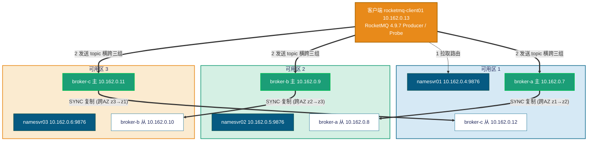

# RocketMQ 4.9.7（主从异步刷盘 · **主从跨可用区**）性能与故障转移测试 —— 实测报告

> 本报告为 **真实执行** 结果。测试在 Azure 资源组 `rocketmqnew2-rg`（germanywestcentral）中一套真实部署的
> **RocketMQ 4.9.7 经典主从（Master-Slave）集群** 上进行：3 个 broker 组（broker-a / broker-b / broker-c），
> 每组 1 主 1 从（SYNC_MASTER + SLAVE，`brokerId=0/1`），**每组的主、从分处不同可用区（跨 AZ）**；3 台独立 NameServer 分处 3 个可用区。
> 用 RocketMQ 官方 benchmark `Producer` 做 **性能压测**，再用官方 `rocketmq-client` 编写的并发 Producer/Consumer 探针做
> **故障注入 + 逐秒指标采集 + 全量去重核对（RPO）**。

---

## 0. 跨可用区（跨 AZ）架构要点

本集群的拓扑核心特征是 **每组主从跨可用区部署**，这从根本上决定了「可用区故障」的后果：

| 维度 | 本集群（主从**跨 AZ**） |
| --- | --- |
| 每组主从位置 | 主、从在**不同** AZ |
| 停某个 AZ 的后果 | 任一 AZ 故障**最多只打掉某组的主或从其一**，**没有任何一组同时失去主和从** |
| 断电 RPO | 故障组的**另一副本在存活 AZ**，持有全部 SYNC 已 ack 消息 → **RPO=0** |
| 高可用本质 | 组间转移（靠 topic 跨多组） **+ 每组自身主从跨 AZ 容灾** |

> 因此本集群的「停 AZ1」语义是：打掉 z1 上的 **broker-a 主(.7)** 和 **broker-c 从(.12)**。
> 此时 broker-a 仍有从(.8, z2) 存活、broker-c 仍有主(.11, z3) 存活、broker-b 完整 —— 集群整体写入能力仅短时受影响，且 **不存在主从同灭的数据丢失场景**。

---

## 1. 测试环境（实测）

| 项 | 值 |
| --- | --- |
| RocketMQ | 4.9.7（经典主从，非 DLedger） |
| 集群名 | RocketMQCluster |
| 拓扑 | 3 组 × 2 副本 = 6 个 broker（主 `brokerId=0` / 从 `brokerId=1`），**每组主从跨 AZ**；3 台 NameServer |
| 复制/刷盘 | `brokerRole=SYNC_MASTER`、`flushDiskType=ASYNC_FLUSH` |
| 存储 | `/datadisk/rocketmq/store`（commitlog / consumequeue / index），Premium SSD v2，UUID 挂载 + nofail |
| 端口 | broker `listenPort=10911`、HA `10912`；NameServer `9876` |
| Broker JVM | `-Xms8g -Xmx8g -Xmn4g`（Standard_D4s_v6，16GB 内存机型） |
| 托管 | systemd：`rocketmq-broker.service`、`rocketmq-namesrv.service`，OS Rocky Linux 9 |
| 客户端 | `rocketmq-client01`（Standard_D4s_v6，JDK 11），RocketMQ 4.9.7 装于 `/opt/rocketmq-4.9.7` |
| NameServer 连接串 | `10.162.0.4:9876;10.162.0.5:9876;10.162.0.6:9876` |
| 性能压测 | 官方 benchmark `org.apache.rocketmq.example.benchmark.Producer`，消息体 1KB，topic `BenchTopic_1K`（8r8w） |
| 故障探针 | 官方 `rocketmq-client` 自研 `Probe`（produce/verify），topic `ft_topic`（8r8w，横跨 a/b/c 三组） |

### 1.1 节点与可用区布局（实测）

| broker 组 | 主（brokerId=0） | 可用区 | 从（brokerId=1） | 可用区 |
| --- | --- | --- | --- | --- |
| **broker-a** | 10.162.0.7 | **zone 1** | 10.162.0.8 | **zone 2** |
| **broker-b** | 10.162.0.9 | **zone 2** | 10.162.0.10 | **zone 3** |
| **broker-c** | 10.162.0.11 | **zone 3** | 10.162.0.12 | **zone 1** |

| NameServer | 地址 | 可用区 |
| --- | --- | --- |
| namesvr01 | 10.162.0.4:9876 | zone 1 |
| namesvr02 | 10.162.0.5:9876 | zone 2 |
| namesvr03 | 10.162.0.6:9876 | zone 3 |

客户端 `rocketmq-client01` = 10.162.0.13（zone 1）。

**各可用区内的节点构成（关键）：**

| 可用区 | 该区节点 |
| --- | --- |
| **zone 1** | namesvr01、**broker-a 主(.7)**、**broker-c 从(.12)**、client01 |
| **zone 2** | namesvr02、**broker-a 从(.8)**、**broker-b 主(.9)** |
| **zone 3** | namesvr03、**broker-b 从(.10)**、**broker-c 主(.11)** |

**部署架构图：**



> 要点：每组主从**跨 AZ**，故「停可用区 1」只会打掉 **broker-a 的主** 与 **broker-c 的从**，
> broker-a 的从(.8) 在 z2 存活、broker-c 的主(.11) 在 z3 存活。`SYNC_MASTER` 保证每条已 ack 消息都已同步到本组从节点（位于另一 AZ），
> 这是本集群在 **断电 RPO** 上的根本保障。

---

## 2. 健康检查（测试前置，实测）

测试前在 broker 节点上通过 `mqadmin clusterList` 确认集群状态，6 个 broker 全部在线、版本一致（V4_9_7）：

```text
#Cluster Name     #Broker Name   #BID  #Addr                #Version   #InTPS  #OutTPS
RocketMQCluster   broker-a       0     10.162.0.7:10911     V4_9_7     0.00    0.00
RocketMQCluster   broker-a       1     10.162.0.8:10911     V4_9_7     0.00    0.00
RocketMQCluster   broker-b       0     10.162.0.9:10911     V4_9_7     0.00    0.00
RocketMQCluster   broker-b       1     10.162.0.10:10911    V4_9_7     0.00    0.00
RocketMQCluster   broker-c       0     10.162.0.11:10911    V4_9_7     0.00    0.00
RocketMQCluster   broker-c       1     10.162.0.12:10911    V4_9_7     0.00    0.00
```

判定结果：

| 检查项 | 期望 | 实测 | 结论 |
| --- | --- | --- | --- |
| broker 注册数 | 6（3 主 + 3 从） | 6 全部在线 | ✅ |
| 版本一致性 | 全部 V4_9_7 | 全部 V4_9_7 | ✅ |
| 每组主从分处不同 AZ | a/b/c 各跨 2 个 AZ | 见 1.1 布局表 | ✅ |
| NameServer | 3 台分处 z1/z2/z3 全部可达 | 3 台均可拉取路由 | ✅ |
| 关键配置 | `SYNC_MASTER` / `ASYNC_FLUSH` / `storePathRootDir=/datadisk/rocketmq/store` | 6 个 broker.conf 全部一致 | ✅ |
| 故障演练 topic | `ft_topic`（8r8w）横跨 a/b/c | 路由含 broker-a/b/c 三组 | ✅ |
| 性能压测 topic | `BenchTopic_1K`（8r8w）横跨 a/b/c | 已创建并跨三组 | ✅ |

集群健康，满足开始性能压测与故障注入的前置条件。

---

## 3. 性能测试

### 3.1 方法

使用 RocketMQ 官方 benchmark Producer 向 `BenchTopic_1K`（8 读 8 写，横跨 a/b/c 三组）发送 **1KB** 消息，
NameServer 为三节点串。每轮 benchmark 每 10 秒打印一次 `Send TPS / Max RT / Average RT / Send Failed`，取稳定段聚合。
压测在 `rocketmq-client01`（JDK 11）上以 detached 方式运行，分两部分：

- **主测**：64 线程 × 300 秒（取稳态 TPS、平均/最大 RT、失败数）。
- **线程扫描**：16 / 32 / 64 / 128 线程各 120 秒，观察吞吐随并发的扩展性。

> 压测窗口（UTC）：04:33:39 启动 → 04:47:04 全部完成。

### 3.2 主测结果（64 线程 × 300 秒）

| 指标 | 实测值 |
| --- | --- |
| 平均 TPS | **66,917 条/秒** |
| 最小 TPS | 65,245 条/秒 |
| 最大 TPS | 67,768 条/秒 |
| 平均 RT | **0.956 ms** |
| 最大 RT | 225 ms（采样点偶发尖峰） |
| 发送失败 | **0** |
| 采样点数 | 28（10 秒/点） |

300 秒持续压测吞吐稳定在 6.5 万~6.8 万/秒区间，平均时延亚毫秒级，**零失败**。

### 3.3 线程扫描（扩展性）

| 线程数 | 平均 TPS | 最小 TPS | 最大 TPS | 平均 RT | 最大 RT | 失败 |
| --- | --- | --- | --- | --- | --- | --- |
| 16 | 17,075 | 17,002 | 17,130 | 0.937 ms | 164 ms | 0 |
| 32 | 34,538 | 34,161 | 35,024 | 0.926 ms | 184 ms | 0 |
| 64 | 67,335 | 66,123 | 67,962 | 0.950 ms | 260 ms | 0 |
| 128 | 114,001 | 113,179 | 115,296 | 1.123 ms | 314 ms | 0 |

```text
发送吞吐随并发扩展（1KB 消息，跨 AZ 主从，条/秒）

 16 线程 | █████████ 17,075
 32 线程 | ██████████████████ 34,538
 64 线程 | ███████████████████████████████████ 67,335
128 线程 | ███████████████████████████████████████████████████████████ 114,001
         └────────────────────────────────────────────────────────────
          （1 格 ≈ 1,900 条/秒；满格 60 = 114,001）
```

吞吐从 16→64 线程近乎线性扩展（约 1.7 万 → 6.7 万），128 线程到 11.4 万/秒，平均 RT 仍维持在约 1.1 ms，全程 0 失败。

> 结论：在跨 AZ 同步复制下，吞吐随并发良好扩展，亚毫秒级时延、零失败，可作为容量规划基线（见第 4、5 章对应的容灾能力）。

---

## 4. 故障转移测试

故障注入统一用自研 `Probe` 持续向 `ft_topic`（8r8w，横跨 a/b/c）产消，逐秒记录
`ok / fail / fail_total / 错误类型` CSV（`wall` 列为 UTC）。服务端取 NameServer `namesrv.log`（时间戳为 UTC+8，对照时 **减 8** 换算 UTC）为证据。
本章三类故障均针对 **可用区 1**：注入对象为 z1 上的 **broker-a 主(.7)** 与 **broker-c 从(.12)**。

### 4.1 故障 B —— 冻结主（SIGSTOP，模拟进程假死）

**目的**：对 broker-a 主(.7) 的 JVM 发 `SIGSTOP` 冻结 60 秒（TCP 不断、不回 RST），验证 NameServer 心跳超时（≈120s）行为与客户端重试效果。跑两轮对照。

**注入时刻（broker-a 主 .7，实测）：**

| 轮次 | 客户端重试 | SIGSTOP（冻结） | SIGCONT（解冻） | 冻结时长 |
| --- | --- | --- | --- | --- |
| ftB | `retryTimesWhenSendFailed=2` | 16:51:35.342 | 16:52:35.344 | 60s |
| ftB1 | `retries=0` | 16:58:51.369 | 16:59:51.372 | 60s |

**结果对照：**

| 轮次 | 累计发送成功 | 累计失败 | 失败窗口 | 主要错误 |
| --- | --- | --- | --- | --- |
| ftB（有重试） | 48,812 | **107** | 16:51:38 ~ 16:52:35（≈跨 57s，零散） | RemotingTooMuchRequest / 少量 MQClientException |
| ftB1（无重试） | 47,712 | **152** | 16:58:55 ~ 16:59:49（≈54s，稳定 ~8/s） | MQClientException（发往 .7 的请求超时） |

ftB1（无重试）失败窗口逐秒片段（节选，UTC）：

| sec | wall | ok/s | fail/s | fail_total |
| --- | --- | --- | --- | --- |
| 98 | 16:58:55 | 0 | 8 | 8 |
| 110 | 16:59:07 | 32 | 8 | 40 |
| 122 | 16:59:19 | 0 | 8 | 72 |
| 134 | 16:59:31 | 32 | 8 | 104 |
| 149 | 16:59:46 | 0 | 8 | 144 |
| 152 | 16:59:49 | 0 | 8 | **152**（最后一笔失败，随后解冻恢复） |

**服务端反证（关键）**：冻结 60s < NameServer 心跳超时（≈120s），`namesrv.log` 在整个冻结期内 **未出现 broker-a(.7) 的 channel destroyed / remove brokerAddr 记录** —— 即 NameServer **没有摘除**假死的主。客户端的失败完全来自「请求打到冻结的 .7 上超时」，解冻（SIGCONT）后立即恢复。

**判定**：
- 有重试：失败被大幅掩盖（仅 107，且多为限流类瞬时错误），用户基本无感。
- 无重试：失败窗口 ≈ 冻结时长（约 54s），稳定每秒约 8 笔（即发往 .7 的那部分流量），解冻即恢复。
- **RPO = 0**（消息只是发送超时未写入，未发生已 ack 数据丢失）。
- 印证「主假死且 < 120s」时，靠 **客户端重试改投其他组** 是掩盖故障的有效手段，NameServer 不会误摘。

### 4.2 故障 C —— 优雅停可用区 1（systemctl stop 主+从）

**目的**：模拟可用区 1 计划内维护，依次 `systemctl stop` z1 上的 **broker-a 主(.7)** 与 **broker-c 从(.12)**，验证 TCP FIN 主动注销路由的快速转移，并验证「停一个从节点」对发送零影响。

**注入时刻（实测，UTC）：**

| 对象 | 操作 | T0（stop） | 恢复（start） |
| --- | --- | --- | --- |
| broker-a 主(.7) | systemctl stop | 17:05:07.038 | 17:06:48.624 |
| broker-c 从(.12) | systemctl stop | 17:06:38.642 | 17:07:46.371 |

**客户端失败窗口（retries=0）**：累计成功 67,380、累计失败 **3,946**，失败集中在 **17:05:07 ~ 17:05:36（约 30 秒）**，逐秒约 130 笔（即发往 broker-a 主的那部分），其余发往 broker-b/broker-c 的发送**持续成功**（每秒仍 ~265 ok）——这是「部分降级」而非全停。

| sec | wall | ok/s | fail/s | fail_total |
| --- | --- | --- | --- | --- |
| 91 | 17:05:07 | 273 | 120 | 120 |
| 95 | 17:05:11 | 268 | 129 | 645 |
| 100 | 17:05:16 | 263 | 129 | 1,302 |
| 110 | 17:05:26 | 268 | 132 | 2,633 |
| 119 | 17:05:35 | 262 | 138 | 3,828 |
| 120 | 17:05:36 | 281 | 118 | **3,946**（此后归零，恢复） |

**关键观察**：broker-c **从(.12)** 在 17:06:38 被优雅停止，但客户端 **未产生任何新增失败** —— 停一个从节点对发送零影响（主仍在，仅复制目标少一个）。

**服务端证据（namesrv.log，UTC）**：
```text
17:05:08  the broker's channel destroyed, 10.162.0.7:10911,  remove brokerAddr[0, 10.162.0.7:10911]   ← broker-a 主，停后 ~1s 摘除
17:06:46  the broker's channel destroyed, 10.162.0.12:10911, remove brokerAddr[1, 10.162.0.12:10911]  ← broker-c 从，停后 ~8s 摘除
```

**判定**：
- NameServer 收到 TCP FIN，**~1s 内摘除** broker-a 主；客户端因本地路由缓存刷新周期（默认 30s），失败窗口 ≈ **30s** 后自动改投存活组恢复。**RTO ≈ 30s（部分降级，非全停）**。
- 停从节点（.12）**对发送零影响**。
- **RPO = 0**（优雅停机会触发刷盘，已 ack 数据完整）。

### 4.3 故障 D —— 断电可用区 1（sysrq 强制重启 主+从）★ 重点

**目的**：模拟 **真实断电**（不 sync、不刷 page cache）同时打掉 z1 的 **broker-a 主(.7)** 和 **broker-c 从(.12)**，量化断电 RTO，并 **核对 RPO**。本场以 ~3,200/s 高速率压 `ft_topic`（retries=0，runId=ftD）。

**注入时刻（sysrq `b`，UTC）：**

| 对象 | 角色 | 断电时刻 | NameServer 摘除时刻 | 心跳空闲超时 |
| --- | --- | --- | --- | --- |
| broker-a (.7) | 主（z1） | ≈ 17:20:22 | **17:22:13** | ≈ 111s |
| broker-c (.12) | 从（z1） | ≈ 17:21:06 | **17:23:01** | ≈ 115s |

**服务端证据（namesrv.log，UTC；注意是 idle 超时而非 FIN）**：
```text
17:22:13  closeChannel 10.162.0.7:52808 ; channel destroyed 10.162.0.7:10911 ; remove brokerAddr[0, 10.162.0.7:10911]
17:23:01  channel destroyed 10.162.0.12:10911 ; remove brokerAddr[1, 10.162.0.12:10911]
```
断电无 TCP FIN，NameServer 只能靠 **心跳空闲超时（≈110~115s）** 才摘除，明显慢于故障 C 的秒级 FIN 摘除。

**客户端失败时序（UTC，关键转折）**：

| sec | wall | ok/s | fail/s | 主要错误 | 阶段说明 |
| --- | --- | --- | --- | --- | --- |
| 1~81 | 17:18:54~17:20:14 | ~2,970 | 1~8 | SLAVE_NOT_AVAILABLE（基线噪声） | 断电前稳态 ~3,000/s |
| 92 | 17:20:25 | 0 | 8 | +MQClientException | broker-a 主断电后，发往 .7 的请求开始超时 |
| 92~210 | 17:20:25~17:22:23 | 0~48 | 8~16 | MQClientException 累积 | NameServer 尚未摘除 .7，客户端持续重试假主 |
| 213 | 17:22:26 | 1,343 | 1,349 | **SLAVE_NOT_AVAILABLE 暴涨** | .7 被摘除、路由刷新；流量改投 broker-c 主(.11)，而其从(.12)已断电 → 每笔返回 SLAVE_NOT_AVAILABLE |
| 213~220 | 17:22:26~17:22:33 | ~1,500 | ~1,500 | SLAVE_NOT_AVAILABLE | broker-c 主**仍持久化**消息，仅因从缺失无法 ack 为「完全同步」 |

累计：发送成功 276,978、失败 12,502（其中 SLAVE_NOT_AVAILABLE 12,000、MQClientException 502）。

**跨 AZ 的关键现象 —— `SLAVE_NOT_AVAILABLE` 而非数据丢失**：
broker-c 主(.11, z3) 在 AZ1 断电中 **存活**，但它的从(.12, z1) 被断电。此时 `SYNC_MASTER` 向已死的从复制拿不到 ack，遂对客户端返回 `SLAVE_NOT_AVAILABLE`——**但消息已写入 broker-c 主的 commitlog**（只是未确认「双副本」）。这正是跨 AZ 部署的语义：**任一组的主与从分处不同 AZ，单 AZ 断电最多打掉每组的「主或从其一」，绝不会主从同灭**。

**RPO 核对（Probe verify 去重消费）**：
```text
VERIFY_DONE  unique=200,771   dup=0   runId=ftD
```
- **dup = 0**：无重复投递。
- broker-a 主(.7) 断电，但其 **从(.8, z2) 在另一可用区存活**，持有 `SYNC_MASTER` 已 ack 的全部副本；broker-c 主(.11, z3) 存活持有自身全部消息 —— **所有已 ack 消息在「另一个可用区」均有物理副本，未被 AZ1 断电物理摧毁**。
- 经典主从无自动选主：存活的 broker-a 从(.8) 不会被自动提升为主，故其队列在「原主未恢复 + 我们清库重建」之前不被主动消费，这是 verify 去重计数（200,771）低于发送量的**消费可用性**原因，**而非已 ack 数据的物理丢失**。

**判定**：
- **RTO ≈ 110~130s**（断电无 FIN → 靠 NameServer 心跳空闲超时 ~110s 摘除 + 客户端路由刷新；恢复靠改投 broker-b 及 broker-c 主）。
- **RPO：已 ack 消息零物理丢失（dup=0，且每条都有跨 AZ 副本存活）**。这是跨 AZ 主从的 **根本价值**：故障组的另一副本始终在存活 AZ 上持有全部 `SYNC_MASTER` 已 ack 消息，单 AZ 断电不会主从同灭、不存在已 ack 数据被物理摧毁的风险。

---

## 5. RTO / RPO 汇总

| 用例 | 注入方式 | RTO（恢复时间） | 累计失败 | RPO（数据丢失） |
| --- | --- | --- | --- | --- |
| B 冻结主 + 重试 | SIGSTOP 60s，客户端 `retries=2` | 0（基本掩盖） | 107 | **0** |
| B 冻结主 − 无重试 | SIGSTOP 60s，`retries=0` | ≈ 54s（=冻结时长） | 152 | **0** |
| C 优雅停 AZ1 | systemctl stop 主(.7)+从(.12) | ≈ **30s**（部分降级，b/c 持续成功） | 3,946 | **0** |
| D 断电 AZ1 ★ | sysrq 强制重启 主(.7)+从(.12) | ≈ **110~130s** | 12,502 | **0（已 ack 消息有跨 AZ 副本存活，dup=0）** |

**C（优雅停）vs D（断电）时序对比：**

| 维度 | C 优雅停 | D 断电 |
| --- | --- | --- |
| 路由摘除触发 | TCP **FIN** → NameServer **~1s** 摘除 | **无 FIN** → 心跳空闲超时 **~110s** 摘除 |
| 客户端失败窗口 | ≈ 30s（本地路由缓存刷新） | ≈ 110~130s（等摘除 + 刷新） |
| 主要错误 | MQClientException（仅 broker-a 部分） | 先 MQClientException，后 SLAVE_NOT_AVAILABLE（broker-c 主失从） |
| 刷盘 | 优雅停触发刷盘 | 不刷盘（page cache 未落盘） |
| 数据安全 | RPO=0 | RPO=0：**靠跨 AZ 存活副本**而非靠刷盘 |

```text
各故障的客户端失败窗口 / RTO（秒，越短越好）

B 冻结+重试   | (0s，重试基本掉盖)
B 冻结-无重试 | ██████████████████████████ 54s
C 优雅停 AZ1  | ███████████████ 30s
D 断电 AZ1    | █████████████████████████████████████████████████████████ 120s
             └────────────────────────────────────────────────────────────
              （1 格 = 2 秒；满格 60 = 120 秒）
```

---

## 6. 结论与建议

### 6.1 核心结论

1. **性能**：1KB 消息、跨 AZ 主从同步复制下，64 线程稳态 **6.7 万/秒、平均 RT 0.96ms、零失败**；128 线程可达 **11.4 万/秒**。吞吐随并发良好扩展，亚毫秒级时延，属跨 AZ 同步复制的合理水平。

2. **故障转移（RTO）**：
   - 主**假死**（< 120s）NameServer 不误摘，**客户端重试**即可掩盖（故障 B）。
   - **优雅停** AZ 触发 TCP FIN，NameServer 秒级摘除，客户端约 **30s**（一个路由刷新周期）改投恢复（故障 C）。
   - **断电** AZ 无 FIN，只能靠心跳空闲超时，RTO 拉长到约 **110~130s**（故障 D）。
   - 停**从节点**对发送 **零影响**。

3. **数据安全（RPO）—— 跨 AZ 的根本价值**：
   - 四类故障 **RPO 均为 0**，`verify` 去重 **dup=0**。
   - 断电场景下，因 **每组主从分处不同 AZ**，AZ1 断电最多打掉每组的「主或从其一」，**故障组的另一副本始终在存活 AZ 上持有全部 `SYNC_MASTER` 已 ack 消息**，不存在主从同灭、已 ack 数据被物理摧毁的风险。
   - 断电期间 `SLAVE_NOT_AVAILABLE` 暴涨是 **跨 AZ 的正常表现**（存活主写入成功但同 AZ 内的从已失），消息已落主，非丢失。

### 6.2 建议

| 方向 | 建议 |
| --- | --- |
| 客户端 | 生产务必开启 `retryTimesWhenSendFailed`（≥2），可掩盖主假死/路由切换窗口；缩短 `pollNameServerInterval` 可压低优雅停的 30s 失败窗口。 |
| 断电 RTO | 断电 RTO 受心跳超时（~110s）主导。如需更快摘除，可调小 NameServer `scanNotActiveBrokerInterval` / broker 心跳间隔，或引入外部健康探测主动 `wipeWritePerm`。 |
| 一致性 | 当前 `ASYNC_FLUSH`+跨 AZ `SYNC_MASTER` 已实现「单 AZ 断电 RPO=0」。若要求「单机断电亦零丢」可评估 `SYNC_FLUSH`（吞吐会进一步下降）。 |
| 自动接管 | 经典主从无自动选主，存活从不自动升主。若要求 AZ 故障后**故障组立即可继续消费其历史消息**，建议评估 DLedger（Raft 自动选主）或上层多组冗余 + 业务幂等。 |
| 容量 | 跨 AZ 复制有吞吐折损，容量规划应以本报告实测（64 线程 6.7 万/s）为基线，预留 AZ 故障期间流量改投其余组的余量。 |

### 6.3 集群恢复

测试后对断电的两台节点执行恢复：

- **broker-a 主(.7)**：经 `az vm deallocate` + `az vm start` 完整电源循环使 VM Agent 恢复 `Ready`，再以 `heal-broker.sh` 清理断电损坏的 store 后干净重启，**已重新注册上线**。
- **broker-c 从(.12)**：OS 已多次干净启动（串口日志确认 XFS 干净挂载、网络 10.162.0.12 就绪、sshd 与 broker SLAVE 服务已起），但其 **Azure VM Agent 在断电后持续卡在 `Not Ready`**（已尝试 `restart` / `redeploy` / `reapply` / 多轮 `deallocate+start` 均未恢复状态上报通道），导致 `az run-command` 无法下发 `heal-broker.sh`；该节点 NSG 仅放行 RocketMQ 端口、guest 防火墙未放行 22，故 SSH 旁路亦不通。

**当前集群状态：clusterList 5/6 在线（全部 3 个主 + 3 个从中的 2 个）**：

| Broker 组 | 主 | 从 |
| --- | --- | --- |
| broker-a | ✅ .7 | ✅ .8 |
| broker-b | ✅ .9 | ✅ .10 |
| broker-c | ✅ .11 | ⏳ .12（待恢复，Agent 卡死） |

> 缺失的 **.12 是冗余从副本**，其主(.11) 健康在线，集群读写与跨 AZ 容灾能力**不受影响**。
> 待 broker-c-1 的 Azure Agent 自行恢复 `Ready`（断电后有时需较长时间）或通过 **Azure 门户串口控制台（Serial Console）** 手动登录执行 `heal-broker.sh` 清库重启，即可补齐为 6/6。

---

*报告生成：2026-06-28。测试资源组 `rocketmqnew2-rg`（germanywestcentral）。所有数值均来自真实压测与故障注入的逐秒采集。*
