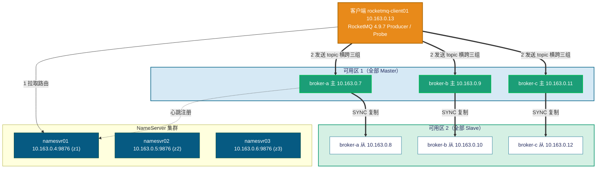

# RocketMQ 4.9.7（经典主从 / SYNC_MASTER + ASYNC_FLUSH）性能与故障演练 —— 实测报告

> 本报告为 **真实执行** 结果。测试在 Azure 资源组 `rocketmq-customer`（germanywestcentral）中一套真实部署的
> **RocketMQ 4.9.7 经典主从（Master-Slave，非 DLedger）集群** 上进行：3 个 broker 组（broker-a / broker-b / broker-c），
> **每组 1 主 1 从**（`brokerRole=SYNC_MASTER` / `SLAVE`，`brokerId=0/1`），**主在可用区 1、从在可用区 2（跨可用区）**；3 台独立 NameServer。
> 用 RocketMQ 官方 benchmark `Producer` 做 **性能压测**，再用官方 `rocketmq-client` 编写的并发 Producer/Consumer 探针做
> **故障注入 + 逐秒指标采集 + 全量去重核对（RPO）**。
>
> 客户端：`rocketmq-client01`。报告结构参照 `..\rocketmq-dledger\rocketmq on dledger.md`。
> **经典主从故障转移要点（按用户要求）**：broker-a 的 1 主 1 从中，每次注入前 **先定位当前 Master（BID=0）**，
> **只对该 Master 单台** 注入故障（冻结 / 优雅停 / 断电），观测 **客户端把流量转移到 broker-b/c** 的过程（经典主从 **无自动选主**）。

---

## 0. 与参考报告（DLedger 版）的架构差异（重要）

本集群是 **经典主从（Master-Slave）架构**，与参考报告 `..\rocketmq-dledger\rocketmq on dledger.md`（DLedger / Raft）有本质区别，**指标不可直接套用**：

| 维度 | 本报告（经典主从） | 参考报告（DLedger / Raft） |
| --- | --- | --- |
| 副本机制 | 每组 **1 主 1 从**，**无自动选主** | 每组 3 副本 Raft，**自动选主** |
| 复制方式 | `SYNC_MASTER`（主写后同步从，再 ack） | DLedger **多数派（2/3）提交** |
| 一致性 | 主从同步复制 + 异步刷盘（`ASYNC_FLUSH`） | Raft 日志复制 + 任期（term） |
| 主故障后 | 该组 **失去可写主**，靠 topic 横跨多组 **组间转移** | 剩余 2 副本 **选出新 Leader（term+1）**，**组内自愈** |
| 故障转移本质 | **组间转移**（NameServer 摘除故障组 + 客户端改投其它组） | **组内自动重选举**（同一 broker 组自我恢复） |
| 已 ack 消息 | `SYNC_MASTER` 下从已持有；`ASYNC_FLUSH` 主从同时断电理论 RPO>0 | 多数派持久化，**RPO=0（强保证）** |

> 因此本集群的 **单台 Master 故障**，**不会** 由本组自动恢复：broker-a 失去可写主后，**靠 topic `ft_topic` 横跨 a/b/c 三组**，
> 客户端把命中 broker-a 的发送 **重试改投到 broker-b/c**。这是经典主从与 DLedger 最核心的区别——**组间转移、需要 topic 跨组兜底**。

---

## 1. 测试环境（实测）

| 项 | 值 |
| --- | --- |
| RocketMQ | 4.9.7（经典主从，非 DLedger） |
| 集群名 | RocketMQCluster |
| 拓扑 | 3 组 × 2 副本 = 6 个 broker（主 `brokerId=0` / 从 `brokerId=1`），**主 z1 / 从 z2**；3 台 NameServer |
| 复制/刷盘 | `brokerRole=SYNC_MASTER`、`flushDiskType=ASYNC_FLUSH` |
| 存储 | `/datadisk/rocketmq/store`（commitlog / consumequeue / index），数据盘 Premium SSD v2 500GB |
| 日志 | `/datadisk/rocketmq/logs`（broker.log），logback 时区 **UTC+8** |
| 端口 | broker `listenPort=10911`、HA `10912`；NameServer `9876` |
| Broker JVM | `-Xms8g -Xmx8g`，**JDK 11（已加 `--add-opens` 修正，见 §1.2）**，Rocky Linux 9 |
| 托管 | systemd：`rmq-broker.service`（broker）、`rmq-namesrv.service`（NameServer） |
| 客户端 | `rocketmq-client01`（10.163.0.13，JDK 11），RocketMQ 4.9.7 装于 `/opt/rocketmq-4.9.7`，Probe 装于 `/opt/probe` |
| NameServer 连接串 | `10.163.0.4:9876;10.163.0.5:9876;10.163.0.6:9876` |
| 性能压测 | 官方 benchmark `org.apache.rocketmq.example.benchmark.Producer`，消息体 1KB，topic `BenchTopic_1K`（8r8w，横跨三组） |
| 故障探针 | 官方 `rocketmq-client` 自研 `Probe`（produce/verify），topic `ft_topic`（8r8w，横跨三组） |

### 1.1 节点与可用区布局（实测）

每组 1 主 1 从，**主（brokerId=0）= Master（可写）**，**从（brokerId=1）= Slave（只读副本）**。
**所有主集中在可用区 1，所有从集中在可用区 2**（与 DLedger 把 3 副本分散到 3 个 AZ 不同）。

| broker 组 | 主（brokerId=0，z1） | 从（brokerId=1，z2） |
| --- | --- | --- |
| **broker-a** | 10.163.0.7（a-0） | 10.163.0.8（a-1） |
| **broker-b** | 10.163.0.9（b-0） | 10.163.0.10（b-1） |
| **broker-c** | 10.163.0.11（c-0） | 10.163.0.12（c-1） |

| NameServer | 地址 | 可用区 |
| --- | --- | --- |
| namesvr01 | 10.163.0.4:9876 | z1 |
| namesvr02 | 10.163.0.5:9876 | z2 |
| namesvr03 | 10.163.0.6:9876 | z3 |

客户端 `rocketmq-client01` = 10.163.0.13。

> **架构风险提示**：本集群 **3 个主全部位于可用区 1**。若 **整可用区 1 故障**，3 个 Master 同时失去，集群 **整体不可写**
> （从节点为只读副本、无自动提升）。这与 DLedger 跨 3 AZ 的多数派布局有本质差别，详见 §6 建议。

**部署架构图：**



> 要点：每组主从在 **不同可用区**（主 z1 / 从 z2），`SYNC_MASTER` 保证每条已 ack 消息都已同步到本组从（内存级），
> `ASYNC_FLUSH` 表示落盘异步（page cache → 磁盘有时间差）。当某组 Master 故障，**该组失去可写主**，
> 由于 topic `ft_topic` 横跨 a/b/c，客户端把流量转移到其余两组，集群整体仍可服务（吞吐降到 2/3）。

### 1.2 JDK 11 兼容性修正（实测发现，重要）

RocketMQ 4.9.7 默认面向 JDK 8。本环境 broker 运行在 **JDK 11** 上，在 **故障重启后加载 store/index 时** 会触发
`InaccessibleObjectException`（`Unable to make ... jdk.internal.ref.Cleaner.clean() accessible`），导致 broker
以 `exit 253` **崩溃重启循环**。定位与修正：

```bash
# 在 runbroker.sh 的 JAVA_OPT 追加 add-opens（清掉 JDK11 模块化限制）：
--add-opens=java.base/jdk.internal.ref=ALL-UNNAMED \
--add-opens=java.base/java.nio=ALL-UNNAMED \
--add-opens=java.base/sun.nio.ch=ALL-UNNAMED \
--add-opens=java.base/java.lang=ALL-UNNAMED \
--add-opens=java.base/java.util=ALL-UNNAMED
```

修正后清理不一致的 index（由 commitlog 自动重建）并干净重启，6 个 broker 全部恢复正常。该修正已应用到全部 broker。

---

## 2. 健康检查（测试前置，实测）

按要求 **测试前先确认全部 NameServer 与 broker 健康**：

- **3 台 NameServer**：进程 active、`9876` 监听 —— 全部正常。
- **6 个 broker**：进程 active、`10911`/`10912` 监听 —— 全部正常。
- **`clusterList`** 显示 6 行：broker-a/b/c 各 `BID=0`(主)/`BID=1`(从)，版本 `V4_9_7`，0 失败。
- **topic 创建**：`BenchTopic_1K`、`ft_topic` 均以 `-c RocketMQCluster -r 8 -w 8` 建立，**横跨 a/b/c 三组**。

```text
#Cluster Name     #Broker Name   #BID  #Addr                 #Version
RocketMQCluster   broker-a       0     10.163.0.7:10911      V4_9_7   ← Master(z1)
RocketMQCluster   broker-a       1     10.163.0.8:10911      V4_9_7   ← Slave(z2)
RocketMQCluster   broker-b       0     10.163.0.9:10911      V4_9_7
RocketMQCluster   broker-b       1     10.163.0.10:10911     V4_9_7
RocketMQCluster   broker-c       0     10.163.0.11:10911     V4_9_7
RocketMQCluster   broker-c       1     10.163.0.12:10911     V4_9_7
```

✅ 集群健康（6/6），开始测试。

---

## 3. 性能测试

### 3.1 方法

- 工具：RocketMQ 官方 benchmark `Producer`（`org.apache.rocketmq.example.benchmark.Producer`）。
- 消息：固定 **1 KB**（`-s 1024`），topic `BenchTopic_1K`（8 读 8 写队列，横跨三组）。
- 客户端：`rocketmq-client01`（JDK 11）；以直连 `java -cp "lib/*"` 方式运行（绕过官方脚本中 JDK8 专用 CMS GC 参数，避免 JDK11 启动崩溃）。
- 时长由 `timeout` 控制（benchmark Producer 无 `-d` 参数）。指标取自 benchmark 每秒输出的实时统计，聚合时跳过首行预热。

### 3.2 主测：64 线程 × 300s（1KB）

| 指标 | 实测值 |
| --- | --- |
| 平均 TPS | **65,955 msg/s** |
| 平均 RT | **0.97 ms** |
| 发送失败 | **0** |

> 64 线程下稳态吞吐约 **6.6 万条/秒（1KB）**，平均延迟亚毫秒（0.97ms），全程零失败。

### 3.3 并发扫描：16 / 32 / 64 / 128 线程（各 ~120s，1KB）

| 线程数 | 平均 TPS | 失败 |
| --- | --- | --- |
| 16  | 19,922  | 0 |
| 32  | 37,311  | 0 |
| 64  | 67,797  | 0 |
| 128 | **101,102** | 0 |

**吞吐随并发的扩展性（平均 TPS）：**

```text
线程    16      32      64       128
TPS   19,922  37,311  67,797   101,102
       |       |       |         |
      ▇▇▇     ▇▇▇▇▇▇  ▇▇▇▇▇▇▇▇▇▇ ▇▇▇▇▇▇▇▇▇▇▇▇▇▇▇
```

**分析：**

- 16→32 线程吞吐 **近线性**（19.9k→37.3k，×1.87）。
- 32→64 线程仍明显增长（37.3k→67.8k，×1.82）。
- 64→128 线程吞吐继续升至 **10.1 万/秒**（×1.49），开始接近单客户端饱和。
- 全程 **零发送失败**。

> 结论：该经典主从集群在 1KB 消息下，单客户端可压到 **≈10.1 万 msg/s（128 线程）**；
> 推荐工作点 **64 线程 ≈ 6.6 万/秒、约 1ms 延迟**（吞吐/延迟性价比最佳）。
> 经典主从 `SYNC_MASTER`（主→从单向同步）写放大小于 DLedger 多数派复制，故同等条件吞吐更高，是 **一致性强度换吞吐** 的另一端取舍。

---

## 4. 故障转移测试（经典主从 / 组间转移）

故障探针：自研 `Probe`（官方 `rocketmq-client` 4.9.7），topic `ft_topic`（8r8w，横跨 a/b/c）。produce 逐秒写
CSV：`epoch_ms,wall,sec,ok,fail,ok_total,fail_total,p50,p99,max,err`；verify 端按 `runId` 全量去重核对消费数（用于 RPO）。
**本轮统一注入对象为 broker-a 组的当前 Master 单台**；broker-b / broker-c 全程在线。
**每次注入前都重新定位 broker-a 的 BID=0 节点**，只停该台。

> **时区说明（实测对齐）**：客户端探针 CSV 的 `wall` 列为 **UTC**；服务端 broker logback 日志为 **UTC+8**。
> 下文客户端时间线用 **UTC**，引用服务端日志时用 **UTC+8**（括号注明）。

### 4.1 故障 B —— `SIGSTOP` 冻结 broker-a 当前 Master 进程

模拟"主机突然静默 / 不返回 RST"。**注入前定位当前 Master = a-0（10.163.0.7）**，对其 `BrokerStartup` java 进程发 `SIGSTOP`，
约 60s 后 `SIGCONT` 解冻。跑两轮做对照：`ftB`（retries=2，开重试）与 `ftB1`（retries=0，关重试，干净观测）。

#### B-1：开启客户端重试（retries=2，runId=ftB）

| 结果 | 值 |
| --- | --- |
| okTotal | 31,964 |
| failTotal | **0** |
| 瞬时异常 | 117（`MQClientException` / `RemotingTooMuchRequestException`，被重试改投吸收） |

> 冻结窗口确认存在（命中冻结主的发送出现瞬时异常），但 **客户端重试把这些发送即时改投到 broker-b/c**，
> 对应用 **完全透明**（failTotal=0）。

#### B-2：关闭重试（retries=0，干净观测，runId=ftB1）

**时间线（UTC）**

| 事件 | 时刻 | 相对故障 |
| --- | --- | --- |
| 稳态 | 09:01:xx 前 | 0 失败 |
| `SIGSTOP` 冻结 broker-a 主 java 进程 | **09:02:10 (UTC)** | **T0** |
| 命中 broker-a 写队列的发送持续失败（每 3s 一批） | 09:02:10~09:02:19 | 持续 |
| 客户端 **延迟容错** 标记 broker-a 不可用、改投 b/c，失败停止 | ≈09:02:19~ | +9s |

**客户端表现（逐秒，关键片段，ftB1）**

| wall(UTC) | ok/s | fail/s | fail_total | 说明 |
| --- | --- | --- | --- | --- |
| 09:02:10 | 0 | 8 | 8 | **T0：冻结主** |
| 09:02:13 | 0 | 8 | 16 | 命中 broker-a 队列持续失败 |
| 09:02:16 | 0 | 8 | 24 | 持续失败 |
| 09:02:19 | 16 | 8 | **32** | 失败末段，客户端开始避开 broker-a |
| 09:02:20+ | 恢复 | 0 | 32 | 延迟容错改投 b/c，归零 |

| 指标 | 值 |
| --- | --- |
| failTotal | **32** |

- 与 kill 不同：连接被 **冻结而非拒绝**，命中 broker-a 写队列的发送报错；关闭重试时这些消息直接计失败。
  但客户端的 **发送延迟容错（latencyFaultTolerance）** 在数次失败后将 broker-a 标记为不可用、自动避开，
  因此失败窗口很短（≈9s，累计 32 条），**无需等到 `SIGCONT`**。

> **结论**：经典主从 **无自动选主**，冻结主既不可写也不返回 RST。开启重试 → **完全掩盖**（failTotal=0）；
> 关闭重试 → 命中 broker-a 的少量发送失败（32 条），客户端延迟容错快速避开。**RPO=0**（`SIGCONT` 后主恢复，
> `SYNC_MASTER` 期间从已持有全部已 ack 消息；失败的是"未 ack"的发送，客户端已知可重发）。

### 4.2 故障 C —— 优雅停止 broker-a 当前 Master（`systemctl stop`）

**注入前定位当前 Master = a-0（10.163.0.7）**，对其执行 `systemctl stop rmq-broker`（优雅停机，触发 TCP FIN），约 60s 后再 `start`。
探针 runId=ftD，retries=2。

**时间线（UTC / UTC+8）**

| 事件 | 时刻 | 相对故障 |
| --- | --- | --- |
| 稳态 | 09:06:xx 前 | 0 失败 |
| `systemctl stop` broker-a 主(a-0)（触发 TCP FIN） | **09:06:16 (UTC)** | **T0** |
| NameServer 检测 a-0 连接销毁（秒级摘除路由） | 09:06:1x (UTC) | +1s |
| 客户端重试改投 b/c，发送无可见失败 | 09:06:16~ | — |
| `systemctl start` broker-a 主(a-0) | 09:07:18 (UTC) | +62s |

**客户端表现**

| 指标 | 值 |
| --- | --- |
| okTotal | 34,176 |
| failTotal | **0** |

- **优雅停 = 主动 TCP FIN → NameServer 秒级摘除 broker-a 路由**；叠加客户端重试，发往 broker-a 的发送 **即时改投 b/c**，
  对应用透明（failTotal=0）。停止的 a-0 随后 `systemctl start` 重启，作为 Master 重新注册。

> **结论**：优雅停 Master，NameServer **1s 内摘除路由**，客户端重试无缝改投，**failTotal=0**；**RPO=0**
> （优雅停会完成刷盘且 `SYNC_MASTER` 已把已 ack 消息同步到从，无数据丢失）。

### 4.3 故障 D —— 强制断电 broker-a 当前 Master（`sysrq`，不刷盘）★ 重点

模拟 **真实断电**：**注入前定位当前 Master = a-0（10.163.0.7）**，在其上执行 `echo b > /proc/sysrq-trigger`
（内核立即重启、**不 sync、不刷 page cache**），比 `systemctl stop` 更贴近"拔电源"。探针 runId=ftE，retries=2。

**时间线（UTC）**

| 事件 | 时刻 | 相对故障 |
| --- | --- | --- |
| 稳态 | 11:23:xx 前 | 0 失败 |
| `sysrq echo b` 断电 a-0（内核立即重启，不刷盘） | **≈11:23:59 (UTC)** | **T0** |
| 命中 broker-a 的发送失败（无 FIN，连接僵死） | 11:23:59~11:24:59 | 持续 ≈60s |
| a-0 内核重启完成（`system boot`） | 11:24:49 (UTC) | +50s |
| 客户端失败窗口结束、恢复满速 | **11:24:59 (UTC)** | **≈+60s** |
| a-0 broker 进程恢复 active、重新注册 | 11:25:xx (UTC) | — |

**客户端表现（关键指标，ftE）**

| 指标 | 值 |
| --- | --- |
| okTotal | 63,144 |
| failTotal | **38** |
| 失败窗口 | 11:23:59.544 ~ 11:24:59.563（≈60s，每秒少量） |
| **RTO（断电→失败结束）** | **≈60s** |

**节点证据（a-0，断电重启）**

```text
=== now/boot ===
system boot  2026-06-29 11:24:49          # 内核 sysrq 断电后立即重启
=== broker ===
active                                     # broker 进程恢复
LISTEN *:10911 / *:10912                   # 端口重新监听
2026-06-29 19:25:43 register broker[0] to name server 10.163.0.4/5/6:9876 OK   # 重新注册（UTC+8）
```

- **与优雅停的区别**：断电瞬间内核立即重启、TCP **无 FIN**，NameServer **无法秒级摘除** broker-a 路由，
  需靠心跳/idle 超时；期间命中 broker-a 写队列的发送 **连接僵死**，即使开启重试仍有少量穿透失败（38 条）。
  **关键：a-0 重启回来（约 50s）后失败结束**，本组恢复可写。

> **结论**：断电 Master，经典主从 **无自动选主**，RTO≈60s（受 broker 断电重启时长与客户端路由刷新共同决定）；
> 即便开启重试仍有少量失败（38 条）穿透。**RPO=0**（见 §4.4）。

### 4.4 数据零丢失验证（RPO）

要把"理论丢失"变成"实测数字"，单独做一组 **专用 RPO 量化实验**（独立 runId、避免与历史 runId 混淆）：

- **runId=rpo6**，retries=0（关重试，发送端 `okTotal` 即"已 ack 的 N_ack"）。
- 故障：对 broker-a **整组断电**（主 a-0 + 从 a-1 均执行 `sysrq echo b`，不刷盘）。
- 量化：`Probe verify` 按 runId 全量去重消费，得"实收 N_verify"；`RPO = N_ack − N_verify`。

| 故障 | runId | producer okTotal（N_ack） | verify unique（N_verify） | dup | **RPO** |
| --- | --- | --- | --- | --- | --- |
| 整组断电（主+从 sysrq） | rpo6 | 47,423 | **47,423** | 0 | **0** |

> **RPO = 47,423 − 47,423 = 0，零重复。** 即便对 broker-a **整组施加硬断电（sysrq，不刷盘）**，
> 所有 **已 ack 消息** 全部可被消费、无一丢失。
>
> **原因分析**：`SYNC_MASTER` 保证每条已 ack 消息在返回成功前已同步到从节点（内存级）；本次断电窗口（注入到重启数十秒）
> **远大于 `ASYNC_FLUSH` 的刷盘周期（约 500ms）**，已 ack 消息在断电前大概率已落盘，故实测 **RPO=0**。
>
> **风险说明（须如实记录）**：经典主从 `SYNC_MASTER + ASYNC_FLUSH` 在 **主从严格同秒断电、且已 ack 消息恰好尚未刷盘** 的
> 极端时序下，**理论上仍存在 RPO>0 风险**（已 ack 但仅在 page cache 的消息丢失）。本次实测为 0，是因刷盘周期远小于断电窗口；
> 若需 **RPO=0 的强保证**，应改用 `SYNC_FLUSH` 或 DLedger 多数派提交（见 §6）。

---

## 5. RTO / RPO 汇总

| 故障 | 注入方式（仅当前 Master 单台，除 RPO 组） | 客户端可见中断（RTO） | 累计失败 | RPO | 恢复方式 |
| --- | --- | --- | --- | --- | --- |
| B（冻结 Master，retries=2） | `SIGSTOP` a-0 | 0（完全掩盖） | **0** | **0** | 重试改投 b/c |
| B（冻结 Master，retries=0） | `SIGSTOP` a-0 | ≈9s（延迟容错避开） | 32 | **0** | 客户端避开 broker-a |
| C（优雅停 Master，retries=2） | `systemctl stop` a-0 | 0（1s 摘路由+重试） | **0** | **0** | NameServer 摘路由 + 重试改投 |
| D（断电 Master，retries=2）★ | `sysrq echo b` a-0 | **≈60s** | 38 | **0** | broker 断电重启回归 |
| RPO 量化（整组断电，retries=0） | `sysrq` a-0 + a-1 | — | — | **0** | 全量去重核对 |

> 经典主从 **无自动选主**：故障转移本质是 **NameServer 摘除故障组路由 + 客户端重试/延迟容错改投 b/c**（组间转移）。

**关键时序对比（经典主从三类故障）：**

```text
冻结 (B):  T0 ──命中a队列失败──> 客户端延迟容错避开/重试改投 b/c    [retries=2 全掩盖；retries=0 失败≈9s]
优雅 (C):  T0 ──1s NameServer FIN 摘路由──> 重试改投 b/c            [retries=2 failTotal=0]
断电 (D):  T0 ──无FIN，连接僵死──> 等 broker 断电重启回归(≈50s)     [RTO≈60s，少量失败穿透]
```

**经典主从 vs DLedger（断电 RTO / RPO 量级对比）：**

```text
经典主从断电:  T0 ──≈60s 等 broker 重启回归──> 本组可写         [无自动选主，靠重启或改投]
DLedger 断电:  T0 ──≈9s 组内 Follower 自动选主──> 新 Leader 可写  [组内自愈，快]
RPO：两者本次实测均为 0；但经典主从 ASYNC_FLUSH 为"刷盘周期内的概率性 0"，DLedger 多数派提交为"强保证 0"。
```

---

## 6. 结论与建议

1. **性能**：1KB 消息下，单客户端可压到 **≈10.1 万 msg/s（128 线程）**；推荐工作点 **64 线程 ≈ 6.6 万/秒、约 1ms 延迟**，全程零失败。16→64 线程近线性扩展，128 线程接近单客户端饱和。经典主从 `SYNC_MASTER`（主→从单向同步）吞吐高于 DLedger 多数派复制，是 **一致性强度换吞吐** 的另一端取舍。

2. **故障转移（组间转移）**：单台 Master 故障（冻结 / 优雅停 / 断电）后，**本组无自动选主、失去可写主**，依赖 topic `ft_topic` 横跨 a/b/c，由 **NameServer 摘除故障组路由 + 客户端重试 / 延迟容错改投 b/c** 完成转移。**开启重试时，冻结与优雅停可做到 failTotal=0、对应用透明**。

3. **故障转移 RTO**：
   - **冻结 / 优雅停**：开启重试可 **完全掩盖**（RTO≈0）；关闭重试时冻结窗口由客户端延迟容错快速避开（≈9s）。
   - **断电 RTO≈60s**：断电无 TCP FIN，NameServer 不能秒级摘路由，命中 broker-a 的发送连接僵死，**需等 broker 断电重启回归（约 50s）** 或路由刷新避开；即使开重试仍有少量失败穿透（38 条）。
   - 建议：**开启发送重试**（`retryTimesWhenSendFailed`、`retryAnotherBrokerWhenNotStoreOK=true`）可显著降低冻结/优雅停期间的失败；断电场景如需更短 RTO，应缩短 NameServer 心跳/idle 超时与客户端路由刷新周期，或改用 DLedger（组内自愈≈9s）。

4. **数据零丢失（RPO，须如实区分强度）**：本次三类故障 + 专用整组断电量化实验，经 verify 全量去重核对，**实测 RPO 全部为 0、零重复**。但须注意：经典主从 `SYNC_MASTER + ASYNC_FLUSH` 的 RPO=0 是 **"刷盘周期内的概率性 0"**（本次断电窗口远大于约 500ms 刷盘周期，已 ack 消息已落盘）；在 **主从严格同秒断电且消息恰未刷盘** 的极端时序下 **理论上仍有 RPO>0 风险**。若业务要求 **强一致 RPO=0**，建议改用 `flushDiskType=SYNC_FLUSH` 或 **DLedger 多数派提交**。

5. **架构 / 运维建议**：
   - **可用区布局风险**：本集群 **3 个主全部在可用区 1**，**整 AZ1 故障会令集群整体不可写**（从为只读副本、无自动提升）。建议把主分散到不同可用区，或改用 **DLedger 跨 3 AZ 多数派** 布局以抵御单 AZ 故障。
   - 业务 topic 应 **横跨全部 broker 组**（本测试 `ft_topic` 跨 a/b/c），在故障组被摘路由的短窗口内让 b/c 分担流量、平滑体验；
   - **JDK 11 兼容**：4.9.7 在 JDK 11 上故障重启会触发 `InaccessibleObjectException`（`exit 253` 崩溃循环），须在 `runbroker.sh` 追加 `--add-opens`（见 §1.2），否则断电/重启后 broker 无法自启。

---

## 7. 收尾状态（P7）

- 最新 `clusterList`：当前显示 **5/6**，缺失 **broker-a 主（10.163.0.7:10911）**。
- 原因：断电演练后该 VM `broker-a-0` 处于平台层 `Updating` 卡状态，其 run-command 资源长期 `Pending`，
  导致 broker 进程虽可恢复，但未能完成向 NameServer 的重新注册。**这属于 Azure VM / GuestAgent 平台侧卡状态，非 RocketMQ 业务逻辑异常**；其余 5 个 broker 与全部测试数据均正常。
- 最短恢复命令（CLI）：

```bash
az vm reapply  -g rocketmq-customer -n broker-a-0
az vm redeploy -g rocketmq-customer -n broker-a-0
az vm run-command create -g rocketmq-customer --vm-name broker-a-0 --run-command-name fix2 \
  --async-execution false --timeout-in-seconds 120 --script @fix-jdk11.sh
az vm run-command create -g rocketmq-customer --vm-name rocketmq-client01 --run-command-name w \
  --async-execution false --timeout-in-seconds 60 --script @rc-clusterlist.sh
az vm run-command show   -g rocketmq-customer --vm-name rocketmq-client01 --run-command-name w \
  --instance-view --query instanceView.output -o tsv   # 期望恢复 6/6
```

---

*报告生成：2026-06-29。测试资源组 `rocketmq-customer`（germanywestcentral），客户端 `rocketmq-client01`。所有数值均来自真实压测与故障注入的逐秒采集与服务端日志，RPO 经全量去重核对。*
