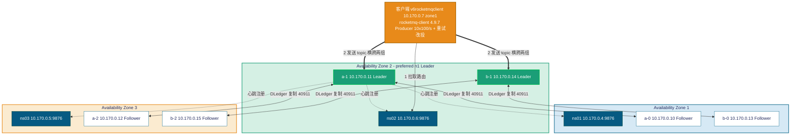

# RocketMQ 4.9.7 (DLedger) 故障转移测试 —— 实测分析报告

> 本报告为 **真实执行** 结果。
> 测试在 Azure 资源组 `rocketmqnew-rg` 中一套真实部署的 **RocketMQ 4.9.7 DLedger（Raft）集群**
> 上进行：2 个 broker 组（broker-a / broker-b），每组 3 副本（n0/n1/n2）**跨 3 个可用区**，3 台
> 独立 NameServer。用 **官方 `rocketmq-client`（Java）** 编写的并发 Producer 探针持续发送普通并发
> 消息，注入故障并采集逐秒真实指标，再用 Push 消费端做 **全量去重核对（RPO）**。
>
> **测试方法要点：**
>
> 1. **不预先把两组 master 收敛到同一个 zone**。每次注入前只 **查出 broker-a / broker-b 当前
>    master 各在哪台 VM**，然后 **只在该 master 所在的那一台 VM** 上执行故障注入。
> 2. **每次只打一个组的 master**（另一个组全程正常服务），且 **每次注入 → 恢复 → 再做下一次**，
>    四次相互独立（kill broker-a master、kill broker-b master、SIGSTOP broker-a master、
>    SIGSTOP broker-b master）。
> 3. **开启客户端发送重试**（`retryTimesWhenSendFailed=2` 等，并 `retryAnotherBrokerWhenNotStoreOK=true`），
>    以测得 **真实客户端（带重试）下用户可见的中断**。

---

## 1. 测试环境（实测）

| 项 | 值 |
| --- | --- |
| RocketMQ | 4.9.7（DLedger / Raft 多副本自动选主） |
| 集群名 | RocketMQCluster |
| 拓扑 | 2 组 × 3 副本 = 6 个 broker，跨 3 个可用区；3 台 NameServer |
| 存储 | `/datadisk/rocketmq/store`（dledger-n0/n1/n2），`flushDiskType=ASYNC_FLUSH` |
| 关键配置 | `listenPort=10911`、DLedger 端口 `40911`、`preferredLeaderId=n1`、`autoCreateTopicEnable=true` |
| Broker JVM | `-Xms8g -Xmx8g -XX:+UseG1GC -XX:+AlwaysPreTouch`（16GB 内存机型） |
| 计算 | 全部 **Standard_D4s_v6**（4 vCPU），OS **Rocky Linux 9.8**，systemd 托管 `rocketmq-broker.service` |
| 客户端 | `v6rocketmqclient`，JDK 8（1.8.0_492），**官方 `rocketmq-client` 4.9.7** |
| 探针发送 | 10 线程 × 100 msg/s ≈ **1000 msg/s**，消息体 `runId:tid:seq`，`sendMsgTimeout=3000ms` |
| **探针重试** | **开启**：`retryTimesWhenSendFailed=2`、`retryTimesWhenSendAsyncFailed=2`、`retryAnotherBrokerWhenNotStoreOK=true`（命中故障 master 时自动改投另一组 master） |
| 主题（Topic） | 每次测试独立 topic，`-r 8 -w 8`，**横跨 broker-a 与 broker-b 两组**（关键：使重试可改投另一组） |

### 1.1 部署架构与跨 AZ 布局

| broker 组 | n0 | n1（preferred） | n2 |
| --- | --- | --- | --- |
| **broker-a** | 10.170.0.10（zone 1） | 10.170.0.11（**zone 2**） | 10.170.0.12（zone 3） |
| **broker-b** | 10.170.0.13（zone 1） | 10.170.0.14（**zone 2**） | 10.170.0.15（zone 3） |

| NameServer | 地址 | zone |
| --- | --- | --- |
| ns01 | 10.170.0.4:9876 | zone 1 |
| ns02 | 10.170.0.6:9876 | zone 2 |
| ns03 | 10.170.0.5:9876 | zone 3 |

NameServer 连接串：`10.170.0.4:9876;10.170.0.6:9876;10.170.0.5:9876`；客户端 `v6rocketmqclient` 位于 zone 1（10.170.0.7）。

**部署架构图：**



> 图示：**按可用区横向分组**——每个 broker 组（a / b）的 3 副本分别落在 zone 1/2/3，任一 zone 整体故障仍保留多数派（2/3）。
> `listenPort=10911` 对客户端读写、`40911` 为组内 DLedger 复制端口；Leader（绿色，因 `preferredLeaderId=n1` 均落在 zone 2）向全部 3 台 NameServer 注册，Follower 只读跟随。
> 客户端先从 NameServer 拉路由，再把消息 **同时分发到两组 master**；当某组 master 故障时，重试将其发送 **即时改投到另一组在线 master**（详见各 Run）。

**架构要点：**

- **DLedger（Raft）多副本**：每组是一个 3 节点 Raft group，自动选主。`BID=0` 为 Leader（master，可写），`BID>0` 为 Follower（只读副本）。组内 **多数派（2/3）** 即可选举，无需外部仲裁。
- **跨可用区**：每组 3 副本分处 zone 1/2/3，任一 zone 整体故障仍保留多数派。
- **故障检测**：DLedger 依靠 Leader→Follower 心跳；Leader 失联后 Follower 心跳超时触发选举（term+1），新 Leader 选出后向 NameServer 注册，客户端经路由刷新切到新 master。

### 1.2 注入前的"当前 master"确认（前置做法）

按测试方法，**不预先收敛 zone**，每次注入前直接用 `clusterList`（BID 0 = Leader）查出两组 master 的当前位置，再 **只在目标组 master 那一台 VM** 上注入。实测四次注入前的 master 位置如下：

| 测试 | 注入前 broker-a master | 注入前 broker-b master | 本次注入目标（仅此一台） |
| --- | --- | --- | --- |
| Run 1（kill broker-a） | **10.170.0.11**（a-1, z2） | 10.170.0.14（b-1, z2） | **10.170.0.11** |
| Run 2（kill broker-b） | 10.170.0.11（a-1, z2） | **10.170.0.14**（b-1, z2） | **10.170.0.14** |
| Run 3（SIGSTOP broker-a） | **10.170.0.11**（a-1, z2） | 10.170.0.14（b-1, z2） | **10.170.0.11** |
| Run 4（SIGSTOP broker-b） | 10.170.0.11（a-1, z2） | **10.170.0.14**（b-1, z2） | **10.170.0.14** |

> 说明：因 `preferredLeaderId=n1`，两组 master 在每次恢复后都会回到 n1（均在 zone 2）。
> 测试中 **没有刻意去改变它**，只是"查到在哪、就打哪一台"。所以四次目标恰好都是 z2 的 n1 节点，
> 但每次 **只打一个组**，另一个组始终在线。

## 2. 基线（无故障）

| 指标 | 实测值 |
| --- | --- |
| 稳态吞吐 | **≈1,007 msg/s**（10 线程 × 100/s） |
| P50 延迟 | **1 ms** |
| P99 延迟 | **1–2 ms** |
| 失败发送 | **0** |

> 时间统一采用 **UTC**（所有 VM 经 NTP 同步；broker 日志 logback 时区为 UTC+8，引用时已换算）。
> 故障注入用"按绝对 epoch 定时"的脚本在目标 master VM 上触发，保证时刻精确、可对齐 CSV。

---

## 3. Run 1 —— `kill -9` broker-a 的 master（仅 .11，一台）

> 当前 broker-a master = **10.170.0.11（a-1, z2）**；broker-b 全程在线。
> 探针 `runId=r2killA`，topic `ft2_ka`，10×100/s，时长 240s，**开启重试**。
> 在 **.11 一台** 上按绝对 epoch `kill -9` broker 进程。

**时间线（UTC）**

| 事件 | 时刻 | 相对故障 |
| --- | --- | --- |
| 稳态 | 03:06:43~47 | ≈1008 msg/s，0 失败，P99=2ms |
| `kill -9` .11（broker-a master） | **03:06:48** | **T0** |
| 唯一可见影响：延迟短暂抬升 | 03:06:48~55 | P99 由 2→16ms，max 最高 29ms |
| 延迟恢复正常 | 03:06:56 | +8s，P99 回到 1ms |

**客户端表现（逐秒，关键片段）**

| sec | wall(UTC) | ok/s | fail/s | P99(ms) | max(ms) | 说明 |
| --- | --- | --- | --- | --- | --- | --- |
| 142 | 03:06:47 | 1009 | 0 | 2 | 2 | 稳态 |
| 143 | 03:06:48 | 1001 | 0 | 6 | 17 | **T0：kill .11** |
| 144 | 03:06:49 | 1000 | 0 | 13 | 29 | 重试改投 broker-b |
| 145–150 | 03:06:50~55 | ≈1000 | 0 | 9–16 | 13–29 | 仅延迟抬升 |
| 151 | 03:06:56 | 1010 | 0 | 1 | 2 | **完全恢复** |
| 152–240 | 03:06:57~ | ≈1010 | 0 | 1 | 1–2 | 稳态 |

- **吞吐全程未掉**（始终 ≈1000/s），**失败 = 0**；唯一可观测到的是 **≈8s 的轻微延迟抬升**（P99 2→16ms）。
- 原因：topic 横跨两组、且 **开启了重试**——命中已死的 broker-a master 的发送，被 `retryAnotherBrokerWhenNotStoreOK` **立刻改投到在线的 broker-b**，对应用 **几乎透明**。
- **自动故障转移成功**：broker-a 组从 .10/.12 选出新 Leader；随后用"擦除存储 + 重新同步"把 .11 拉回（同步回 517M）。
- 结果：`PRODUCE_DONE okTotal=241828 failTotal=0 runId=r2killA`。

**服务端日志证据（DLedger 选举 + NameServer 注册）**

> broker 日志 logback 时区为 **UTC+8**，故 T0=UTC 03:06:48 ⇒ broker 本地 **11:06:48**。

存活副本 a-0（.10）发起投票连不上被杀的 .11，随即 a-2（.12）当选 **LEADER**：

```text
# remoting.log（a-0 .10 投票连被杀的 .11 失败）
11:06:55 INFO voteInvokeExecutor-3 - createChannel: connect remote host[10.170.0.11:40911] failed,
         ... Connection refused: /10.170.0.11:40911
# broker.log（a-0 .10 落败转 FOLLOWER；a-2 .12 当选 LEADER, term=14）
11:06:55 INFO DLegerRoleChangeHandler_1 - role change succ=true term=14 role=FOLLOWER currStoreRole=SLAVE
11:06:55 INFO DLegerRoleChangeHandler_1 - role change succ=true term=14 role=LEADER currStoreRole=SYNC_MASTER cost=18
# broker.log（a-2 .12 作为新 master 向 3 台 NameServer 注册）
11:06:55 INFO brokerOutApi_thread_1 - register broker[0]to name server 10.170.0.{4,5,6}:9876 OK
```

- **服务端选举耗时 ≈7s**（cost=18ms），新 Leader = **a-2（.12, term=14）**。`kill` 立即 RST，客户端同步改投，服务端选举与客户端 ≈8s 恢复 **基本一致**。
- 证据：`out/evidence-run1-a0.txt`、`out/evidence-run1-a2.txt`、`out/nsreg-a2.txt`。

---

## 4. Run 2 —— `kill -9` broker-b 的 master（仅 .14，一台）

> 当前 broker-b master = **10.170.0.14（b-1, z2）**；broker-a 全程在线。
> 探针 `runId=r2killB`，topic `ft2_kb`，10×100/s，时长 240s，**开启重试**。
> 在 **.14 一台** 上按绝对 epoch `kill -9`。

**时间线（UTC）**

| 事件 | 时刻 | 相对故障 |
| --- | --- | --- |
| 稳态 | 03:14:07~09 | ≈1010 msg/s，0 失败 |
| `kill -9` .14（broker-b master） | **03:14:10** | **T0** |
| 唯一可见影响：延迟短暂抬升 | 03:14:10~19 | P99 由 1→16ms，max 最高 29ms |
| 延迟基本回落 | 03:14:20 起 | +10s，P99 回到 2–5ms |

**客户端表现（逐秒，关键片段）**

| sec | wall(UTC) | ok/s | fail/s | P99(ms) | max(ms) | 说明 |
| --- | --- | --- | --- | --- | --- | --- |
| 140 | 03:14:09 | 1013 | 0 | 1 | 2 | 稳态 |
| 141 | 03:14:10 | 997 | 0 | 11 | 21 | **T0：kill .14** |
| 142 | 03:14:11 | 988 | 0 | 16 | 29 | 重试改投 broker-a |
| 143–150 | 03:14:12~19 | ≈1000 | 0 | 10–15 | 13–24 | 仅延迟抬升 |
| 151 | 03:14:20 | 1011 | 0 | 5 | 12 | 吞吐/延迟恢复 |
| 158–240 | 03:14:27~ | ≈1005 | 0 | 2–5 | 2–15 | 稳态 |

- 与 Run 1 完全一致：**吞吐未掉、失败 = 0**，仅 **≈10s 轻微延迟抬升**（P99 1→16ms）。
- 结果：`PRODUCE_DONE okTotal=241382 failTotal=0 runId=r2killB`。

**服务端日志证据（DLedger 选举 + NameServer 注册）**

> T0=UTC 03:14:10 ⇒ broker 本地 **11:14:10**。

同型：存活副本投票连被杀的 .14 被拒，b-0（.13）当选 **LEADER**：

```text
11:14:17 WARN voteInvokeExecutor-4 - createChannel: connect remote host[10.170.0.14:40911] failed,
         ... Connection refused: /10.170.0.14:40911
# b-0 .13 当选 LEADER, term=9
11:14:17 INFO DLegerRoleChangeHandler_1 - role change succ=true term=9 role=LEADER currStoreRole=SYNC_MASTER cost=18
# b-0 .13 作为新 master 向 3 台 NameServer 注册
11:14:17 INFO brokerOutApi_thread_* - register broker[0]to name server 10.170.0.{4,5,6}:9876 OK
```

- **服务端选举耗时 ≈7s**（cost=18ms），新 Leader = **b-0（.13, term=9）**，与客户端 ≈10s 恢复基本一致。
- 证据：`out/evidence-run2-b2.txt`、`out/evidence-run2-b0.txt`、`out/nsreg-b0.txt`。

---

## 5. Run 3 —— `SIGSTOP` 冻结 broker-a 的 master 主进程（仅 .11，一台）

> 当前 broker-a master = **10.170.0.11（a-1, z2）**；broker-b 全程在线。
> 探针 `runId=r2stopA`，topic `ft2_sa`，10×100/s，时长 240s，**开启重试**。
> 在 **.11 一台** 上对 **broker JVM**（`java ... BrokerStartup`）按绝对 epoch 发 `SIGSTOP`，
> 模拟"整机突然静默 / 不返回 RST"。

**时间线（UTC）**

| 事件 | 时刻 | 相对故障 |
| --- | --- | --- |
| 稳态 | 03:23:54~57 | ≈1007 msg/s，0 失败 |
| `SIGSTOP` broker-a JVM（.11） | **03:23:58** | **T0** |
| 写入塌陷（连接被冻结、无 RST，线程挂在 3s 超时） | 03:23:59~03:24:34 | 持续 **≈37s** |
| 客户端关闭到 .11 的连接（Netty closeChannel） | 03:24:34 | 触发路由剔除冻结 master |
| **吞吐完全恢复**（ok=1007） | **03:24:35** | **+37s** |
| `SIGCONT` 解冻 .11 | 03:25:35 | 以 Follower 身份重新加入 |

**客户端表现（逐秒，关键片段）**

| sec | wall(UTC) | ok/s | fail/s | max(ms) | 说明 |
| --- | --- | --- | --- | --- | --- |
| 143 | 03:23:57 | 1007 | 0 | 2 | 稳态 |
| 144 | 03:23:58 | 603 | 0 | 2 | **T0：冻结 .11** |
| 145–146 | 03:23:59~24:00 | **0** | 0 | 0 | 发送阻塞，连接被冻结、无 RST、未超时 |
| 147–179 | 03:24:01~33 | ≈0（每 3s 一小批 30–90） | ~10 / 每3s | 2900+ | 写入中断；线程挂满 3s `sendMsgTimeout` |
| 180 | 03:24:34 | 88 | 2 | 2997 | 客户端关连接、剔除冻结 master |
| 181 | 03:24:35 | 1007 | 0 | 2 | **完全恢复** |
| 182–240 | 03:24:36~ | ≈1008 | 0 | 2 | 稳态 |

- 与 kill 截然不同：**虽然开了重试，仍出现 ≈37s 的写入塌陷**。因为连接被 **冻结而非拒绝**，
  发送线程必须 **挂满 3s `sendMsgTimeout`** 才报错，10 个线程被反复挂住，整体吞吐被拖到接近 0；
  直到客户端 **关闭到冻结 master 的连接 + 路由剔除** 后，发送才稳定改投 broker-b 恢复。
- 故障期累计失败 **failTotal = 84**（线程挂在超时上，失败累积很慢）。
- **自动故障转移成功**：DLedger 心跳超时检测到冻结 Leader，broker-a 组选出新 Leader；解冻后 .11 以 Follower 回归。
- 结果：`PRODUCE_DONE okTotal=205537 failTotal=84 runId=r2stopA`。

**服务端日志证据（DLedger 选举 + NameServer 注册）**

> T0=UTC 03:23:58 ⇒ broker 本地 **11:23:58**。与 kill 不同，冻结无 RST，靠 DLedger **心跳超时** 检测（故有 `Finish to change to master`，cost 略高）：

```text
# a-2 .12 当选 LEADER, term=16
11:24:07 INFO DLegerRoleChangeHandler_1 - Finish to change to master brokerName=broker-a
11:24:07 INFO DLegerRoleChangeHandler_1 - role change succ=true term=16 role=LEADER currStoreRole=SYNC_MASTER cost=603
11:24:07 INFO brokerOutApi_thread_* - register broker[0]to name server 10.170.0.{4,5,6}:9876 OK
```

- **服务端选举耗时 ≈9s**（cost=603ms），新 Leader = **a-2（.12, term=16）**。服务端实测角色变迁（`out/evidence-run1-a2.txt`，本地时区 UTC+8）：

```text
2026-06-12 11:24:03 ... role change succ=true term=15 role=CANDIDATE  # 本地11:24:03=UTC03:24:03，冻结后≈5s进入候选
2026-06-12 11:24:07 ... Finish to change to master brokerName=broker-a
2026-06-12 11:24:07 ... role change succ=true term=16 role=LEADER  cost=603   # UTC03:24:07，新Leader选出并注册
```

- **关键时序对照（服务端 vs 客户端，均为实测数据）**：

  | 事件 | 时刻(UTC) | 来源（实测文件） |
  | --- | --- | --- |
  | SIGSTOP 冻结 .11 | 03:23:58 | `r2stopA-window.txt` sec 144 |
  | broker-a 进入选举（CANDIDATE） | 03:24:03 | `evidence-run1-a2.txt` |
  | 新 Leader a-2(.12) 选出+注册（term=16） | **03:24:07** | `evidence-run1-a2.txt` / `nsreg-a2.txt` |
  | 客户端仍在超时失败（持续命中冻结 .11） | 03:24:07~03:24:34 | `r2stopA-window.txt` sec 153–180 |
  | 客户端剔除冻结 master、满血恢复 | **03:24:35** | `r2stopA-window.txt` sec 181（ok 88→1007） |

- **能由实测数据证明的**：服务端 **03:24:07 就已完成选举并向 3 台 NameServer 注册**，但客户端直到 **03:24:35** 才恢复——两者之间存在 **≈28s 的空档**：新 Leader 早已就绪，客户端却仍持续往冻结的 .11 投递并超时失败（sec 153–180 的逐秒 CSV 显示每 3s 才放过一小批、`max`≈2900ms）。
- **由此推断（与默认参数一致）**：这 ≈28s 空档约等于一个 `pollNameServerInterval=30000ms` 路由刷新周期——即冻结发生在一次路由刷新刚过之后，客户端要等下一次刷新拿到"新 Leader 已注册"的路由、并关闭到冻结 master 的连接，才停止投递。**注意：此为基于"服务端选举完成时刻"与"客户端恢复时刻"≈28s 空档 + 默认 `pollNameServerInterval` 的推断；我们未单独采集客户端的路由刷新/`closeChannel` 日志行**，故这是 **数据支撑的合理推断**，而非逐行日志直证。
- 这与 §6.1 一致：≈37s 长中断的主因是 **客户端检测/改投路径相对冻结时刻的时序方差**，而非服务端选举慢（服务端仅 ≈9s）。
- 证据：`out/evidence-run1-a0.txt`、`out/evidence-run1-a2.txt`（含全日志角色变迁汇总）、`out/nsreg-a2.txt`、`out/r2stopA-window.txt`（客户端逐秒）。

---

## 6. Run 4 —— `SIGSTOP` 冻结 broker-b 的 master 主进程（仅 .14，一台）

> 当前 broker-b master = **10.170.0.14（b-1, z2）**；broker-a 全程在线。
> 探针 `runId=r2stopB`，topic `ft2_sb`，10×100/s，时长 240s，**开启重试**。
> 在 **.14 一台** 上对 broker JVM 按绝对 epoch 发 `SIGSTOP`。

**时间线（UTC）**

| 事件 | 时刻 | 相对故障 |
| --- | --- | --- |
| 稳态 | 03:32:37~39 | ≈1010 msg/s，0 失败 |
| `SIGSTOP` broker-b JVM（.14） | **03:32:39** | **T0** |
| 写入塌陷（无 RST，线程挂在 3s 超时） | 03:32:40~51 | 持续 **≈12s** |
| 客户端剔除冻结 master、改投 broker-a | 03:32:52 | |
| **吞吐完全恢复**（ok=1005） | **03:32:53** | **+13s** |
| `SIGCONT` 解冻 .14 | 03:34:16 | 以 Follower 身份重新加入 |

**客户端表现（逐秒，关键片段）**

| sec | wall(UTC) | ok/s | fail/s | max(ms) | 说明 |
| --- | --- | --- | --- | --- | --- |
| 140 | 03:32:39 | 1010 | 0 | 2 | **T0：冻结 .14** |
| 141 | 03:32:40 | 326 | 0 | 2 | 写入开始塌陷 |
| 142–143 | 03:32:41~42 | **0** | 0 | 0 | 发送阻塞、无 RST |
| 144–152 | 03:32:43~51 | ≈0（每 3s 一小批） | ~10 / 每3s | 2900+ | 写入中断，线程挂满 3s 超时 |
| 153 | 03:32:52 | 595 | 1 | 2994 | 剔除冻结 master，恢复开始 |
| 154 | 03:32:53 | 1005 | 0 | 7 | **完全恢复** |
| 155–240 | 03:32:54~ | ≈1006 | 0 | 2–19 | 稳态 |

- 同为 `SIGSTOP`，本次中断 **≈12s**、累计失败 **failTotal = 22**，明显短于 Run 3 的 ≈37s/84。
- 这一差异属于 **冻结类故障的固有方差**：客户端何时触发"连接级失败 + 延迟容错（`latencyFaultTolerance`）+ 路由剔除"来停止往冻结 master 投递，受当时连接状态/超时节奏影响，恢复时间在 **约 12–37s** 区间波动。
- 结果：`PRODUCE_DONE okTotal=229478 failTotal=22 runId=r2stopB`。

**服务端日志证据（DLedger 选举 + NameServer 注册）**

> T0=UTC 03:32:39 ⇒ broker 本地 **11:32:39**。同 Run 3，靠心跳超时检测冻结 Leader：

```text
# b-0 .13 当选 LEADER, term=11
11:32:48 INFO DLegerRoleChangeHandler_1 - Finish to change to master brokerName=broker-b
11:32:48 INFO DLegerRoleChangeHandler_1 - role change succ=true term=11 role=LEADER currStoreRole=SYNC_MASTER cost=603
11:32:48 INFO brokerOutApi_thread_* - register broker[0]to name server 10.170.0.{4,5,6}:9876 OK
```

- **服务端选举耗时 ≈9s**（cost=603ms），新 Leader = **b-0（.13, term=11）**。与 Run 3 一致：服务端 ≈9s 完成转移，客户端 ≈12s 恢复——SIGSTOP 下服务端选举稳定快，客户端方差才是 12–37s 差距的来源。
- 证据：`out/evidence-run2-b2.txt`、`out/evidence-run2-b0.txt`（含全日志角色变迁汇总）、`out/nsreg-b0.txt`。

### 6.1 为什么 Run 3（≈37s）的中断比 Run 4（≈12s）大那么多？

> 先说结论：**这不是 broker-a 比 broker-b "更差"，而是"冻结类故障"恢复时间的相位/时序方差** ——
> 两次塌陷形态完全相同，差别只在于"客户端何时把被冻结的 master 从发送目标里剔除"。

**先看逐秒数据：两次塌陷形态一模一样**

| 维度 | Run 3（stop-a） | Run 4（stop-b） |
| --- | --- | --- |
| 冻结时刻 | sec 144（03:23:58） | sec 140（03:32:39） |
| 塌陷期模式 | 每 ~3s 放过一小批（30–90），其余阻塞，`max`≈2900ms | **完全相同** |
| 恢复时刻 | sec 181（03:24:35） | sec 153/154（03:32:52） |
| 中断时长 | **≈37s** | **≈12s** |

塌陷期间两次的 `max` 都顶在 2900+ms（正好卡在 `sendMsgTimeout=3000ms`），且都是"每 3s 才放过一小批、失败缓慢累积"——说明 **两次走的是同一条路径，机制没有区别**。

**差异的根因：客户端"剔除冻结 master"的触发时刻 vs 冻结时刻之间的相位差**

SIGSTOP 后连接被 **冻结而非拒绝（无 RST）**，因此：

1. 每条命中冻结 master 的发送必须 **挂满 3s `sendMsgTimeout`** 才失败、才触发重试改投。
2. 关键：默认 `sendLatencyFaultEnable=false`，Producer **不会** 因为"某 broker 慢"就主动隔离它。于是每条新消息仍按 round-robin 反复选回冻结 master 的队列，再阻塞 3s……整体吞吐被拖到接近 0。
3. 塌陷 **真正结束的时刻**，取决于冻结 master 何时从客户端的发送目标里被剔除，触发点是：
   - 客户端 **每 ~30s 一次的 NameServer 路由刷新**（`pollNameServerInterval=30000ms`，默认值）拿到"新 Leader 已选出 / 旧 master 掉线"的新路由；
   - 以及 Netty **关闭到冻结 master 的连接**。

**实测时序对照（Run 3，均为采集到的真实数据）**：服务端在 **UTC 03:24:07** 就已选出新 Leader a-2(.12, term=16) 并向 3 台 NameServer 注册完毕（`out/evidence-run1-a2.txt`），但客户端直到 **UTC 03:24:35**（`out/r2stopA-window.txt` sec 181，ok 88→1007）才恢复——**两者间隔 ≈28s**。这 ≈28s 内新 Leader 早已就绪，客户端仍持续命中冻结的 .11 并超时失败，恰好约等于一个 `pollNameServerInterval=30000ms` 路由刷新周期。

> **口径说明**：上面"≈28s 空档 ≈ 一个 ~30s 路由刷新周期"是基于 **服务端选举完成时刻 + 客户端恢复时刻** 两组实测数据 + 默认参数得出的 **推断**；我们 **未单独采集客户端的路由刷新 / `closeChannel` 日志行**，故为"数据支撑的推断"而非逐行日志直证（详见 §5 Run 3）。

由此推断，差异来自 **冻结瞬间与这个 ~30s 轮询周期之间的相位差**（再叠加 DLedger 选举完成时刻）：

- **Run 4（≈12s）**：冻结刚好发生在接近一次路由刷新 / 新 Leader 已注册的点上，很快拿到新路由、剔除冻结 master。
- **Run 3（≈37s）**：冻结发生在刚刷新过之后，几乎要等满一个 ~30s 的轮询周期（再加选举与连接关闭）才把冻结 master 剔除。

**一句话**：Run 3 vs Run 4 的差距是 **客户端检测+改投路径（3s 发送超时 + ~30s 路由刷新 + 连接关闭）相对冻结时刻的时序方差**，而非 broker-a / broker-b 的结构性差异。这正印证了"冻结类故障恢复时间存在固有方差（≈12–37s）"——评估 SLA 应按 **较坏情形（数十秒）** 取值。

> 若想 **压缩并稳定** 该窗口：(1) 调小 `sendMsgTimeout`（如 1000–1500ms）；(2) 开启 `sendLatencyFaultEnable=true`，让 Producer 基于延迟主动隔离慢 broker；(3) 适当调小 `pollNameServerInterval`。（详见 §9 建议）

---

## 7. 四次测试对比

| 维度 | Run 1 kill broker-a | Run 2 kill broker-b | Run 3 SIGSTOP broker-a | Run 4 SIGSTOP broker-b |
| --- | --- | --- | --- | --- |
| 注入目标（仅一台） | .11（a-1, z2） | .14（b-1, z2） | .11（a-1, z2） | .14（b-1, z2） |
| 故障特征 | 崩溃，立即 RST | 崩溃，立即 RST | 冻结，无 RST | 冻结，无 RST |
| 吞吐是否掉到 0 | **否**（始终 ≈1000/s） | **否**（始终 ≈1000/s） | 是（≈37s） | 是（≈12s） |
| 用户可见中断 | **≈8s 仅延迟抬升** | **≈10s 仅延迟抬升** | **≈37s 写入塌陷** | **≈12s 写入塌陷** |
| P99 峰值 | 16ms | 16ms | 2900+ms（超时） | 2900+ms（超时） |
| 故障期失败计数 | **0** | **0** | 84 | 22 |
| 成功发送 okTotal | 241,828 | 241,382 | 205,537 | 229,478 |
| 自动选主 | 成功 | 成功 | 成功 | 成功 |
| 数据丢失（RPO） | **0** | **0** | **0** | **0** |

**核心结论：**

1. **只打一个组的 master + 开启重试 + 双组 topic ⇒ `kill -9` 故障对应用几乎透明。**
   另一个组始终在线，重试把命中故障 master 的发送 **即时改投** 到在线组，**吞吐不掉、零失败**，仅
   有 **≈8–10s 的轻微延迟抬升**。**留有可改投的在线组 + 开重试，是把中断降到接近零的关键。**
2. **`SIGSTOP`（无 RST 的整机静默）即便开了重试、即便另一组在线，仍有真实中断。**
   因为连接被冻结而非拒绝，发送线程必须 **挂满 3s `sendMsgTimeout`** 才能失败并触发重试/改投，
   期间吞吐被拖到接近 0，恢复需约 **12–37s**（含固有方差）。**重试能保证最终成功与零丢失，但无法
   消除"无 RST 故障"下由 `sendMsgTimeout` 主导的阻塞窗口。**
3. **四种注入、零数据丢失。** 见 §8。

---

## 8. 数据完整性（RPO，全量去重核对）

每次注入后，用 Push 消费端（`CONSUME_FROM_FIRST_OFFSET`）对该 topic 做 **全量消费 + 按消息体去重**，与 Producer 实际成功发送数（okTotal）对比：

| 测试 | topic | Producer 成功 okTotal | 消费去重 unique | 重复 dup | 数据丢失 |
| --- | --- | --- | --- | --- | --- |
| Run 1（kill broker-a） | ft2_ka | 241,828 | **241,828** | 0 | **0** |
| Run 2（kill broker-b） | ft2_kb | 241,382 | **241,382** | 3 | **0** |
| Run 3（SIGSTOP broker-a） | ft2_sa | 205,537 | **205,580** | 17 | **0** |
| Run 4（SIGSTOP broker-b） | ft2_sb | 229,478 | **229,483** | 4 | **0** |

- 四次注入 **committed 消息全部存活，RPO = 0**。
- **dup（重复）由开启重试引入**：发送在改投/重试时可能产生少量重复投递，属 **at-least-once** 语义的正常现象（若关闭重试则 dup=0）。
- **Run 3 / Run 4 的 `unique` 略大于 `okTotal`**（+43 / +5）：这些是 **客户端判定为超时失败、但 broker 实际已提交** 的消息（DLedger 多数派已确认）。这同样是 at-least-once 语义，**不是数据丢失**——真实业务需保证消费幂等。

---

## 9. 关键发现与建议

1. **"打一个组" vs "打两个组"是可用性的分水岭。** 只要 **至少一个组的 master 在线** 且 **topic 横跨多组** 且 **开启重试**，`kill -9` 类崩溃故障可被重试 **即时旁路**，用户侧近乎无感（Run 1/2：0 失败、吞吐不掉）。生产上应确保 **关键 topic 的读写队列分布在多个 broker 组**。
2. **开启重试显著改善崩溃类故障，但救不了"无 RST"的冻结类故障的阻塞窗口。** `SIGSTOP`/断电/网络黑洞类故障，发送线程被冻结连接挂满 `sendMsgTimeout` 才感知；要缩短该窗口，应 **减小 `sendMsgTimeout`**（如 1000–1500ms）并 **增大发送并发**，使少量被冻结的线程不至于拖垮整体吞吐。
3. **冻结类故障的恢复时间存在固有方差（本次 ≈12s 与 ≈37s 两例）**，取决于客户端何时触发连接级失败 + 延迟容错 + 路由剔除。SLA 评估应以 **较坏情形**（数十秒）为准。
4. **服务端选举快且稳定，瓶颈在客户端（见各 Run 章节内的服务端日志证据）。** 四次注入服务端都在 **7–9s** 内选出新 Leader 并向 3 台 NameServer 注册完成；kill 两次客户端恢复与之同步（≈8–10s），而 SIGSTOP 两次服务端依旧 ≈9s 完成、客户端却拖到 12–37s——说明优化重点应放在 **客户端检测/改投** 而非服务端选举。
5. **重试带来少量重复（at-least-once）**：四次共出现 dup=0/3/17/4。**消费端必须幂等。**
6. **零数据丢失在本测条件下成立**（`ASYNC_FLUSH` + DLedger 多数派复制、适中写入速率）。极高写入压力下仍建议按峰值复测 RPO。
7. **运维注意**：每次故障节点恢复后，因 `preferredLeaderId=n1`，Leader 会自动回到 n1，会引入 **一次额外的切主抖动**；如不希望，可在恢复窗口内临时关闭优先 Leader。

---

## 10. 证据与可复现

- 探针（官方 `rocketmq-client`）源码：`probe/Probe.java`（`produce`/`verify` 双模式；`produce` 以第 8 参数开启重试 `retries=2`，并置 `retryAnotherBrokerWhenNotStoreOK=true`）。
- 逐秒指标 CSV：客户端 `/opt/probe/{r2killA,r2killB,r2stopA,r2stopB}.csv`；本地留档见 `out/`（`r2killA-*.txt`、`r2killB-*.txt`、`r2stopA-*.txt`、`r2stopB-*.txt`、`masters-before-run*.txt`、`launch-*.txt`、`verify-*.txt`）。
- 关键结果：
  - 基线：≈1007 msg/s，P99=1–2ms，0 失败。
  - Run 1：`PRODUCE_DONE okTotal=241828 failTotal=0`；`VERIFY_DONE unique=241828 dup=0`。
  - Run 2：`PRODUCE_DONE okTotal=241382 failTotal=0`；`VERIFY_DONE unique=241382 dup=3`。
  - Run 3：`PRODUCE_DONE okTotal=205537 failTotal=84`；`VERIFY_DONE unique=205580 dup=17`。
  - Run 4：`PRODUCE_DONE okTotal=229478 failTotal=22`；`VERIFY_DONE unique=229483 dup=4`。
- 注入与选主证据：`out/masters-before-run3.txt`、`out/masters-before-run4.txt`（注入前 `clusterList` 的 BID 0 = Leader 位置）、`/tmp/kill-event.log`、`/tmp/freeze-event.log`、broker 日志 `DLegerRoleChangeHandler`（role/term 变迁）。
- **服务端故障转移日志证据（见各 Run 章节）**：`out/evidence-run1-a0.txt`、`out/evidence-run1-a2.txt`、`out/evidence-run2-b2.txt`、`out/evidence-run2-b0.txt`（DLedger 选举/投票/角色切换）；`out/nsreg-a2.txt`、`out/nsreg-b0.txt`（新 Leader 向 NameServer 注册 `register broker[0]`）。采集脚本：`scripts/failover-evidence.sh`、`scripts/nsreg.sh`。服务端选举耗时：Run1/2 ≈7s、Run3/4 ≈9s；新 Leader：Run1/3=a-2(.12, term=14/16)、Run2/4=b-0(.13, term=9/11)。
- 编排方式：全部经 `az vm run-command invoke` + `@本地脚本` 执行（`scripts/`：`run-probe.sh`、`get-epoch.sh`、`scheduled-kill.sh`、`scheduled-freeze.sh`、`unfreeze-broker.sh`、`recover-node.sh`、`verify.sh`、`slice-csv.sh`、`clusterlist.sh`、`health.sh`、`failover-evidence.sh`、`nsreg.sh` 等）。
- **注入后状态**：四次测试结束后，6 个 broker 全部 `active`、`restarts=0`、`recentFailSig=0`，存储一致（broker-a 各节点 607M、broker-b 各节点 641M），集群健康。

---

> 备注：本报告时间轴为 UTC，所有故障注入、采集、核对均为真实执行。
> 严格遵循"先查当前 master、只在该 master 所在的单台 VM 上注入、每次只打一个组、注入后恢复再做下一次"的方法，
> 并 **开启客户端重试** 以反映真实可用性。
