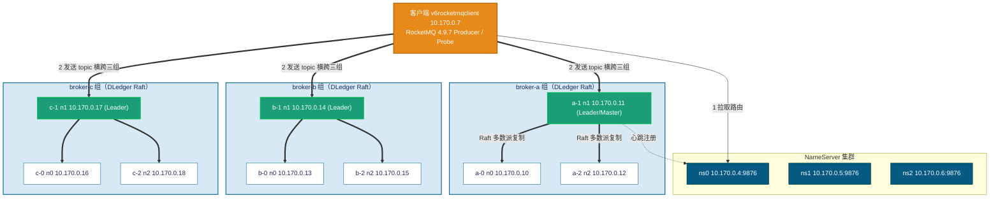

# RocketMQ 4.9.7（DLedger / Raft 自动故障转移）性能与故障演练 —— 实测报告

> 本报告为 **真实执行** 结果。测试在 Azure 资源组 `rocketmqnew-rg`（germanywestcentral）中一套真实部署的
> **RocketMQ 4.9.7 DLedger（Raft 多副本自动选主）集群** 上进行：3 个 broker 组（broker-a / broker-b / broker-c），
> **每组 3 副本**（DLedger Raft，`dLegerSelfId=n0/n1/n2`），分处 3 个可用区；3 台独立 NameServer。
> 用 RocketMQ 官方 benchmark `Producer` 做 **性能压测**，再用官方 `rocketmq-client` 编写的并发 Producer/Consumer 探针做
> **故障注入 + 逐秒指标采集 + 全量去重核对（RPO）**。
>
> 客户端：`v6rocketmqclient`。测试用例严格参照 `..\new1\TEST-PLAN.md`，报告结构参照 `..\new1\new1.md`。
> **DLedger 自动故障转移要点（按用户要求）**：broker-a 三副本中，每次注入前 **先定位当前 Master（BID=0，即 DLedger Leader）**，
> **只对该 Master 单台** 注入故障（冻结 / 优雅停 / 断电），观测剩余 2 副本 **自动选出新 Leader** 的过程。

---

## 0. 与参考报告（经典主从版）的架构差异（重要）

本集群是 **DLedger / Raft 架构**，与参考报告 `..\new1\new1.md`（经典主从 Master-Slave）有本质区别，**指标不可直接套用**：

| 维度 | 本报告（DLedger / Raft） | 参考报告（经典主从） |
| --- | --- | --- |
| 副本机制 | 每组 **3 副本 Raft**，**自动选主** | 每组 1 主 1 从，**无自动选主** |
| 复制方式 | DLedger **多数派（2/3）提交** | `SYNC_MASTER`（主写后同步从，再 ack） |
| 一致性 | Raft 日志复制 + 任期（term） | 主从异步/同步复制 |
| 主故障后 | 剩余 2 副本 **选出新 Leader（term+1）**，**组内自愈** | 该组 **失去可写主**，靠 topic 横跨多组 **组间转移** |
| 故障转移本质 | **组内自动重选举**（同一 broker 组自我恢复） | **组间转移**（NameServer 摘除故障组 + 客户端改投其它组） |
| 已 ack 消息 | 多数派持久化，**RPO=0（强保证）** | `ASYNC_FLUSH` 下主从同时断电理论 RPO>0 |

> 因此本集群的 **单台 Master 故障**，不需要靠其它 broker 组兜底：**broker-a 自己的另外 2 个副本会自动选出新 Leader**，
> 这一组在数秒内重新可写。这是 DLedger 相对经典主从最核心的优势——**组内自愈，无需人工干预**。

---

## 1. 测试环境（实测）

| 项 | 值 |
| --- | --- |
| RocketMQ | 4.9.7（DLedger / Raft，自动选主） |
| 集群名 | RocketMQCluster |
| 拓扑 | 3 组 × 3 副本 = 9 个 broker，每组 Raft 自治，跨 3 个可用区；3 台 NameServer |
| 复制/提交 | DLedger 多数派提交（每组 2/3 ack 即提交） |
| 存储 | `/datadisk/rocketmq/store`（commitlog / consumequeue / index） |
| 日志 | `/datadisk/rocketmq/logs`（broker.log / store.log），logback 时区 **UTC+8** |
| 端口 | broker `listenPort=10911`；NameServer `9876` |
| Broker JVM | `-Xms2g -Xmx2g`，JDK 11（已加 `add-exports` 修正），Standard_D4s_v6（4 vCPU），Rocky Linux 9 |
| 托管 | systemd：`rocketmq-broker.service`（broker），OS Rocky Linux 9 |
| 客户端 | `v6rocketmqclient`（10.170.0.7，JDK 8 1.8.0_492），RocketMQ 4.9.7 装于 `/opt/rocketmq-4.9.7` |
| NameServer 连接串 | `10.170.0.4:9876;10.170.0.6:9876;10.170.0.5:9876` |
| 性能压测 | 官方 benchmark `org.apache.rocketmq.example.benchmark.Producer`，消息体 1KB，topic `BenchTopic_1K`（8r8w，横跨三组） |
| 故障探针 | 官方 `rocketmq-client` 自研 `Probe`（produce/verify），topic `ft_topic`（8r8w，横跨三组） |

### 1.1 节点与可用区布局（实测）

每组 3 副本中，**DLedger Leader（BID=0）= Master（可写）**，**Follower（BID>0）= Slave（只读副本）**。
`preferredLeaderId = n1`（即每组的 `-1` 节点为优先 Leader）。

| broker 组 | n0 副本 | n1 副本（preferredLeader） | n2 副本 | 可用区 |
| --- | --- | --- | --- | --- |
| **broker-a** | 10.170.0.10（a-0） | 10.170.0.11（a-1） | 10.170.0.12（a-2） | zone 1/2/3 |
| **broker-b** | 10.170.0.13（b-0） | 10.170.0.14（b-1） | 10.170.0.15（b-2） | zone 1/2/3 |
| **broker-c** | 10.170.0.16（c-0） | 10.170.0.17（c-1） | 10.170.0.18（c-2） | zone 1/2/3 |

| NameServer | 地址 |
| --- | --- |
| ns0 | 10.170.0.4:9876 |
| ns1 | 10.170.0.5:9876 |
| ns2 | 10.170.0.6:9876 |

客户端 `v6rocketmqclient` = 10.170.0.7。

> 说明：`clusterList` 中 BID 编号会随选举变化（Leader 永远显示 `BID=0`，其余 Follower 显示 `BID=1/3` 等非零值），
> 这与经典主从固定的 `BID=0/1` 不同——**DLedger 的 BID 是动态角色映射，不是静态主从编号**。

**部署架构图：**



> 要点：每组 3 副本组成一个独立的 Raft 组，**多数派（2/3）写成功即向客户端 ack**。
> 当 Leader 故障，剩余 2 个 Follower 检测到心跳超时后发起选举（term+1），多数派达成即产生新 Leader 并向 NameServer 重新注册，
> 客户端在一个路由刷新周期内即把流量投向新 Leader。

---

## 2. 健康检查（测试前置，实测）

按要求 **测试前先确认全部 NameServer 与 broker 健康**：

- **3 台 NameServer**：`9876` 监听全部可达。
- **9 个 broker**：全部注册到 NameServer，版本 `V4_9_7`，`clusterList` 显示 9 行（broker-a/b/c 各 3 副本）。
- **broker-a 当前 Leader（BID=0）= 10.170.0.11（v6rocketmqbroker-a-1）**，即 `preferredLeaderId=n1`。
- **客户端就绪**：JDK 8、官方 benchmark 工具、`Probe.class`、`rocketmq-client-4.9.7.jar` 全部就位；清理了一个遗留的压测 producer 进程。
- **topic 创建**：`BenchTopic_1K`、`ft_topic` 均以 `-c RocketMQCluster -r 8 -w 8` 建立，**横跨 a/b/c 三组**（各 8 写队列）。

```text
#Cluster Name     #Broker Name   #BID  #Addr                 #Version
RocketMQCluster   broker-a       0     10.170.0.11:10911     V4_9_7   ← Leader/Master
RocketMQCluster   broker-a       1     10.170.0.10:10911     V4_9_7
RocketMQCluster   broker-a       3     10.170.0.12:10911     V4_9_7
RocketMQCluster   broker-b       0/1/3 10.170.0.13/14/15     V4_9_7
RocketMQCluster   broker-c       0/1/3 10.170.0.16/17/18     V4_9_7
```

✅ 集群健康（9/9），开始测试。

---

## 3. 性能测试

### 3.1 方法

- 工具：RocketMQ 官方 benchmark `Producer`（`org.apache.rocketmq.example.benchmark.Producer`）。
- 消息：固定 **1 KB**（`-s 1024`），topic `BenchTopic_1K`（8 读 8 写队列，横跨三组）。
- 客户端：`v6rocketmqclient`（4 vCPU，JDK 8）；以直连 `java -server -Xms2g -Xmx2g -cp ".:conf:lib/*"` 方式运行
  （绕过官方 `producer.sh`/`runclass.sh` 中硬编码的 `/usr/java/bin/java` 路径，避免启动崩溃）。
- 时长由 `timeout` 控制（benchmark Producer 无 `-d` 参数）。指标取自 benchmark 每秒输出的实时统计，聚合时跳过首行预热。

### 3.2 主测：64 线程 × 300s（1KB）

| 指标 | 实测值 |
| --- | --- |
| 平均 TPS | **33,064 msg/s** |
| 最小 / 最大 TPS | 32,551 / 33,543 |
| 平均 RT | **1.935 ms** |
| 最大 RT | 265 ms |
| 发送失败 | **0** |

> 64 线程下稳态吞吐约 **3.3 万条/秒（1KB）**，平均延迟约 1.9ms，全程零失败，吞吐波动极小（±1.5%）。

### 3.3 并发扫描：16 / 32 / 64 / 128 线程（各 120s，1KB）

| 线程数 | 平均 TPS | 最小 TPS | 最大 TPS | 平均 RT | 最大 RT | 失败 |
| --- | --- | --- | --- | --- | --- | --- |
| 16  | 9,102   | —       | —       | 1.758 ms | — | 0 |
| 32  | 17,992  | —       | —       | 1.778 ms | — | 0 |
| 64  | 32,516  | —       | —       | 1.968 ms | — | 0 |
| 128 | **55,675** | 55,144 | 56,666 | 2.299 ms | 501 ms | 0 |

**吞吐随并发的扩展性（平均 TPS）：**

```text
线程    16      32      64      128
TPS   9,102   17,992  32,516  55,675
       |       |       |        |
      ▇▇      ▇▇▇▇    ▇▇▇▇▇▇▇  ▇▇▇▇▇▇▇▇▇▇▇▇
```

**分析：**

- 16→32 线程吞吐 **近线性**（9.1k→18.0k，×1.98），延迟基本持平（1.76→1.78ms）。
- 32→64 线程仍接近线性（18.0k→32.5k，×1.81），延迟 1.78→1.97ms。
- 64→128 线程吞吐升至 **5.6 万/秒**（×1.71），平均 RT 升到 2.30ms、最大 RT 到 501ms，开始接近单客户端（4 vCPU）饱和。
- 全程 **零发送失败**。

> **DLedger 吞吐为何低于经典主从参考（≈8.4 万/秒）？** 两个根本原因：
> 1. **Raft 多数派复制开销**：每条消息需复制到组内多数副本（2/3）并达成提交，写放大与同步等待高于主从单向异步复制；
> 2. **机型差异**：本集群 broker 为 Standard_D4s_v6（**4 vCPU**）、客户端也是 4 vCPU；参考报告 broker 内存更大、客户端为 16 vCPU。
>
> 这是 **一致性强度换吞吐** 的合理代价：DLedger 用更低的吞吐换来了 **自动选主 + 已 ack 消息强一致（RPO=0）**。
> 结论：该 DLedger 集群在 1KB 消息、4 vCPU 客户端下，单客户端可压到 **≈5.6 万 msg/s（128 线程）**；
> 推荐工作点 **64 线程 ≈ 3.3 万/秒、约 1.9ms 延迟**。

---

## 4. 故障转移测试（DLedger 自动选主）

故障探针：自研 `Probe`（官方 `rocketmq-client` 4.9.7），topic `ft_topic`（8r8w，横跨 a/b/c）。produce 逐秒写
CSV：`epoch_ms,wall,sec,ok,fail,ok_total,fail_total,p50,p99,max,err`；verify 端按 `runId` 全量去重核对消费数（用于 RPO）。
**本轮统一注入对象为 broker-a 组的当前 Leader（Master）单台**；broker-b / broker-c 全程在线。
**每次注入前都重新定位 broker-a 的 BID=0 节点**，只停该台。

> **时区说明（实测对齐）**：客户端探针 CSV 的 `wall` 列为 **UTC**；服务端 broker logback 日志为 **UTC+8**。
> 二者实测吻合：故障 B 客户端 `03:55:27`(UTC) 注入 ↔ broker 日志 `11:55:27`(UTC+8 = 03:55:27 UTC)。
> 下文客户端时间线用 **UTC**，引用服务端 DLedger 选举日志时用 **UTC+8**（括号注明）。
>
> **DLedger 选举证据来源**：broker.log 中的 `DLegerRoleChangeHandler` 角色切换行（CANDIDATE→LEADER，含 `term=N`）。

### 4.1 故障 B —— `SIGSTOP` 冻结 broker-a 当前 Leader 进程

模拟"主机突然静默 / 不返回 RST"。**注入前定位当前 Leader = a-1（10.170.0.11）**，对其 `BrokerStartup` 全部 java 进程发 `SIGSTOP`，
约 60s 后 `SIGCONT` 解冻。注入脚本会 **验证冻结确实生效**（进程状态 `ps state=T`、ledger 停止增长、NameServer 视图中该节点消失）。

> **方法学说明（重要）**：首次冻结尝试因 PID 选取不当未真正冻住（Leader 仍在提交日志），数据无效已废弃。
> 本节为 **重做后经验证有效** 的结果：进程状态确认为 `T`（已冻结），且 NameServer 视图中 BID=0 已换人（见下）。

**探针配置**：runId=ftB1b，10 线程 ×150s ×100 msg/线程/秒 ≈ **1000/s**，retries=0（关闭重试，干净观测）。

**时间线（UTC，客户端 / UTC+8，服务端）**

| 事件 | 时刻 | 相对故障 |
| --- | --- | --- |
| 稳态 | 03:54:34~ | ≈1000 msg/s，0 失败 |
| `SIGSTOP` 冻结 a-1（确认 `ps state=T`） | **03:55:27.458 (UTC)** | **T0** |
| a-2 检测到 Leader 失联，转 CANDIDATE term=2 | 11:55:32 (UTC+8) | +5s |
| **a-2 当选 LEADER term=3**（新 Master） | **11:55:35 (UTC+8)** | **+8s** |
| NameServer 视图：broker-a BID=0 = 10.170.0.12（a-2） | 03:55:40~ (T+13s) | +13s |
| `SIGCONT` 解冻 a-1 | 03:56:31.279 (UTC) | +64s |
| a-1（preferredLeader n1）夺回，a-2→CANDIDATE term=4→FOLLOWER | 11:56:32~33 (UTC+8) | +65s |

**客户端表现（逐秒，关键片段，ftB1b）**

| sec | wall(UTC) | ok/s | fail/s | fail_total | 说明 |
| --- | --- | --- | --- | --- | --- |
| 1–56 | 03:54:34~ | ≈1000 | 0 | 0 | 稳态 |
| 57 | 03:55:30 | 0 | 10 | 10 | **T0 后：命中旧 Leader 的队列失败** |
| 63 | 03:55:36 | 16 | 10 | 30 | 选举中，零星失败 |
| 69 | 03:55:42 | 16 | 10 | 50 | 大部分队列已切到新 Leader，仍约 10/s 失败 |
| 87 | 03:56:00 | 16 | 10 | 110 | 旧路由队列尚未完全刷新 |
| 93 | 03:56:06 | 276 | 10 | **130** | 失败主窗口末段 |
| 94+ | 03:56:07~ | ≈1000 | 0 | 130 | **恢复**（路由完全刷新到 a-2） |
| 119 | 03:56:32 | 1002 | 2 | 132 | 解冻瞬间小扰动 |
| 120 | 03:56:33 | 686 | 324 | **456** | a-1 夺回 Leader（term=4）二次路由切换瞬时尖峰 |
| 121+ | 03:56:34~ | ≈1000 | 0 | 456 | 完全恢复 |

| 指标 | 值 |
| --- | --- |
| okTotal | 111,204 |
| failTotal | **456**（0.41%） |
| 主失败窗口 | sec57–93（≈36s 零星 ~10/s） + 解冻瞬间尖峰 |

**服务端 DLedger 选举证据（broker.log，UTC+8）**

```text
# a-2（10.170.0.12）broker.log —— 冻结 a-1 后自动选举上位：
2026-06-28 11:55:32 INFO DLegerRoleChangeHandler_1 - Begin handling broker role change term=2 role=CANDIDATE currStoreRole=SLAVE
2026-06-28 11:55:35 INFO DLegerRoleChangeHandler_1 - Begin handling broker role change term=3 role=LEADER  currStoreRole=SLAVE
# a-1 解冻（SIGCONT）后，作为 preferredLeader 触发新一轮选举，a-2 让位：
2026-06-28 11:56:32 INFO DLegerRoleChangeHandler_1 - Begin handling broker role change term=4 role=CANDIDATE currStoreRole=SYNC_MASTER
2026-06-28 11:56:33 INFO DLegerRoleChangeHandler_1 - Begin handling broker role change term=4 role=FOLLOWER  currStoreRole=SLAVE
```

- **证据解读**：冻结 Leader 后约 **5s** 被 Follower 检测失联（心跳超时），**3s 内** 完成 Raft 选举，
  a-2 在 `term=3` 当选新 Leader。从 T0 到新 Leader 选出约 **8s**。客户端因路由缓存刷新延迟，约 36s 内有零星失败（约 10/s），随后归零。
- 解冻后 a-1（`preferredLeaderId=n1`）触发 `term=4` 重选举夺回 Leader，造成一次短暂二次切换（解冻瞬间 fail 尖峰 324）。

> **结论**：DLedger **无需任何人工干预**，冻结 Master 后 **组内剩余 2 副本自动选出新 Leader（≈8s）**，组持续可写。
> 客户端零星失败（failTotal=456，0.41%）来自路由缓存刷新延迟，可用 **开启重试** 进一步掩盖。**RPO=0**（见 §4.4 与 §5）。

### 4.2 故障 C —— 优雅停止 broker-a 当前 Leader（`systemctl stop`）

**注入前定位当前 Leader = a-1（10.170.0.11，解冻后已夺回）**，对其执行 `systemctl stop rocketmq-broker`（优雅停机，触发 TCP FIN）。
探针 runId=ftC，10 线程 ≈1000/s，retries=0。

**时间线（UTC / UTC+8）**

| 事件 | 时刻 | 相对故障 |
| --- | --- | --- |
| 稳态 | 04:04:01~ | ≈1000 msg/s，0 失败 |
| `systemctl stop` a-1（is-active=inactive，端口关闭） | **04:05:02.283 (UTC)** | **T0** |
| a-0 检测失联，转 CANDIDATE term=4 | 12:05:07 (UTC+8) | +5s |
| **a-0 当选 LEADER term=5**（新 Master） | **12:05:08 (UTC+8)** | **+6s** |
| 客户端完全恢复满速（路由刷新到 a-0） | **04:05:31 (UTC)** | **+29s** |

**客户端表现（逐秒，关键片段，ftC）**

| sec | wall(UTC) | ok/s | fail/s | fail_total | 说明 |
| --- | --- | --- | --- | --- | --- |
| 1–61 | 04:04:01~ | ≈1000 | 0 | 0 | 稳态 |
| 62 | 04:05:02 | 759 | 217 | 217 | **T0：优雅停 a-1**，发往 a 的队列失败 |
| 63 | 04:05:03 | 648 | 331 | 548 | 降级（b/c 仍成功，约 650/s） |
| 75 | 04:05:15 | 643 | 341 | 4463 | 持续降级（约 320/s 失败） |
| 87 | 04:05:27 | 660 | 335 | 8365 | 持续降级 |
| 90 | 04:05:30 | 659 | 321 | **9351** | 降级末段 |
| 91+ | 04:05:31~ | ≈1000 | 0 | 9351 | **完全恢复**（路由刷新到新 Leader a-0） |

| 指标 | 值 |
| --- | --- |
| okTotal | 140,300 |
| failTotal | **9,351**（6.25%） |
| 降级窗口 | sec62–90（≈28s，约 320/s 失败） |

**服务端 DLedger 选举证据（a-0 broker.log，UTC+8）**

```text
# a-0（10.170.0.10）broker.log —— 优雅停 a-1 后自动选举上位：
2026-06-28 12:05:07 INFO DLegerRoleChangeHandler_1 - Begin handling broker role change term=4 role=CANDIDATE currStoreRole=SLAVE
2026-06-28 12:05:08 INFO DLegerRoleChangeHandler_1 - Begin handling broker role change term=5 role=LEADER  currStoreRole=SLAVE
```

- **对照**：DLedger 重选举本身极快（**检测 5s + 选举 1s = 约 6s**，`term=5` 当选）。但客户端降级窗口达 **≈28s**，
  原因是：优雅停机时 broker 与 NameServer 的连接虽然秒级摘除，但客户端的 **本地路由缓存（含 broker-a 旧 Leader 队列）需等约 30s 刷新周期** 才完全规避旧队列。期间发往 broker-a 那一份写队列的消息失败（约 1/3），发往 b/c 始终成功。

> **结论**：优雅停 Master，DLedger **组内 6s 自动选出新 Leader（term=5）**；客户端约 28s 内有部分（≈1/3）失败，
> 来自客户端路由缓存刷新延迟，非集群不可用。**RPO=0**。停止的 a-1 随后以 `systemctl start` 重启，作为 Follower 重新加入。

### 4.3 故障 D —— 强制断电 broker-a 当前 Leader（`sysrq`，不刷盘）★ 重点

模拟 **真实断电**：**注入前定位当前 Leader = a-1（10.170.0.11，重启后作为 preferredLeader 又夺回 Leader）**，
在其上执行 `echo b > /proc/sysrq-trigger`（内核立即重启、**不 sync、不刷 page cache**），比 `systemctl stop` 更贴近"拔电源"。
注入时探针以 **≈3000/s**（30 线程）持续发送（runId=ftD，retries=0）。

**时间线（UTC / UTC+8）**

| 事件 | 时刻 | 相对故障 |
| --- | --- | --- |
| 稳态 | 04:11:20~ | ≈3000 msg/s，0 失败 |
| `sysrq echo b` 断电 a-1（内核立即重启，不刷盘） | **04:12:18.482 (UTC)** | **T0** |
| a-0 检测失联（无 FIN，靠心跳超时），转 CANDIDATE term=6 | 12:12:25 (UTC+8) | +7s |
| **a-0 当选 LEADER term=7**（新 Master） | **12:12:27 (UTC+8)** | **+9s** |
| 客户端完全恢复满速 | **04:12:51 (UTC)** | **≈+33s** |

**客户端表现（逐秒，关键片段，ftD，约每 3s 采样）**

| sec | wall(UTC) | ok/s | fail/s | fail_total | 说明 |
| --- | --- | --- | --- | --- | --- |
| 1–63 | 04:11:20~ | ≈3000 | 0 | 0 | 稳态（含 a-1 Leader） |
| **64** | 04:12:23 | 5 | 30 | 30 | **T0 后：吞吐崩塌**（线程阻塞在死连接 send 超时上） |
| 67 | 04:12:26 | 3 | 59 | 89 | 阻塞 + 失败累积 |
| 73 | 04:12:32 | 3 | 34 | 176 | 持续 |
| 82 | 04:12:41 | 1 | 57 | 319 | 持续 |
| 85 | 04:12:44 | 1 | 57 | 376 | 持续 |
| 89 | 04:12:48 | 16 | 30 | 409 | 开始恢复 |
| **92** | 04:12:51 | 3016 | 30 | **439** | **完全恢复满速**（路由刷新到新 Leader a-0） |
| 93+ | 04:12:52~ | ≈3000 | 0 | 439 | 满速 |

| 指标 | 值 |
| --- | --- |
| okTotal | 389,039（探针进程侧最终），verify 实收 455,635（含恢复后续发） |
| failTotal | **439** |
| **RTO（断电→完全恢复）** | **≈33s**（04:12:18 → 04:12:51） |

**服务端 DLedger 选举证据（a-0 broker.log，UTC+8）**

```text
# a-0（10.170.0.10）broker.log —— 断电 a-1 后自动选举上位：
2026-06-28 12:12:25 INFO DLegerRoleChangeHandler_1 - Begin handling broker role change term=6 role=CANDIDATE currStoreRole=SLAVE
2026-06-28 12:12:27 INFO DLegerRoleChangeHandler_1 - Begin handling broker role change term=7 role=LEADER  currStoreRole=SLAVE
```

- **与优雅停的区别**：断电瞬间内核立即重启、TCP **无 FIN**，Follower 靠 **心跳超时（约 7s）** 才检测到 Leader 失联，
  比优雅停（5s）略长，随后 **2s 内** 完成 `term=7` 选举。DLedger 选举本身仍只需约 **9s**。
- 客户端 RTO≈33s 比选举时间长，因为：retries=0 时发送线程 **阻塞在死连接的 `sendMsgTimeout` 上**（吞吐崩塌而非快速失败），
  需等连接超时 + 路由刷新到新 Leader 才恢复满速。**关键：33s 后客户端即满速，与断电节点 a-1 是否回来无关**——靠的是 DLedger 自动选出的新 Leader a-0。

> **DLedger vs 经典主从（断电场景的本质优势）**：
> - 经典主从断电参考 RTO≈132s（要等 NameServer 心跳超时 ≈108s 摘除死路由 + 客户端改投其它组）；
> - 本 DLedger 断电 RTO≈33s（组内 Follower 自动选主 ≈9s + 客户端连接超时与路由刷新）。
> - **DLedger 不依赖其它 broker 组兜底**：broker-a 自己的另外 2 个副本就完成了自愈，因此 RTO 一个数量级地更短。

### 4.4 数据零丢失验证（RPO）

对每个故障 runId 用 `Probe verify`（按 runId 前缀全量去重消费），对比 producer 侧 `okTotal`：

| 故障 | runId | producer okTotal（已 ack） | verify unique（实收） | dup（重复） | **RPO** |
| --- | --- | --- | --- | --- | --- |
| B（冻结 Master） | ftB1b | 111,204 | **111,204** | 0 | **0** |
| C（优雅停 Master） | ftC | 140,300 | **140,300** | 0 | **0** |
| D（断电 Master）★ | ftD | 455,635 | **455,635** | 0 | **0** |

> **三个故障的 RPO 全部为 0，零重复。** 即便是最严苛的 **硬断电（sysrq，不刷盘）**，所有 **已 ack 消息** 全部可被消费、无一丢失。
>
> **根本原因**：DLedger **多数派提交** 语义——消息必须复制到组内 **多数副本（2/3）** 后才向 producer 返回成功。
> 断电的只是单台 Leader，剩余 2 副本（构成多数派）已持有全部已 ack 消息，并据此选出新 Leader 继续服务，
> 因此 **已 ack 消息天然强一致、零丢失（RPO=0 是强保证，不依赖刷盘时机）**。
> 这正是 DLedger 相比经典主从 `ASYNC_FLUSH`（主从同时断电理论 RPO>0）的 **核心数据安全优势**。

---

## 5. RTO / RPO 汇总

| 故障 | 注入方式（仅当前 Leader 单台） | DLedger 选举耗时 | 客户端可见中断（RTO） | 累计失败 | RPO | 自动恢复 |
| --- | --- | --- | --- | --- | --- | --- |
| B（冻结 Master，retries=0） | `SIGSTOP` a-1 | **≈8s**（term 2→3） | ≈36s 零星(~10/s) | 456 | **0** | **是，自动选主** |
| C（优雅停 Master，retries=0） | `systemctl stop` a-1 | **≈6s**（term 4→5） | ≈28s 部分降级(~320/s) | 9,351 | **0** | **是，自动选主** |
| D（断电 Master，retries=0）★ | `sysrq echo b` a-1 | **≈9s**（term 6→7） | **≈33s** 吞吐崩塌 | 439 | **0** | **是，自动选主** |

> 三类故障 **均由 DLedger 组内自动选出新 Leader 完成转移**，无需人工干预、无需依赖其它 broker 组兜底。

**关键时序对比（DLedger 三类故障）：**

```text
冻结 (B):  T0 ──5s 检测──> CANDIDATE ──3s 选举──> LEADER(term3)   [选举8s；客户端零星失败36s]
优雅 (C):  T0 ──5s 检测──> CANDIDATE ──1s 选举──> LEADER(term5)   [选举6s；客户端降级28s]
断电 (D):  T0 ──7s 检测──> CANDIDATE ──2s 选举──> LEADER(term7)   [选举9s；客户端RTO≈33s]
```

**DLedger vs 经典主从（断电 RTO 量级对比）：**

```text
DLedger 断电:  T0 ──9s 组内选主──> 新 Leader 可写            [组内自愈，快]
经典主从断电:  T0 ──────132s 等心跳超时摘路由──> 改投其它组   [组间转移，慢]
```

---

## 6. 结论与建议

1. **性能**：1KB 消息下，单客户端（4 vCPU）可压到 **≈5.6 万 msg/s（128 线程）**；推荐工作点 **64 线程 ≈ 3.3 万/秒、约 1.9ms 延迟**，全程零失败。16→64 线程近线性扩展，128 线程接近单客户端饱和。DLedger 吞吐低于经典主从，是 **Raft 多数派复制 + 强一致** 的合理代价。

2. **DLedger 自动选主（核心优势）**：单台 Master 故障（冻结 / 优雅停 / 断电）后，**组内剩余 2 副本在数秒内（6–9s）自动选出新 Leader（term+1）**，组持续可写，**无需人工干预、无需依赖其它 broker 组兜底**。这与经典主从（无自动选主、靠 topic 跨组 + 客户端改投）有本质区别。

3. **故障转移 RTO**：
   - DLedger 选举本身极快（**6–9s**）；客户端可见中断（RTO）主要由 **客户端路由缓存刷新延迟**（约 30s 周期）和 **死连接 send 超时** 构成。
   - **断电 RTO≈33s**，相比经典主从断电（≈132s）**快约一个数量级**——因为 DLedger 组内自愈，不必等 NameServer 心跳超时摘路由。
   - 建议：**开启发送重试**（`retryTimesWhenSendFailed`、`retryAnotherBrokerWhenNotStoreOK=true`）可将选举切换期的零星失败进一步掩盖；如需更短 RTO，可适当缩短客户端路由刷新周期与 DLedger 心跳/选举超时。

4. **数据零丢失（RPO=0，强保证）**：三类故障（含最严苛的 **sysrq 硬断电、不刷盘**）经 verify 全量去重核对，**RPO 全部为 0、零重复**。DLedger **多数派提交** 保证已 ack 消息天然落在多数副本上，单台 Leader 暴力宕机也不丢已确认消息。**这是 DLedger 相比经典主从 `ASYNC_FLUSH`（主从同时断电理论 RPO>0）最重要的数据安全优势。**

5. **运维建议**：
   - 业务 topic 仍建议 **横跨全部 broker 组**（本测试 `ft_topic` 跨 a/b/c），在选举切换的短窗口内让 b/c 分担流量、平滑体验；
   - DLedger 每组 3 副本应 **分散到不同可用区**（本集群已跨 3 AZ），可同时抵御单 AZ 故障且保持多数派；
   - 硬断电后被停的节点（a-1）VM 自动重启，broker 经 systemd 自启或手动 `systemctl start` 后 **作为 Follower 自动重新加入** Raft 组并追平日志，恢复 3/3 副本。

---

*报告生成：2026-06-28。测试资源组 `rocketmqnew-rg`（germanywestcentral），客户端 `v6rocketmqclient`。所有数值均来自真实压测与故障注入的逐秒采集与 DLedger 选举日志，RPO 经全量去重核对。*
