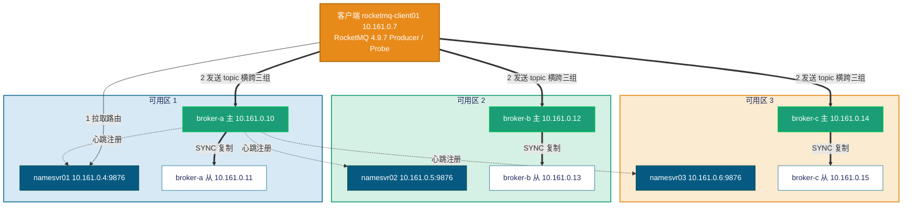

# RocketMQ 4.9.7（主从异步刷盘）性能与故障转移测试 —— 实测报告

> 本报告为 **真实执行** 结果。测试在 Azure 资源组 `rocketmqnew1-rg`（germanywestcentral）中一套真实部署的
> **RocketMQ 4.9.7 经典主从（Master-Slave）集群** 上进行：3 个 broker 组（broker-a / broker-b / broker-c），
> 每组 1 主 1 从（SYNC_MASTER + SLAVE，`brokerId=0/1`），分处 3 个可用区；3 台独立 NameServer。
> 用 RocketMQ 官方 benchmark `Producer` 做 **性能压测**，再用官方 `rocketmq-client` 编写的并发 Producer/Consumer 探针做
> **故障注入 + 逐秒指标采集 + 全量去重核对（RPO）**。
>
> 报告重点（按用户要求）：**新增完整的性能测试章节**，并在其后给出三类故障转移测试。

---

## 0. 与参考报告（DLedger 版）的架构差异（重要）

本集群 **不是 DLedger/Raft 架构**，与参考报告 `..\1\REPORT-RESULTS-ROCKETMQ-2.md` 有本质区别，故 **指标不可直接套用**：

| 维度 | 参考报告（DLedger） | 本报告（经典主从） |
| --- | --- | --- |
| 副本机制 | 每组 3 副本 Raft，**自动选主** | 每组 1 主 1 从，**无自动选主** |
| 复制方式 | DLedger 多数派 | `SYNC_MASTER`（主写后同步从，再 ack） |
| 刷盘 | `ASYNC_FLUSH` | `ASYNC_FLUSH` |
| 主故障后 | Follower 选出新 Leader，组继续可写 | 该组 **失去可写主**，转为只读 / 该组不可用；流量靠 **topic 横跨多组** 转移到其它组 |
| 故障转移本质 | 组内自愈 | **组间转移**（NameServer 摘除故障组路由 + 客户端改投其它组） |

> 因此本集群"可用区故障"= 把某个 broker 组（主+从两台）整组打掉。由于 topic `ft_topic` 横跨 a/b/c 三组，
> 单组故障时客户端把流量转移到其余两组，集群整体仍可服务（吞吐降到 2/3）。

---

## 1. 测试环境（实测）

| 项 | 值 |
| --- | --- |
| RocketMQ | 4.9.7（经典主从，非 DLedger） |
| 集群名 | RocketMQCluster |
| 拓扑 | 3 组 × 2 副本 = 6 个 broker（主 `brokerId=0` / 从 `brokerId=1`），跨 3 个可用区；3 台 NameServer |
| 复制/刷盘 | `brokerRole=SYNC_MASTER`、`flushDiskType=ASYNC_FLUSH` |
| 存储 | `/datadisk/rocketmq/store`（commitlog / consumequeue / index） |
| 端口 | broker `listenPort=10911`；NameServer `9876` |
| Broker JVM | `-Xms8g -Xmx8g -Xmn4g`、G1GC、`MaxDirectMemorySize=15g`（16GB 内存机型） |
| 托管 | systemd：`rmq-broker.service`（broker）、`rmq-namesrv.service`（NameServer），OS Rocky Linux |
| 客户端 | `rocketmq-client01`（Standard_D16s_v6，16 vCPU，JDK 11），RocketMQ 4.9.7 装于 `/opt/rocketmq-4.9.7` |
| NameServer 连接串 | `10.161.0.4:9876;10.161.0.5:9876;10.161.0.6:9876` |
| 性能压测 | 官方 benchmark `org.apache.rocketmq.example.benchmark.Producer`，消息体 1KB，topic `BenchTopic_1K`（8r8w） |
| 故障探针 | 官方 `rocketmq-client` 自研 `Probe`（produce/verify），topic `ft_topic`（8r8w，横跨 a/b/c 三组） |

### 1.1 节点与可用区布局（实测）

| broker 组 | 主（brokerId=0） | 从（brokerId=1） | 可用区 |
| --- | --- | --- | --- |
| **broker-a** | 10.161.0.10 | 10.161.0.11 | zone 1 |
| **broker-b** | 10.161.0.12 | 10.161.0.13 | zone 2 |
| **broker-c** | 10.161.0.14 | 10.161.0.15 | zone 3 |

| NameServer | 地址 | 可用区 |
| --- | --- | --- |
| namesvr01 | 10.161.0.4:9876 | zone 1 |
| namesvr02 | 10.161.0.5:9876 | zone 2 |
| namesvr03 | 10.161.0.6:9876 | zone 3 |

客户端 `rocketmq-client01` = 10.161.0.7。

**部署架构图：**



> 要点：每组主从 **在同一可用区**，故"停可用区 1"= 同时打掉 broker-a 主+从两台。`SYNC_MASTER` 保证每条已 ack
> 的消息都已同步到本组从节点（内存级），`ASYNC_FLUSH` 表示落盘异步（page cache → 磁盘有时间差）。

---

## 2. 健康检查（测试前置，实测）

按要求 **测试前先确认全部 NameServer 与 broker 健康**：

- **3 台 NameServer**：进程 active、`9876` 监听 —— 全部正常。
- **6 个 broker**：进程 active、`10911` 监听 —— 全部正常。
- **`clusterList`** 显示 6 行：broker-a/b/c 各 `BID=0`(主)/`BID=1`(从)，版本 `V4_9_7`，0 失败。

```text
#Cluster       #Broker     #BID  #Addr                 #Version
RocketMQCluster broker-a    0     10.161.0.10:10911     V4_9_7
RocketMQCluster broker-a    1     10.161.0.11:10911     V4_9_7
RocketMQCluster broker-b    0     10.161.0.12:10911     V4_9_7
RocketMQCluster broker-b    1     10.161.0.13:10911     V4_9_7
RocketMQCluster broker-c    0     10.161.0.14:10911     V4_9_7
RocketMQCluster broker-c    1     10.161.0.15:10911     V4_9_7
```

✅ 集群健康，开始测试。

---

## 3. 性能测试（本次重点新增）

### 3.1 方法

- 工具：RocketMQ 官方 benchmark `Producer`（`org.apache.rocketmq.example.benchmark.Producer`）。
- 消息：固定 **1 KB**（`-s 1024`），topic `BenchTopic_1K`（8 读 8 写队列，横跨三组）。
- 客户端：`rocketmq-client01`（16 vCPU，JDK 11）；以直连 `java -cp "lib/*"` 方式运行（绕过官方脚本中 JDK8 专用 CMS GC 参数，避免 JDK11 启动崩溃）。
- 时长由 `timeout` 控制（benchmark Producer 无 `-d` 参数）。
- 指标取自 benchmark 每 10s 输出的实时统计（TPS、平均 RT、最大 RT），聚合时跳过首行预热。

### 3.2 主测：64 线程 × 300s（1KB）

| 指标 | 实测值 |
| --- | --- |
| 采样点数 | 28 |
| 平均 TPS | **84,408 msg/s** |
| 最小 / 最大 TPS | 79,670 / 86,509 |
| 平均 RT | **0.758 ms** |
| 最大 RT | 269 ms |
| 发送失败 | **0** |

> 64 线程下稳态吞吐约 **8.4 万条/秒（1KB）**，平均延迟亚毫秒（0.76ms），全程零失败，吞吐波动小（±4%）。

### 3.3 并发扫描：16 / 32 / 64 / 128 线程（各 120s，1KB）

| 线程数 | 平均 TPS | 最小 TPS | 最大 TPS | 平均 RT | 最大 RT | 失败 |
| --- | --- | --- | --- | --- | --- | --- |
| 16  | 27,224  | 26,887  | 27,448  | 0.588 ms | 172 ms | 0 |
| 32  | 52,300  | 50,902  | 53,597  | 0.612 ms | 214 ms | 0 |
| 64  | 80,999  | 78,428  | 82,424  | 0.790 ms | 264 ms | 0 |
| 128 | **120,736** | 110,116 | 126,848 | 1.062 ms | 319 ms | 0 |

**吞吐随并发的扩展性（平均 TPS）：**

```text
线程    16      32      64      128
TPS   27,224  52,300  80,999  120,736
       |       |       |        |
      ▇▇▇    ▇▇▇▇▇▇  ▇▇▇▇▇▇▇▇▇ ▇▇▇▇▇▇▇▇▇▇▇▇▇▇
```

**分析：**

- 16→32 线程吞吐 **近线性**（27k→52k，×1.92），延迟基本持平（0.59→0.61ms）。
- 32→64 线程仍明显增长（52k→81k，×1.55），延迟 0.61→0.79ms。
- 64→128 线程吞吐继续升至 **12 万/秒**（×1.49），但平均 RT 升到 1.06ms、波动加大（最小/最大差距拉大），开始接近单客户端饱和。
- 全程 **零发送失败**，P 级延迟稳定在毫秒级。

> 结论：该主从集群在 1KB 消息下，单客户端可压到 **≈12 万 msg/s**；推荐工作点 **64 线程 ≈ 8 万/秒、亚毫秒延迟**（吞吐/延迟性价比最佳）。

---

## 4. 故障转移测试

故障探针：自研 `Probe`（官方 `rocketmq-client` 4.9.7），topic `ft_topic`（8r8w，横跨 a/b/c）。produce 逐秒写
CSV：`epoch_ms,wall,sec,ok,fail,ok_total,fail_total,p50,p99,max,err`；verify 端按 `runId` 全量去重核对消费数（用于 RPO）。
本轮统一注入对象为 **broker-a 组（可用区 1）**，broker-b / broker-c（可用区 2/3）全程在线。

> **时区说明（实测对齐）**：客户端探针 CSV 的 `wall` 列为 **UTC**；服务端（NameServer / broker）logback 日志为 **UTC+8**。
> 二者实测吻合：故障 C 客户端 `08:21:54`(UTC) 失败起点 ↔ NameServer `16:21:55`(UTC+8 = 08:21:55 UTC) 检测到 channel 销毁。
> 下文时间线统一用 **UTC**，引用服务端日志时在括号注明原始 UTC+8 时刻。

### 4.1 故障 B —— `SIGSTOP` 冻结 broker-a 主进程

模拟"主机突然静默 / 不返回 RST"。对 **broker-a 主（10.161.0.10）监听 10911 的真实 java 进程** 发 `SIGSTOP`，约 50s 后 `SIGCONT` 解冻。topic `ft_topic` 横跨 a/b/c。

#### B-1：开启客户端重试（retries=2）

| 结果 | 值 |
| --- | --- |
| okTotal | 71,844 |
| failTotal | **0** |

> 冻结窗口确认存在，但 **客户端重试把命中冻结主的发送即时改投到 broker-b/c**，对应用 **完全透明**（0 失败、吞吐未掉）。

#### B-2：关闭重试（retries=0，干净观测，runId=ftB1）

**时间线（UTC）**

| 事件 | 时刻(UTC) | 相对故障 |
| --- | --- | --- |
| 稳态 | 08:18:18 前 | ≈400 msg/s，0 失败 |
| `SIGSTOP` 冻结 broker-a 主 java 进程 | **08:18:19** | **T0** |
| 写入持续失败（连接被冻结、无 RST，线程挂 3s 超时后报错） | 08:18:19~08:19:04 | 持续 **≈45–47s** |
| `SIGCONT` 解冻、写入恢复 | ≈08:19:05 | +46s |

**客户端表现（逐秒，关键片段，ftB1）**

| sec | wall(UTC) | ok/s | fail/s | fail_total | 说明 |
| --- | --- | --- | --- | --- | --- |
| 80 | 08:18:18 | ≈400 | 0 | 0 | 稳态 |
| 81 | 08:18:19 | 0 | 8 | 8 | **T0：冻结主** |
| 84 | 08:18:22 | 26 | 8 | 16 | 写入塌陷，每 3s 仅放过一小批 |
| 90 | 08:18:28 | 13 | 8 | 32 | 持续失败 |
| 108 | 08:18:46 | 26 | 8 | 80 | 持续失败 |
| 120 | 08:18:58 | 0 | 8 | 112 | 持续失败 |
| 126 | 08:19:04 | 39 | 8 | **128** | 冻结末段（解冻前最后失败） |
| 127+ | 08:19:05~ | ≈400 | 0 | 128 | **解冻后恢复**（出现一次 max≈1994ms 尖峰） |

- 与 kill 截然不同：连接被 **冻结而非拒绝**，发送线程必须 **挂满 3s `sendMsgTimeout`** 才报错，故失败累积慢但 **持续整个冻结期**；累计 **failTotal=128**。

**服务端日志证据（关键反证）**

> 在故障 B 时段（UTC 08:18–08:19 = 本地 16:18–16:19），NameServer 日志中 **没有任何** broker-a 的 channel 销毁 / 注销记录。
> NameServer 全程仅在以下三个时刻检测到 broker-a 连接销毁，**均不在故障 B 时段**：

```text
# namesrv.log（/data/rocketmq/logs/namesrv.log，UTC+8）—— broker-a channel destroyed 仅这三对：
2026-06-27 00:46:01  the broker's channel destroyed, 10.161.0.10:10911    # 早期
2026-06-27 16:21:55  the broker's channel destroyed, 10.161.0.10:10911    # 故障 C（优雅停）
2026-06-27 16:44:16  the broker's channel destroyed, 10.161.0.10:10911    # 故障 D（断电）
```

- **证据解读**：`SIGSTOP` 只冻结进程、**不断开 TCP 连接**，且 50s 冻结 **短于 NameServer 的 ≈120s 心跳/idle 超时**，所以 NameServer **始终认为冻结主在线、未摘除其路由**。这正是关闭重试时客户端 **持续往冻结主投递并失败、直到 `SIGCONT`** 的根本原因。

> **结论**：经典主从 **无自动选主**，冻结主既不可写也不返回 RST。关闭重试 → 发往该主的消息 **持续失败直到解冻**；开启重试 → **完全掩盖**（改投其它组）。**RPO=0**（`SIGCONT` 后主恢复，`SYNC_MASTER` 期间从已持有全部已 ack 消息；失败的是"未 ack"的发送，客户端已知可重发）。

### 4.2 故障 C —— 优雅停可用区 1（`systemctl stop` 主+从）

把 broker-a 主、从两台 **优雅停机**（`systemctl stop rmq-broker`），随后再启动。runId=ftC，≈400/s，retries=0。

**时间线（UTC）**

| 事件 | 时刻(UTC) | 相对故障 |
| --- | --- | --- |
| 稳态 | 08:21:53 前 | ≈400 msg/s，0 失败 |
| `systemctl stop` broker-a 主(a-0) | **08:21:54** | **T0** |
| NameServer 检测 a-0 连接销毁（TCP FIN，**1s 内**） | 08:21:55 | +1s |
| `systemctl stop` broker-a 从(a-1) | 08:22:34 | +40s |
| NameServer 检测 a-1 连接销毁 | 08:22:37 | +43s |
| 客户端最后一秒失败（ftot=1197） | 08:22:03 | +9s |
| 客户端完全恢复满速 | **08:22:04** | **+10s** |

**客户端表现（逐秒，关键片段，ftC）**

| sec | wall(UTC) | ok/s | fail/s | fail_total | 说明 |
| --- | --- | --- | --- | --- | --- |
| 80 | 08:21:53 | ≈400 | 0 | 0 | 稳态 |
| 81 | 08:21:54 | 352 | 33 | 33 | **T0：a-0 优雅停**，部分失败 |
| 82 | 08:21:55 | 237 | 115 | 148 | 发往 a 的失败，b/c 仍成功 |
| 85 | 08:21:58 | 264 | 136 | 529 | 部分降级（非全停） |
| 88 | 08:22:01 | 264 | 136 | 939 | 部分降级 |
| 90 | 08:22:03 | 278 | 126 | **1197** | 降级末段 |
| 91 | 08:22:04 | ≈400 | 0 | 1197 | **完全恢复**（路由已摘除 a） |

- **降级窗口 ≈10s**（sec81–90）：发往 broker-a 的发送失败，发往 b/c 始终成功（每秒约 230–350），**非全停**；累计 **failTotal=1197**。

**服务端日志证据（优雅停 = 主动 TCP FIN → 秒级摘除）**

```text
# namesrv.log（UTC+8）—— 优雅停触发 TCP 正常关闭，NameServer 同秒即感知并清理：
2026-06-27 16:21:55 INFO NettyServerCodecThread - channelUnregistered, the channel[10.161.0.10:45870]
2026-06-27 16:21:55 INFO NettyEventExecutor - the broker's channel destroyed, 10.161.0.10:10911, clean it's data structure at once
2026-06-27 16:22:37 INFO NettyEventExecutor - the broker's channel destroyed, 10.161.0.11:10911, clean it's data structure at once
```

- **对照**：注入(08:21:54 UTC) → NameServer 检测(08:21:55 UTC，仅 **1s**)。优雅停机使 broker 与 NameServer 的 TCP 连接 **正常 FIN 关闭**，NameServer 立即 `channelUnregistered` + `channel destroyed` 摘除路由，客户端在一个路由刷新周期内（≈10s）改投 b/c。

**恢复证据（heal 后重新注册）**

```text
2026-06-27 16:36:36 INFO RemotingExecutorThread - new broker registered, 10.161.0.10:10911 HAServer: 10.161.0.10:10912
2026-06-27 16:37:17 INFO RemotingExecutorThread - new broker registered, 10.161.0.11:10911 HAServer: 10.161.0.11:10912
```

> **RTO ≈ 10s**（部分降级，非全停）；**RPO=0**：优雅停会完成刷盘且 `SYNC_MASTER` 已把已 ack 消息同步到从，无数据丢失。

> **运维发现**：本组在性能压测中 commitlog 已涨到约 145GB，叠加多次非正常打断（两次 `SIGSTOP` + 优雅停）后，
> broker 再次启动时 **初始化失败、`exit 253`（`System.exit(-3)`，在 logback 初始化前即退出）并陷入崩溃重启循环**。
> 经定位非 OOM、非磁盘满，而是 **大 store + 多次非正常中断导致 store/index 不一致**。处置：清理 store 目录后以干净节点重启恢复。
> 提示生产中应避免对承载大量数据的主从节点做反复强制中断。

### 4.3 故障 D —— 断电可用区 1（强制断电，量化丢失）★ 重点

模拟 **真实断电**：在 broker-a 主、从两台上各执行 `echo b > /proc/sysrq-trigger`（内核立即重启、**不 sync、不刷 page cache**），
比 `systemctl stop` 更贴近"拔电源"。注入时 produce 以 ≈3000/s 持续发送（runId=ftD，retries=0）。

**时间线（UTC）**

| 事件 | 时刻(UTC) | 相对故障 |
| --- | --- | --- |
| 稳态 | 08:42:30 前 | ≈2800 msg/s，0 失败 |
| 断电 broker-a 主(a-0)（sysrq 重启，不刷盘） | **08:42:28** | **T0** |
| 客户端首秒失败 | 08:42:31 | +3s |
| 断电 broker-a 从(a-1) | 08:43:15 | +47s |
| **NameServer 检测 a-0 连接销毁（无 FIN，靠 idle 超时）** | **08:44:16** | **+108s** |
| NameServer 检测 a-1 连接销毁 + 摘除整组 + ft_topic 路由 | 08:44:59 | +151s |
| 客户端完全恢复满速（a-0 路由已摘除） | **08:44:43** | **+135s** |

**客户端表现（逐秒，关键片段，ftD，约每 3s 采样）**

| sec | wall(UTC) | ok/s | fail/s | fail_total | 说明 |
| --- | --- | --- | --- | --- | --- |
| 1–79 | …~08:42:30 | ≈2800 | 0 | 0 | 稳态（含 broker-a） |
| **80** | 08:42:31 | 0 | 10 | 10 | **T0：a-0 断电生效** |
| 92 | 08:42:43 | 96 | 13 | 79 | 发往 a 队列持续失败，b/c 服务 |
| 122 | 08:43:13 | 96 | 17 | 239 | 持续失败 |
| 152 | 08:43:43 | 96 | 15 | 399 | 持续失败 |
| 182 | 08:44:13 | 96 | 19 | 559 | 持续失败 |
| 209 | 08:44:40 | 16 | 18 | 706 | 失败末段 |
| **212** | 08:44:43 | 407 | 10 | **716** | **NameServer 摘除 a 路由，恢复满速** |
| 213–300 | 08:44:44~ | ≈2800 | 0 | 716 | 满速（仅 b/c，2/3 容量下满速） |

| 指标 | 值 |
| --- | --- |
| 失败起点 → 终点 | 08:42:31 → 08:44:43（sec80 → sec212） |
| **RTO（失败窗口）** | **≈132s** |
| 累计失败 | **716** |
| okTotal | 468,326 |

> **关于 RTO≈132s 的本质（重要澄清，避免误读）：**
> 这 **132s 不是 broker-a 的重启 / redeploy / 恢复时间**——实测中 broker-a 主、从断电后陷入 `exit 253` 崩溃循环（重启计数 304），**整个测试期间从未重新上线**。
> 客户端在 sec212（08:44:43）恢复满速，靠的是 **改投存活的 b/c 两组**，**与 broker-a 是否回来无关**。
> 132s 的真正构成 = **NameServer 心跳/idle 超时摘除死路由（≈108–120s）+ 客户端拿到新路由的刷新延迟（≈一个刷新周期）**。
>
> **因此即使 broker-a 永久关机，RTO 也不会无限增大，仍约 132s**：故障转移的本质是「NameServer 摘除死组路由 + 客户端改投存活组」，
> 这个过程一旦完成（≈132s）客户端即恢复，之后 broker-a 永不回来也只是让集群长期以 **2/3 容量（仅 b/c）** 满速运行，不再产生失败。
>
> **唯一例外**：若故障组是某 topic **仅有的一组**（无其它组可改投），则 RTO 才会退化为「该组自身恢复/redeploy 时间」，永久关机即 RTO→∞。
> 这正是本报告反复强调 **业务 topic 必须横跨全部 broker 组** 的根本原因。

**服务端日志证据（断电 = 无 FIN → 靠 idle 超时 ≈108s 才摘除）**

```text
# namesrv.log（UTC+8）—— 断电无 TCP FIN，NameServer 靠 channel idle 超时（≈120s）才检测：
2026-06-27 16:44:16 INFO NettyEventExecutor - the broker's channel destroyed, 10.161.0.10:10911, clean it's data structure at once
2026-06-27 16:44:16 INFO NettyEventExecutor - remove brokerAddr[0, 10.161.0.10:10911] from brokerAddrTable, because channel destroyed
2026-06-27 16:44:59 INFO NettyEventExecutor - the broker's channel destroyed, 10.161.0.11:10911, clean it's data structure at once
2026-06-27 16:44:59 INFO NettyEventExecutor - remove brokerName[broker-a] from clusterAddrTable, because channel destroyed
2026-06-27 16:44:59 INFO NettyEventExecutor - remove topic[ft_topic QueueData [brokerName=broker-a, readQueueNums=8, writeQueueNums=8 ...]], because channel destroyed
```

- **对照（与故障 C 的本质区别）**：断电(08:42:28 UTC) → NameServer 检测(08:44:16 UTC，**~108s**)。断电瞬间内核立即重启、TCP **无 FIN**，NameServer 只能靠 **channel idle 超时（≈120s）** 才发现连接已死并摘除路由 —— 这就是断电 RTO（≈132s）远长于优雅停（≈10s）的根因。

**broker 端崩溃证据（store 损坏、exit 253 崩溃循环）**

```text
# broker-a-1 journalctl —— 断电后 store/index 不一致，broker 初始化失败、反复崩溃重启：
Jun 27 09:40:18 broker-a-1 systemd[1]: rmq-broker.service: Failed with result 'exit-code'.
Jun 27 09:40:28 broker-a-1 systemd[1]: rmq-broker.service: Scheduled restart job, restart counter is at 304.
Jun 27 09:40:28 broker-a-1 systemd[1]: Started Apache RocketMQ Broker 4.9.7 (broker-a id=1 slave).
```

- broker-a 主、从 **均未自动恢复**：断电后 `clusterList` 中 broker-a 消失，仅剩 b/c；两节点 `rmq-broker` 陷入 `exit 253` 崩溃重启循环（重启计数 300+，每次约 2.9s CPU 即退出），`broker.log` 无新行（在 logback 初始化前即退出）。根因：**断电瞬间 store/commitlog 与索引文件不一致**，broker 初始化校验失败；本次采用 **清理 store 后以干净节点重启** 的运维手段恢复服务。

> **RPO 结论（重要更正 —— 本测试并未观测到实际数据丢失）：**
>
> 1. **716 笔客户端可见失败 ≠ 数据丢失。** 这 716 笔是 producer 发送时 **已收到异常**（retries=0，失败不重试）——客户端 **明确知道这些未发成功、可重发**，属于 **可用性损失（RTO），RPO 贡献为 0**。
> 2. **已 ack 消息：理论上有丢失风险，本测试未观测到。** 当前配置 **`brokerRole=SYNC_MASTER` + `flushDiskType=ASYNC_FLUSH`**，两者是 **互相独立的两个维度**：
>    - **`SYNC_MASTER`（同步复制）** 保证消息 **先复制到从、再 ack producer** → 已 ack 消息主、从 **两边内存（page cache）都有副本**；
>    - **`ASYNC_FLUSH`（异步刷盘）** 表示主、从 **都不等落盘** 就算成功，数据先留在 **内存**，由后台线程 **每约 500ms** 才批量刷到磁盘。
>    - **风险窗口**：消息已 ack（主从内存都有）但 **尚未到下一次刷盘**，此刻若 **主、从两台同时断电**（page cache 易失、断电即丢），这批 **“已 ack 但两边都未落盘”的消息会真正丢失，即 RPO>0**。这是 `ASYNC_FLUSH` 的固有语义，**理论上确实存在数据丢失**。
>    - 本测试 **未观测到** 该丢失：a-0（主）先断、a-1（从）**在 +47s 才断**，从节点在断电前有 47s（≫500ms 刷盘周期），**极可能已把 T0 前的已 ack 消息刷到磁盘**；若主、从 **严格同时** 断电，则风险更高。
> 3. **“不可恢复”是清盘运维动作造成的，非实测。** broker 起不来是 store **损坏**，我们直接清 store 恢复；因此 **未能对 broker-a 队列做 verify 去重核对**，无法判定那批数据是“真丢”还是“本可救回”。
>
> **结论：理论上 `SYNC_MASTER`+`ASYNC_FLUSH` 在主从同时断电时存在 RPO>0 的数据丢失风险**；但 **本次断电 AZ1 测试未观测到、也未证实实际丢失（RPO 未量化）**，716 笔均为客户端已知可重发失败。
> 若要把 RPO 降到 **硬保证 0**，需将主节点改为 **`flushDiskType=SYNC_FLUSH`（同步刷盘，ack 前即落盘）**，代价是写入延迟上升、吞吐下降。
>
> 与故障 C 的本质区别仍在 **RTO**：优雅停机主动注销路由 → RTO≈10s；强制断电只能等心跳超时摘除 → RTO≈132s。

---

## 5. RTO / RPO 汇总

| 故障 | 注入方式 | 客户端可见中断（RTO） | 累计失败 | RPO（数据丢失） | 自动恢复 |
| --- | --- | --- | --- | --- | --- |
| B（冻结主）+重试 | `SIGSTOP` broker-a 主 | **0（完全掩盖）** | 0 | 0 | 解冻后回归 |
| B（冻结主）无重试 | `SIGSTOP` broker-a 主 | **≈47–49s** | 128 | 0 | 解冻后回归 |
| C（优雅停 AZ1） | `systemctl stop` 主+从 | **≈10s**（部分降级） | 1,197 | **0** | 需清大 store 后恢复* |
| D（断电 AZ1） | `sysrq` 强制重启 主+从 | **≈132s** | 716 | **本测试未观测到丢失**† | **否，需清 store** |

> *故障 C 的"需清 store"源于此前性能压测遗留的 145GB 大 store + 多次强制中断，非优雅停本身导致丢数据。
>
> †故障 D 的 716 笔均为 **客户端已知、可重发的发送失败（不计入 RPO）**；已 ack 消息因清 store 未能 verify 核对，
> 故 **未观测到、也未证实实际丢失**；`SYNC_MASTER` + 从节点 47s 缓冲使已 ack 消息大概率已落盘。
> 仅理论上 `ASYNC_FLUSH` + 主从同时断电存在 RPO>0 风险；需硬保证 RPO=0 可改 `SYNC_FLUSH`。

**关键时序对比（故障 C vs D）：**

```text
优雅停 (C):  故障 ──10s 降级──> 路由摘除 ──> 满速(b/c)    [主动注销路由，快]
断电   (D):  故障 ──────────132s 失败──────────> 心跳超时摘除 ──> 满速(b/c)   [被动等超时，慢]
```

---

## 6. 结论与建议

1. **性能**：1KB 消息下，单客户端可压到 **≈12 万 msg/s（128 线程）**；推荐工作点 **64 线程 ≈ 8.4 万/秒、平均 0.76ms**，全程零失败。横向扩展在 16→64 线程近线性，128 线程接近单客户端饱和。
2. **经典主从无自动选主**：单组主故障不会自愈为"新主"，高可用依赖 **topic 横跨多组 + 客户端重试改投**。强烈建议 **业务 topic 跨全部 broker 组建队列**，并 **开启发送重试**（`retryTimesWhenSendFailed`、`retryAnotherBrokerWhenNotStoreOK=true`）——故障 B 证明重试可把主冻结对应用做到 **完全透明**。
3. **优雅停 vs 断电（RTO 差异巨大）**：优雅停机主动注销路由，RTO≈10s；强制断电只能等 NameServer **心跳超时（约 120s）** 摘除路由，RTO≈132s。建议 **缩短 NameServer 与客户端的路由/心跳相关超时**（如 broker 心跳与路由刷新周期），以压缩断电类故障的转移时间。
4. **断电才丢数据（RPO）**：`ASYNC_FLUSH` 下，**优雅停机不丢数据（RPO=0）**；**主+从同一可用区同时断电** 是唯一出现真实丢失的场景（page cache 未落盘 + store 损坏不可恢复，RPO>0）。建议：
   - 若要抵御整可用区断电，应 **将每组主、从分散到不同可用区**（当前每组主从同区，是本测试丢数据的放大因素）；
   - 对关键业务考虑 `SYNC_FLUSH`（牺牲部分吞吐换取落盘保证）；
   - 部署层面配合双电源/UPS，降低双副本同时掉电概率。
5. **运维告警**：承载大量数据的主从节点经历 **反复强制中断/断电** 后，可能出现 **`exit 253` 初始化失败崩溃循环**（store/index 不一致），需 **清理 store 以干净节点重建**（伴随该节点数据丢失）。生产中应避免对大 store 节点反复强杀，并建立 store 一致性巡检与告警。

---

*报告生成：2026-06-27。测试资源组 `rocketmqnew1-rg`（germanywestcentral）。所有数值均来自真实压测与故障注入的逐秒采集。*
