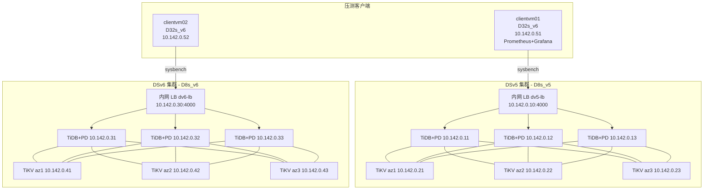
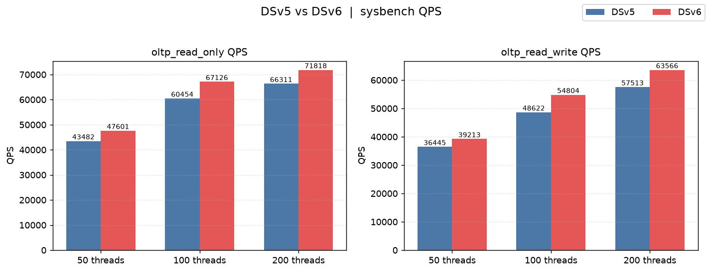
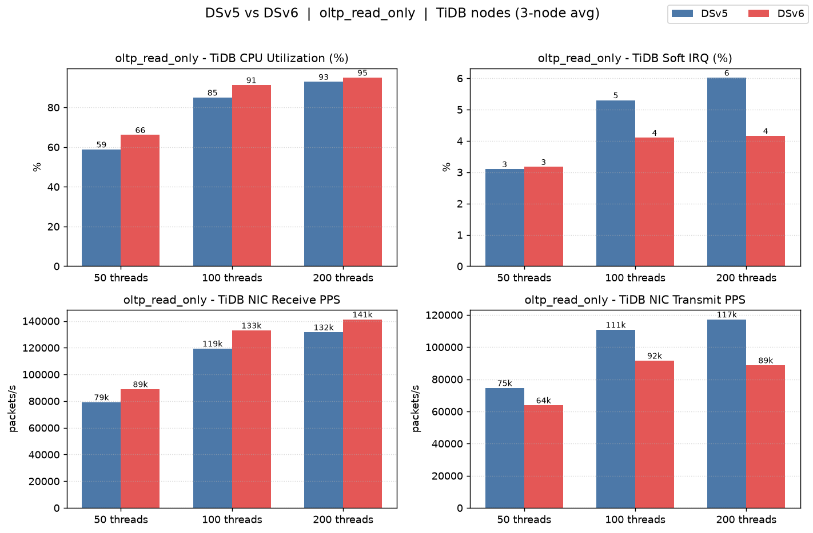
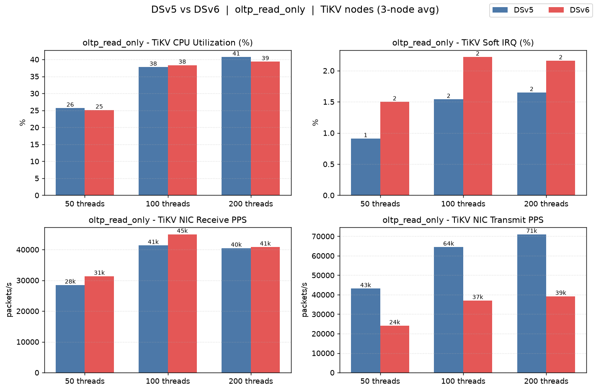
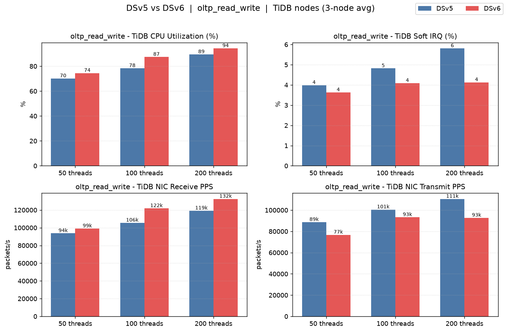
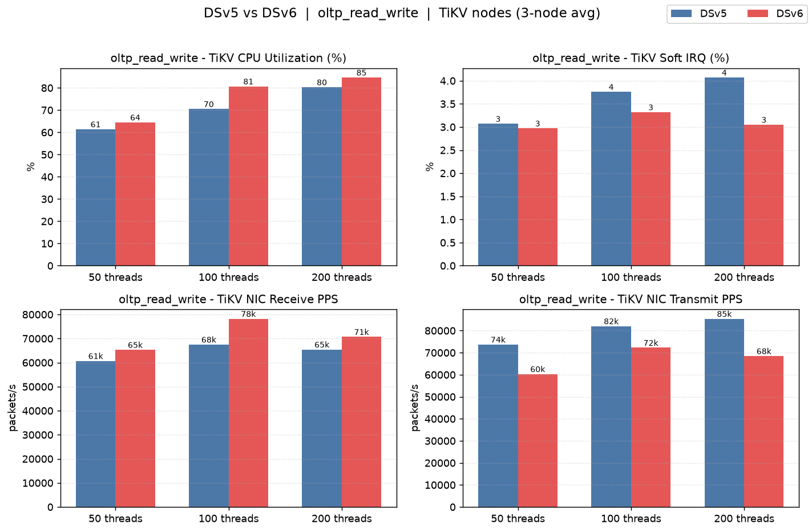
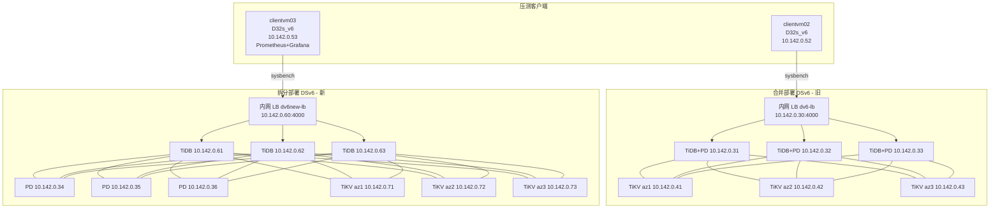

# 第一部分：TiDB DSv5 与 DSv6 集群 sysbench 压测对比报告

> 报告日期：2026-06-16  
> 数据库版本：TiDB v8.5.6（两套集群版本一致）  
> 压测工具：sysbench 1.0.20  
> 区域：Azure Germany West Central（germanywestcentral）

---

## 1. 测试环境说明

本次测试在 Azure 上部署了两套架构完全相同、仅虚拟机系列不同的 TiDB 集群，用于对比 **Dsv5（上一代）** 与 **Dsv6（新一代）** 计算实例在相同 OLTP 负载下的性能差异。

### 1.1 集群规格

| 项目 | DSv5 集群 | DSv6 集群 |
|---|---|---|
| 数据库节点 VM 系列 | Standard_D8s_v5 | Standard_D8s_v6 |
| 单节点 vCPU / 内存 | 8 vCPU / 32 GB | 8 vCPU / 32 GB |
| 压测客户端 | clientvm01（Standard_D32s_v6） | clientvm02（Standard_D32s_v6） |
| 操作系统 | Rocky Linux 9.8 | Rocky Linux 9.8 |
| TiDB 版本 | v8.5.6 | v8.5.6 |
| 数据盘 | Premium SSD v2，200 GB / 3000 IOPS / 125 MB/s | Premium SSD v2，200 GB / 3000 IOPS / 125 MB/s |
| 接入入口 | 内网 Standard LB `10.142.0.10:4000` | 内网 Standard LB `10.142.0.30:4000` |

> 两套集群唯一变量为 **VM 系列（Dsv5 → Dsv6）**，其余（vCPU、内存、磁盘、OS、TiDB 版本、拓扑、网络）均保持一致，确保对比公平。

### 1.2 网络与拓扑参数

- VNet：`10.142.0.0/16`，子网 `10.142.0.0/24`
- 每套集群：3 个 TiDB+PD 合一节点 + 3 个 TiKV 节点，TiKV 按 zone 跨 3 个可用区打散
- 副本策略：`max-replicas=3`，按 `zone/host` 标签打散
- TiKV `block-cache.capacity=14GB`（约为 32 GB 内存的 45%）

### 1.3 压测参数

| 参数 | 取值 |
|---|---|
| 数据规模 | 32 张表 × 100 万行（每表） |
| 测试用例 | `oltp_read_only`、`oltp_read_write` |
| 并发线程 | 50 / 100 / 200 |
| 每组时长 | 300 秒（report-interval=30s） |
| 随机分布 | uniform |
| Prepared statement | 关闭（`--db-ps-mode=disable`） |
| 执行方式 | 两套集群**并发**压测，互不干扰 |

### 1.4 指标采集

主机级系统指标由 node_exporter 采集，统一汇入部署在 clientvm01 的 Prometheus（`10.142.0.51:9090`）。DSv6 的 6 个节点已并入同一 Prometheus 实现统一查询。每组压测的系统指标按其精确的起止时间窗口做区间平均（PromQL `rate(...[1m])`），并按 TiDB 节点与 TiKV 节点分组取 3 节点均值。

---

## 2. 部署架构

- 每套集群 6 个数据库节点：3 × (TiDB + PD 合一) + 3 × TiKV
- 客户端经各自集群的**内网负载均衡器**接入 TiDB:4000，LB 后端为 3 个 TiDB 节点
- clientvm01 同时承载 Prometheus / Grafana，统一采集两套集群的 node_exporter 指标

---

## 3. sysbench 测试结果

> 性能提升% 均以 DSv5 为基线：QPS 提升% =（DSv6 − DSv5）/ DSv5 × 100；延迟降低% =（DSv5 − DSv6）/ DSv5 × 100。

### 3.1 oltp_read_only（只读）

| 并发 | DSv5 QPS | DSv6 QPS | QPS 提升 | DSv5 avg(ms) | DSv6 avg(ms) | 延迟降低 | DSv5 TPS | DSv6 TPS |
|---:|---:|---:|---:|---:|---:|---:|---:|---:|
| 50  | 43481.73 | 47601.27 | **+9.47%**  | 18.40 | 16.80 | **-8.70%** | 2717.61 | 2975.08 |
| 100 | 60454.05 | 67126.49 | **+11.04%** | 26.46 | 23.83 | **-9.94%** | 3778.38 | 4195.41 |
| 200 | 66311.16 | 71817.68 | **+8.30%**  | 48.25 | 44.55 | **-7.67%** | 4144.45 | 4488.61 |

### 3.2 oltp_read_write（读写混合）

| 并发 | DSv5 QPS | DSv6 QPS | QPS 提升 | DSv5 avg(ms) | DSv6 avg(ms) | 延迟降低 | DSv5 TPS | DSv6 TPS |
|---:|---:|---:|---:|---:|---:|---:|---:|---:|
| 50  | 36445.16 | 39212.82 | **+7.59%**  | 27.44 | 25.50 | **-7.07%**  | 1822.26 | 1960.64 |
| 100 | 48622.19 | 54803.99 | **+12.71%** | 41.13 | 36.49 | **-11.28%** | 2431.11 | 2740.20 |
| 200 | 57513.23 | 63565.59 | **+10.52%** | 69.54 | 62.92 | **-9.52%**  | 2875.66 | 3178.28 |

### 3.3 p95 延迟（ms）

| 并发 | RO DSv5 | RO DSv6 | RW DSv5 | RW DSv6 |
|---:|---:|---:|---:|---:|
| 50  | 23.52 | 21.89 | 34.95 | 31.94 |
| 100 | 36.24 | 31.37 | 56.84 | 48.34 |
| 200 | 68.05 | 58.92 | 94.10 | 84.47 |

### 3.4 结论小结

- **QPS：** DSv6 在全部 12 个测试场景下均优于 DSv5，提升幅度约 **7.6% ~ 12.7%**，平均约 **+9.9%**。
- **延迟：** DSv6 平均延迟与 p95 延迟在所有场景下均更低，平均延迟降低约 **7% ~ 11%**。
- **峰值吞吐：** 只读 200 并发下 DSv6 达到 71817 QPS（DSv5 为 66311）；读写 200 并发下 DSv6 达到 63565 QPS（DSv5 为 57513）。
- 提升最显著的负载点为 **100 并发**（读写 +12.71%、只读 +11.04%），说明 DSv6 在中高并发下计算能力优势更明显。

---

## 4. 主机系统指标（压测窗口内均值）

下列数据为各组压测时间窗内，按 TiDB 节点（3 台）/ TiKV 节点（3 台）分组的均值。`CPU idle`、`CPU 利用率`、`软中断(softirq)` 单位为 %（单核占比口径，已对全核 rate 求平均）；`RX/TX PPS` 为网卡每秒收/发包数（已排除 lo）。

### 4.1 oltp_read_only — TiDB 节点

| 并发 | 集群 | CPU idle% | CPU 利用% | softirq% | RX PPS | TX PPS |
|---:|---|---:|---:|---:|---:|---:|
| 50  | DSv5 | 41.18 | 58.82 | 3.10 | 79177 | 74525 |
| 50  | DSv6 | 33.86 | 66.14 | 3.17 | 88979 | 63826 |
| 100 | DSv5 | 15.05 | 84.95 | 5.30 | 119408 | 110794 |
| 100 | DSv6 | 8.70  | 91.30 | 4.10 | 132971 | 91562 |
| 200 | DSv5 | 7.10  | 92.90 | 6.02 | 131633 | 117221 |
| 200 | DSv6 | 5.00  | 95.00 | 4.16 | 141233 | 88704 |

### 4.2 oltp_read_only — TiKV 节点

| 并发 | 集群 | CPU idle% | CPU 利用% | softirq% | RX PPS | TX PPS |
|---:|---|---:|---:|---:|---:|---:|
| 50  | DSv5 | 74.32 | 25.68 | 0.91 | 28488 | 43134 |
| 50  | DSv6 | 74.89 | 25.11 | 1.50 | 31346 | 24079 |
| 100 | DSv5 | 62.26 | 37.74 | 1.54 | 41372 | 64479 |
| 100 | DSv6 | 61.68 | 38.32 | 2.22 | 44982 | 37029 |
| 200 | DSv5 | 59.27 | 40.73 | 1.65 | 40485 | 71026 |
| 200 | DSv6 | 60.64 | 39.36 | 2.16 | 40839 | 39182 |

**图：oltp_read_only — TiDB 节点系统指标对比**

**图：oltp_read_only — TiKV 节点系统指标对比**

### 4.3 oltp_read_write — TiDB 节点

| 并发 | 集群 | CPU idle% | CPU 利用% | softirq% | RX PPS | TX PPS |
|---:|---|---:|---:|---:|---:|---:|
| 50  | DSv5 | 29.86 | 70.14 | 3.99 | 93696 | 88665 |
| 50  | DSv6 | 25.52 | 74.48 | 3.63 | 99066 | 76742 |
| 100 | DSv5 | 21.67 | 78.33 | 4.82 | 105541 | 100520 |
| 100 | DSv6 | 12.63 | 87.37 | 4.09 | 121837 | 93280 |
| 200 | DSv5 | 10.53 | 89.47 | 5.81 | 119193 | 110514 |
| 200 | DSv6 | 5.68  | 94.32 | 4.13 | 132474 | 92709 |

### 4.4 oltp_read_write — TiKV 节点

| 并发 | 集群 | CPU idle% | CPU 利用% | softirq% | RX PPS | TX PPS |
|---:|---|---:|---:|---:|---:|---:|
| 50  | DSv5 | 38.59 | 61.41 | 3.07 | 60688 | 73686 |
| 50  | DSv6 | 35.51 | 64.49 | 2.97 | 65317 | 60328 |
| 100 | DSv5 | 29.52 | 70.48 | 3.76 | 67504 | 82046 |
| 100 | DSv6 | 19.32 | 80.68 | 3.32 | 78210 | 72247 |
| 200 | DSv5 | 19.70 | 80.30 | 4.07 | 65438 | 85384 |
| 200 | DSv6 | 15.33 | 84.67 | 3.05 | 70704 | 68456 |

**图：oltp_read_write — TiDB 节点系统指标对比**

**图：oltp_read_write — TiKV 节点系统指标对比**

### 4.5 系统指标解读

- **CPU：** 在同等并发下，DSv6 的 TiDB 节点 CPU idle 普遍更低、利用率更高（例如读写 100 并发：DSv6 利用率 87.37% vs DSv5 78.33%）。这与 DSv6 吞吐更高一致——DSv6 在单位时间内完成了更多请求，CPU 被更充分利用，单请求的 CPU 成本更低。
- **软中断（softirq）：** DSv6 的软中断占比在多数场景**低于** DSv5（如只读 200 并发 TiDB：4.16% vs 6.02%），表明新一代实例在网络/中断处理上的开销更小。
- **网卡 PPS：** DSv6 的 RX PPS 普遍更高（与更高 QPS 相符），而 TX PPS 反而低于 DSv5，主要源于 DSv5/DSv6 网卡多队列与中断聚合行为差异；两套集群均未触及网卡 PPS 瓶颈。
- **瓶颈定位：** 高并发（200）下 TiDB 节点 CPU 利用率接近饱和（DSv6 达 94~95%），而 TiKV 节点 CPU 仍有余量（idle 约 15~60%），说明本负载下**计算瓶颈集中在 TiDB（SQL）层**，这也正是 DSv6 计算升级直接带来 QPS 提升的原因。

---

## 5. 总体结论

1. 在完全相同的拓扑、磁盘、内存、TiDB 版本与压测参数下，**DSv6 相比 DSv5 在所有 12 个场景均取得正向性能提升**。
2. **QPS 平均提升约 9.9%（区间 7.6%~12.7%），平均延迟与 p95 延迟同步下降约 7%~11%**。
3. 提升来源主要是 DSv6 更强的单核计算能力：相同并发下 DSv6 用更高的 CPU 利用率与更低的软中断开销，完成了更多的 SQL 处理。
4. 本 OLTP 负载的瓶颈位于 TiDB（SQL）计算层，因此 Dsv5 → Dsv6 的计算实例升级能较直接地转化为吞吐与延迟收益；对该类负载，**推荐采用 DSv6 系列**。

---

# 第二部分：DSv6 合并部署 vs 拆分角色部署（新增）

> 本部分新增于 2026-06-30。前面第一部分（第 1~5 节）对比的是 **DSv5 与 DSv6 在相同合并拓扑下的差异**；本部分在 DSv6 系列内部，进一步对比 **两种部署架构**对同一 OLTP 负载的性能影响：
> - **合并部署（旧）**：3 × (TiDB+PD 同机) + 3 × TiKV，接入 LB `10.142.0.30`
> - **拆分部署（新）**：3 × TiDB + 3 × PD + 3 × TiKV（三角色完全分离），接入 LB `10.142.0.60`

## 6. 测试环境说明（DSv6 合并 vs 拆分）

本轮在同一 Azure 区域、同一 VNet 内新增部署了一套 **角色完全分离** 的 DSv6 集群（TiDB / PD / TiKV 各 3 台独立成节点），与第一部分中已有的 **TiDB+PD 合一** 的 DSv6 集群做对比，用以评估将 PD 从 TiDB 节点剥离、三角色独立后的性能变化。

### 6.1 集群规格

| 项目 | 合并部署 DSv6（旧） | 拆分部署 DSv6（新） |
|---|---|---|
| 部署架构 | 3 × (TiDB+PD 同机) + 3 × TiKV | 3 × TiDB + 3 × PD + 3 × TiKV |
| 数据库节点 VM 系列 | Standard_D8s_v5… → Standard_D8s_v6 | Standard_D8s_v6 |
| 单节点 vCPU / 内存 | 8 vCPU / 32 GB | 8 vCPU / 32 GB |
| 节点总数 | 6（3 + 3） | 9（3 + 3 + 3） |
| 压测客户端 | clientvm02（Standard_D32s_v6） | clientvm03（Standard_D32s_v6） |
| 操作系统 | Rocky Linux 9.8 | Rocky Linux 9.8 |
| TiDB 版本 | v8.5.6 | v8.5.6 |
| 数据盘 | Premium SSD v2，200 GB / 3000 IOPS / 125 MB/s | Premium SSD v2，200 GB / 3000 IOPS / 125 MB/s |
| 数据目录 | `/tidb/data`（独立数据盘） | `/tidb/data`（独立数据盘） |
| 接入入口 | 内网 Standard LB `10.142.0.30:4000` | 内网 Standard LB `10.142.0.60:4000` |

> 两套集群唯一变量为 **部署架构（TiDB+PD 合一 → TiDB/PD/TiKV 三角色分离）**，其余（VM 系列、vCPU、内存、磁盘、TiDB 版本、压测参数）均保持一致。

### 6.2 网络与拓扑参数

- VNet：`10.142.0.0/16`，子网 `10.142.0.0/24`（与第一部分同一网络）
- 合并 DSv6：TiDB+PD 合一 `10.142.0.31/.32/.33`，TiKV `10.142.0.41/.42/.43`
- 拆分 DSv6：TiDB `10.142.0.61/.62/.63`，PD `10.142.0.34/.35/.36`，TiKV `10.142.0.71/.72/.73`
- TiKV 均按 zone 跨 3 个可用区打散，副本策略 `max-replicas=3`，按 `zone/host` 标签打散
- TiKV `block-cache.capacity=14GB`（约为 32 GB 内存的 45%）
- 接入入口均为各自集群的内网 Standard LB，后端仅挂 3 个 TiDB:4000

### 6.3 压测参数

| 参数 | 取值 |
|---|---|
| 数据规模 | 32 张表 × 100 万行（每表） |
| 测试用例 | `oltp_read_only`、`oltp_read_write` |
| 并发线程 | 50 / 100 / 200 |
| 每组时长 | 300 秒（report-interval=30s） |
| 随机分布 | uniform |
| Prepared statement | 关闭（`--db-ps-mode=disable`） |
| 执行方式 | 拆分集群由 clientvm03 **独立**压测 |

> **对比口径说明**：旧合并 DSv6 数据来自第一部分既有结果（当时与 DSv5 **并发**压测）；新拆分 DSv6 数据来自 clientvm03 **独立**压测。测试命令、数据规模与压测参数完全一致，差异仅在于执行时是否有并发其它集群——读者解读时请留意此口径差异。

### 6.4 指标采集

拆分集群自带一套监控栈（Prometheus / Grafana / Alertmanager）部署在 clientvm03（`10.142.0.53`），统一抓取 9 个新节点的 node_exporter（`:9100`）。每组压测的系统指标按其精确起止时间窗口做区间平均（PromQL `rate(...[1m])`），并按 TiDB / PD / TiKV 三组各取 3 节点均值。合并 DSv6 的指标沿用第一部分采集结果。

## 7. 部署架构（DSv6 合并 vs 拆分）

- 合并部署：3 个 (TiDB + PD 合一) 节点 + 3 个 TiKV 节点，PD 与 SQL 同机
- 拆分部署：TiDB、PD、TiKV 三角色各 3 台独立成节点，PD 不再与 TiDB 争抢同机 CPU
- 两套集群均经各自内网 LB 接入 TiDB:4000，TiKV 跨 3 可用区打散

## 8. sysbench 测试结果（DSv6 合并 vs 拆分）

> 变化% 均以 **合并部署 DSv6** 为基线：QPS 变化% =（拆分 − 合并）/ 合并 × 100；延迟变化% =（拆分 − 合并）/ 合并 × 100（负值代表拆分更优）。

### 8.1 oltp_read_only（只读）

| 并发 | 合并 DSv6 QPS | 拆分 DSv6 QPS | QPS 变化 | 合并 avg(ms) | 拆分 avg(ms) | avg 延迟变化 | 合并 p95(ms) | 拆分 p95(ms) | p95 变化 |
|---:|---:|---:|---:|---:|---:|---:|---:|---:|---:|
| 50  | 47601.27 | 47284.96 | -0.66% | 16.80 | 16.92 | +0.71% | 21.89 | 23.52 | +7.45% |
| 100 | 67126.49 | 70275.41 | **+4.69%** | 23.83 | 22.77 | **-4.45%** | 31.37 | 30.26 | **-3.54%** |
| 200 | 71817.68 | 74860.57 | **+4.24%** | 44.55 | 42.74 | **-4.06%** | 58.92 | 56.84 | **-3.53%** |

### 8.2 oltp_read_write（读写混合）

| 并发 | 合并 DSv6 QPS | 拆分 DSv6 QPS | QPS 变化 | 合并 avg(ms) | 拆分 avg(ms) | avg 延迟变化 | 合并 p95(ms) | 拆分 p95(ms) | p95 变化 |
|---:|---:|---:|---:|---:|---:|---:|---:|---:|---:|
| 50  | 39212.82 | 39484.41 | +0.69% | 25.50 | 25.32 | -0.71% | 31.94 | 32.53 | +1.85% |
| 100 | 54803.99 | 55791.12 | +1.80% | 36.49 | 35.84 | -1.78% | 48.34 | 48.34 | 0.00% |
| 200 | 63565.59 | 65846.18 | **+3.59%** | 62.92 | 60.74 | **-3.46%** | 84.47 | 81.48 | **-3.54%** |

**图：DSv6 合并 vs 拆分 QPS 对比**

## 9. 主机系统指标（DSv6 合并 vs 拆分）

下列数据为各组压测时间窗内，按 TiDB / PD / TiKV 节点分组的 3 节点均值。

### 9.1 oltp_read_only — TiDB 节点（3 节点均值）

| 并发 | 部署 | CPU idle% | CPU 利用% | softirq% | RX PPS | TX PPS |
|---:|---|---:|---:|---:|---:|---:|
| 50  | 合并 | 33.86 | 66.14 | 3.17 | 88979  | 63826 |
| 50  | 拆分 | 35.90 | 64.10 | 3.16 | 87533  | 62790 |
| 100 | 合并 | 8.70  | 91.30 | 4.10 | 132971 | 91562 |
| 100 | 拆分 | 9.73  | 90.27 | 4.14 | 137223 | 94463 |
| 200 | 合并 | 5.00  | 95.00 | 4.16 | 141233 | 88704 |
| 200 | 拆分 | 5.43  | 94.57 | 4.24 | 146606 | 91667 |

### 9.2 oltp_read_only — TiKV 节点（3 节点均值）

| 并发 | 部署 | CPU idle% | CPU 利用% | softirq% | RX PPS | TX PPS |
|---:|---|---:|---:|---:|---:|---:|
| 50  | 合并 | 74.89 | 25.11 | 1.50 | 31346 | 24079 |
| 50  | 拆分 | 73.24 | 26.76 | 1.61 | 31520 | 23927 |
| 100 | 合并 | 61.68 | 38.32 | 2.22 | 44982 | 37029 |
| 100 | 拆分 | 57.82 | 42.18 | 2.46 | 47705 | 38900 |
| 200 | 合并 | 60.64 | 39.36 | 2.16 | 40839 | 39182 |
| 200 | 拆分 | 55.55 | 44.45 | 2.40 | 43121 | 41316 |

### 9.3 oltp_read_write — TiDB 节点（3 节点均值）

| 并发 | 部署 | CPU idle% | CPU 利用% | softirq% | RX PPS | TX PPS |
|---:|---|---:|---:|---:|---:|---:|
| 50  | 合并 | 25.52 | 74.48 | 3.63 | 99066  | 76742 |
| 50  | 拆分 | 28.77 | 71.23 | 3.54 | 96624  | 75120 |
| 100 | 合并 | 12.63 | 87.37 | 4.09 | 121837 | 93280 |
| 100 | 拆分 | 15.98 | 84.02 | 3.97 | 120417 | 94559 |
| 200 | 合并 | 5.68  | 94.32 | 4.13 | 132474 | 92709 |
| 200 | 拆分 | 6.55  | 93.45 | 4.15 | 133843 | 97137 |

### 9.4 oltp_read_write — TiKV 节点（3 节点均值）

| 并发 | 部署 | CPU idle% | CPU 利用% | softirq% | RX PPS | TX PPS |
|---:|---|---:|---:|---:|---:|---:|
| 50  | 合并 | 35.51 | 64.49 | 2.97 | 65317 | 60328 |
| 50  | 拆分 | 31.78 | 68.22 | 3.25 | 65701 | 60096 |
| 100 | 合并 | 19.32 | 80.68 | 3.32 | 78210 | 72247 |
| 100 | 拆分 | 16.42 | 83.58 | 3.49 | 78152 | 69137 |
| 200 | 合并 | 15.33 | 84.67 | 3.05 | 70704 | 68456 |
| 200 | 拆分 | 11.02 | 88.98 | 3.29 | 73908 | 66889 |

### 9.5 拆分部署新增观察：PD 节点负载

拆分部署下，PD 从 TiDB 节点中剥离后成为独立角色。压测窗口内 3 台 PD 的平均 CPU 利用率在 **1.58% ~ 2.42%** 之间（少量 leader/调度波动会使单节点瞬时更高），说明 PD 资源消耗总体较低，且不会再与 TiDB SQL 处理争抢同机 CPU。

### 9.6 瓶颈分析：为什么拆分收益有限

**结论：本 OLTP 负载的瓶颈在 TiDB（SQL 计算层）的 CPU，而非 TiKV、PD 或网络。** 拆分收益有限，根因是合并部署中 PD 本就占用极少 CPU，剥离后能腾出的余量也十分有限。

**1. 高并发下 TiDB CPU 已基本打满，TiKV / PD 仍有余量**

| 场景（拆分部署） | TiDB 利用% | TiKV 利用% | PD 利用% |
|---|---:|---:|---:|
| oltp_read_only / 200 并发 | **94.57**（idle 仅 5.43） | 44.45 | ~1.6 |
| oltp_read_write / 200 并发 | **93.45** | 88.98 | ~1.9 |

- 只读负载：TiDB ~95% 打满，TiKV 仅 44%、PD 不足 2% → 瓶颈完全在 TiDB。
- 读写负载：TiDB ~93%、TiKV ~89%，TiDB 仍先到顶；TiKV 接近但未超过 TiDB。

**2. 拆分收益 ≈ 合并时 PD 占用的 CPU**

- PD 在所有场景下 CPU 利用率仅 **1.58% ~ 2.42%**。
- 把 PD 从 TiDB 节点剥离，相当于给每台 TiDB “退还”约 2% 的 CPU 余量。
- 实测平均 QPS 提升 **+2.39%**，与腾出的 PD CPU 量几乎一一对应——说明拆分基本只赚到“不再与 PD 争抢同机 CPU”这一点红利。

**3. 网络软中断是第二大隐性消耗（非主因）**

- TiDB 节点 softirq 在高并发下达 **4.1% ~ 4.2%**，RX/TX 高达约 14 万 pps。
- 这部分纯网络收发包开销同样吃 TiDB 的 CPU，进一步压缩了 SQL 处理可用核。

**4. 提升方向（针对 TiDB 计算层）**

1. **扩 TiDB**：增加 TiDB 节点数或换更高单核性能 / 更多核的 VM（OLTP 对单核敏感），收益最直接。
2. **降低单查询 CPU**：生产环境开启 prepared statement（本轮压测为 `--db-ps-mode=disable`），减少 SQL 解析开销。
3. **削减网络 softirq**：连接池复用、网卡多队列中断打散（RPS/RSS）、合并小包。
4. **TiKV 暂非瓶颈**：只读仅 44%、读写 89% 接近但未超 TiDB，当前负载下扩 TiKV 收益不如扩 TiDB。

## 10. 本轮结论（DSv6 内部架构对比）

1. 在本轮口径下，**拆分部署总体优于合并部署**：6 个场景平均 QPS 提升约 **+2.39%**（只读平均 +2.75%，读写平均 +2.03%）。
2. 在中高并发（100/200）下，拆分部署收益更稳定：只读 QPS 提升约 **+4.2% ~ +4.7%**，读写提升约 **+1.8% ~ +3.6%**，同时平均延迟与 p95 多数场景下降。
3. 低并发（50）收益不明显，且只读 p95 有小幅回退（+7.45%）；高并发时拆分带来的资源隔离优势更容易体现。
4. 从系统指标看，拆分后 TiKV 在中高并发下承担更多有效负载（CPU 利用率与 RX/TX PPS 上升），符合“TiDB/PD 解耦、调度与 SQL 互不争抢”的预期。
5. **拆分收益有限的根因**：本负载瓶颈在 TiDB 计算层（高并发下 TiDB CPU ~95% 打满，TiKV/PD 仍有余量），而合并时 PD 仅占用约 2% CPU，故剥离 PD 腾出的余量与实测 +2.39% 的提升基本吻合。要进一步提升应优先扩 TiDB 计算资源（详见 9.6）。

---

## 附录：原始数据来源

- sysbench 结果 CSV：`/tmp/bench-dsv5.csv`、`/tmp/bench-dsv6.csv`（节点本地）
- 系统指标 CSV：`/tmp/metrics.csv`（含每节点逐组明细，72 行）
- 指标查询源：Prometheus `http://10.142.0.51:9090`，PromQL 指标 `node_cpu_seconds_total`、`node_network_receive_packets_total`、`node_network_transmit_packets_total`
- 压测/采集脚本：`scripts/41-run-bench.sh`、`scripts/42-export-metrics.sh`、`scripts/43-export-missing.sh`
- 图表生成脚本：`report/make_charts.py`（输出至 `report/images/`）
