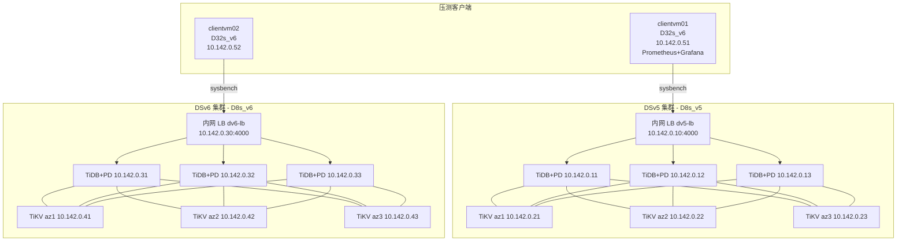
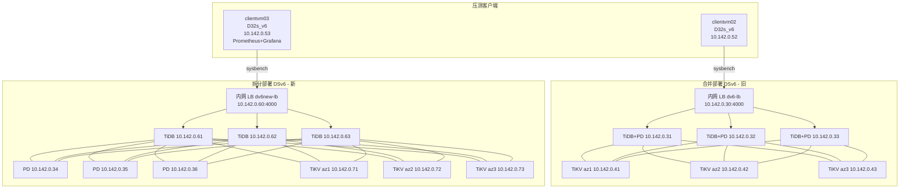
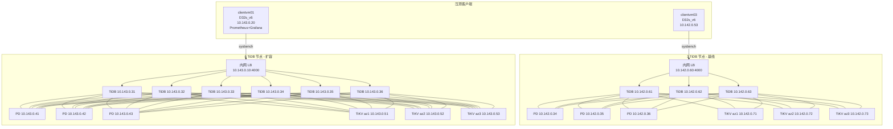
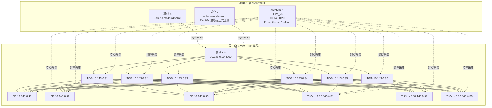

# 第一部分：TiDB DSv5 与 DSv6 集群 sysbench 压测对比报告

> 报告日期：2026-06-16  
> 数据库版本：TiDB v8.5.6（两套集群版本一致）  
> 压测工具：sysbench 1.0.20  
> 区域：Azure Germany West Central（germanywestcentral）

---

## 1. 测试环境说明

本次测试在 Azure 上部署了两套架构完全相同、仅虚拟机系列不同的 TiDB 集群，用于对比 **Dsv5（上一代）** 与 **Dsv6（新一代）** 计算实例在相同 OLTP 负载下的性能差异。

### 1.1 集群规格

| 项目 | DSv5 集群 | DSv6 集群 |
|---|---|---|
| 数据库节点 VM 系列 | Standard_D8s_v5 | Standard_D8s_v6 |
| 单节点 vCPU / 内存 | 8 vCPU / 32 GB | 8 vCPU / 32 GB |
| 压测客户端 | clientvm01（Standard_D32s_v6） | clientvm02（Standard_D32s_v6） |
| 操作系统 | Rocky Linux 9.8 | Rocky Linux 9.8 |
| TiDB 版本 | v8.5.6 | v8.5.6 |
| 数据盘 | Premium SSD v2，200 GB / 3000 IOPS / 125 MB/s | Premium SSD v2，200 GB / 3000 IOPS / 125 MB/s |
| 接入入口 | 内网 Standard LB `10.142.0.10:4000` | 内网 Standard LB `10.142.0.30:4000` |

> 两套集群唯一变量为 **VM 系列（Dsv5 → Dsv6）**，其余（vCPU、内存、磁盘、OS、TiDB 版本、拓扑、网络）均保持一致，确保对比公平。

### 1.2 网络与拓扑参数

- VNet：`10.142.0.0/16`，子网 `10.142.0.0/24`
- 每套集群：3 个 TiDB+PD 合一节点 + 3 个 TiKV 节点，TiKV 按 zone 跨 3 个可用区打散
- 副本策略：`max-replicas=3`，按 `zone/host` 标签打散
- TiKV `block-cache.capacity=14GB`（约为 32 GB 内存的 45%）

### 1.3 压测参数

| 参数 | 取值 |
|---|---|
| 数据规模 | 32 张表 × 100 万行（每表） |
| 测试用例 | `oltp_read_only`、`oltp_read_write` |
| 并发线程 | 50 / 100 / 200 |
| 每组时长 | 300 秒（report-interval=30s） |
| 随机分布 | uniform |
| Prepared statement | 关闭（`--db-ps-mode=disable`） |
| 执行方式 | 两套集群**并发**压测，互不干扰 |

### 1.4 指标采集

主机级系统指标由 node_exporter 采集，统一汇入部署在 clientvm01 的 Prometheus（`10.142.0.51:9090`）。DSv6 的 6 个节点已并入同一 Prometheus 实现统一查询。每组压测的系统指标按其精确的起止时间窗口做区间平均（PromQL `rate(...[1m])`），并按 TiDB 节点与 TiKV 节点分组取 3 节点均值。

---

## 2. 部署架构

- 每套集群 6 个数据库节点：3 × (TiDB + PD 合一) + 3 × TiKV
- 客户端经各自集群的**内网负载均衡器**接入 TiDB:4000，LB 后端为 3 个 TiDB 节点
- clientvm01 同时承载 Prometheus / Grafana，统一采集两套集群的 node_exporter 指标

---

## 3. sysbench 测试结果

> 性能提升% 均以 DSv5 为基线：QPS 提升% =（DSv6 − DSv5）/ DSv5 × 100；延迟降低% =（DSv5 − DSv6）/ DSv5 × 100。

### 3.1 oltp_read_only（只读）

| 并发 | DSv5 QPS | DSv6 QPS | QPS 提升 | DSv5 avg(ms) | DSv6 avg(ms) | 延迟降低 | DSv5 TPS | DSv6 TPS |
|---:|---:|---:|---:|---:|---:|---:|---:|---:|
| 50  | 43481.73 | 47601.27 | **+9.47%**  | 18.40 | 16.80 | **-8.70%** | 2717.61 | 2975.08 |
| 100 | 60454.05 | 67126.49 | **+11.04%** | 26.46 | 23.83 | **-9.94%** | 3778.38 | 4195.41 |
| 200 | 66311.16 | 71817.68 | **+8.30%**  | 48.25 | 44.55 | **-7.67%** | 4144.45 | 4488.61 |

### 3.2 oltp_read_write（读写混合）

| 并发 | DSv5 QPS | DSv6 QPS | QPS 提升 | DSv5 avg(ms) | DSv6 avg(ms) | 延迟降低 | DSv5 TPS | DSv6 TPS |
|---:|---:|---:|---:|---:|---:|---:|---:|---:|
| 50  | 36445.16 | 39212.82 | **+7.59%**  | 27.44 | 25.50 | **-7.07%**  | 1822.26 | 1960.64 |
| 100 | 48622.19 | 54803.99 | **+12.71%** | 41.13 | 36.49 | **-11.28%** | 2431.11 | 2740.20 |
| 200 | 57513.23 | 63565.59 | **+10.52%** | 69.54 | 62.92 | **-9.52%**  | 2875.66 | 3178.28 |

### 3.3 p95 延迟（ms）

| 并发 | RO DSv5 | RO DSv6 | RW DSv5 | RW DSv6 |
|---:|---:|---:|---:|---:|
| 50  | 23.52 | 21.89 | 34.95 | 31.94 |
| 100 | 36.24 | 31.37 | 56.84 | 48.34 |
| 200 | 68.05 | 58.92 | 94.10 | 84.47 |

### 3.4 结论小结

- **QPS：** DSv6 在全部 12 个测试场景下均优于 DSv5，提升幅度约 **7.6% ~ 12.7%**，平均约 **+9.9%**。
- **延迟：** DSv6 平均延迟与 p95 延迟在所有场景下均更低，平均延迟降低约 **7% ~ 11%**。
- **峰值吞吐：** 只读 200 并发下 DSv6 达到 71817 QPS（DSv5 为 66311）；读写 200 并发下 DSv6 达到 63565 QPS（DSv5 为 57513）。
- 提升最显著的负载点为 **100 并发**（读写 +12.71%、只读 +11.04%），说明 DSv6 在中高并发下计算能力优势更明显。

---

## 4. 主机系统指标（压测窗口内均值）

下列数据为各组压测时间窗内，按 TiDB 节点（3 台）/ TiKV 节点（3 台）分组的均值。`CPU idle`、`CPU 利用率`、`软中断(softirq)` 单位为 %（单核占比口径，已对全核 rate 求平均）；`RX/TX PPS` 为网卡每秒收/发包数（已排除 lo）。

### 4.1 oltp_read_only — TiDB 节点

| 并发 | 集群 | CPU idle% | CPU 利用% | softirq% | RX PPS | TX PPS |
|---:|---|---:|---:|---:|---:|---:|
| 50  | DSv5 | 41.18 | 58.82 | 3.10 | 79177 | 74525 |
| 50  | DSv6 | 33.86 | 66.14 | 3.17 | 88979 | 63826 |
| 100 | DSv5 | 15.05 | 84.95 | 5.30 | 119408 | 110794 |
| 100 | DSv6 | 8.70  | 91.30 | 4.10 | 132971 | 91562 |
| 200 | DSv5 | 7.10  | 92.90 | 6.02 | 131633 | 117221 |
| 200 | DSv6 | 5.00  | 95.00 | 4.16 | 141233 | 88704 |

### 4.2 oltp_read_only — TiKV 节点

| 并发 | 集群 | CPU idle% | CPU 利用% | softirq% | RX PPS | TX PPS |
|---:|---|---:|---:|---:|---:|---:|
| 50  | DSv5 | 74.32 | 25.68 | 0.91 | 28488 | 43134 |
| 50  | DSv6 | 74.89 | 25.11 | 1.50 | 31346 | 24079 |
| 100 | DSv5 | 62.26 | 37.74 | 1.54 | 41372 | 64479 |
| 100 | DSv6 | 61.68 | 38.32 | 2.22 | 44982 | 37029 |
| 200 | DSv5 | 59.27 | 40.73 | 1.65 | 40485 | 71026 |
| 200 | DSv6 | 60.64 | 39.36 | 2.16 | 40839 | 39182 |

**图：oltp_read_only — TiDB 节点系统指标对比**

**图：oltp_read_only — TiKV 节点系统指标对比**

### 4.3 oltp_read_write — TiDB 节点

| 并发 | 集群 | CPU idle% | CPU 利用% | softirq% | RX PPS | TX PPS |
|---:|---|---:|---:|---:|---:|---:|
| 50  | DSv5 | 29.86 | 70.14 | 3.99 | 93696 | 88665 |
| 50  | DSv6 | 25.52 | 74.48 | 3.63 | 99066 | 76742 |
| 100 | DSv5 | 21.67 | 78.33 | 4.82 | 105541 | 100520 |
| 100 | DSv6 | 12.63 | 87.37 | 4.09 | 121837 | 93280 |
| 200 | DSv5 | 10.53 | 89.47 | 5.81 | 119193 | 110514 |
| 200 | DSv6 | 5.68  | 94.32 | 4.13 | 132474 | 92709 |

### 4.4 oltp_read_write — TiKV 节点

| 并发 | 集群 | CPU idle% | CPU 利用% | softirq% | RX PPS | TX PPS |
|---:|---|---:|---:|---:|---:|---:|
| 50  | DSv5 | 38.59 | 61.41 | 3.07 | 60688 | 73686 |
| 50  | DSv6 | 35.51 | 64.49 | 2.97 | 65317 | 60328 |
| 100 | DSv5 | 29.52 | 70.48 | 3.76 | 67504 | 82046 |
| 100 | DSv6 | 19.32 | 80.68 | 3.32 | 78210 | 72247 |
| 200 | DSv5 | 19.70 | 80.30 | 4.07 | 65438 | 85384 |
| 200 | DSv6 | 15.33 | 84.67 | 3.05 | 70704 | 68456 |

**图：oltp_read_write — TiDB 节点系统指标对比**

**图：oltp_read_write — TiKV 节点系统指标对比**

### 4.5 系统指标解读

- **CPU：** 在同等并发下，DSv6 的 TiDB 节点 CPU idle 普遍更低、利用率更高（例如读写 100 并发：DSv6 利用率 87.37% vs DSv5 78.33%）。这与 DSv6 吞吐更高一致——DSv6 在单位时间内完成了更多请求，CPU 被更充分利用，单请求的 CPU 成本更低。
- **软中断（softirq）：** DSv6 的软中断占比在多数场景**低于** DSv5（如只读 200 并发 TiDB：4.16% vs 6.02%），表明新一代实例在网络/中断处理上的开销更小。
- **网卡 PPS：** DSv6 的 RX PPS 普遍更高（与更高 QPS 相符），而 TX PPS 反而低于 DSv5，主要源于 DSv5/DSv6 网卡多队列与中断聚合行为差异；两套集群均未触及网卡 PPS 瓶颈。
- **瓶颈定位：** 高并发（200）下 TiDB 节点 CPU 利用率接近饱和（DSv6 达 94~95%），而 TiKV 节点 CPU 仍有余量（idle 约 15~60%），说明本负载下**计算瓶颈集中在 TiDB（SQL）层**，这也正是 DSv6 计算升级直接带来 QPS 提升的原因。

---

## 5. 总体结论

1. 在完全相同的拓扑、磁盘、内存、TiDB 版本与压测参数下，**DSv6 相比 DSv5 在所有 12 个场景均取得正向性能提升**。
2. **QPS 平均提升约 9.9%（区间 7.6%~12.7%），平均延迟与 p95 延迟同步下降约 7%~11%**。
3. 提升来源主要是 DSv6 更强的单核计算能力：相同并发下 DSv6 用更高的 CPU 利用率与更低的软中断开销，完成了更多的 SQL 处理。
4. 本 OLTP 负载的瓶颈位于 TiDB（SQL）计算层，因此 Dsv5 → Dsv6 的计算实例升级能较直接地转化为吞吐与延迟收益；对该类负载，**推荐采用 DSv6 系列**。

---

# 第二部分：DSv6 合并部署 vs 拆分角色部署（新增）

> 本部分新增于 2026-06-30。前面第一部分（第 1~5 节）对比的是 **DSv5 与 DSv6 在相同合并拓扑下的差异**；本部分在 DSv6 系列内部，进一步对比 **两种部署架构**对同一 OLTP 负载的性能影响：
> - **合并部署（旧）**：3 × (TiDB+PD 同机) + 3 × TiKV，接入 LB `10.142.0.30`
> - **拆分部署（新）**：3 × TiDB + 3 × PD + 3 × TiKV（三角色完全分离），接入 LB `10.142.0.60`

## 6. 测试环境说明（DSv6 合并 vs 拆分）

本轮在同一 Azure 区域、同一 VNet 内新增部署了一套 **角色完全分离** 的 DSv6 集群（TiDB / PD / TiKV 各 3 台独立成节点），与第一部分中已有的 **TiDB+PD 合一** 的 DSv6 集群做对比，用以评估将 PD 从 TiDB 节点剥离、三角色独立后的性能变化。

### 6.1 集群规格

| 项目 | 合并部署 DSv6（旧） | 拆分部署 DSv6（新） |
|---|---|---|
| 部署架构 | 3 × (TiDB+PD 同机) + 3 × TiKV | 3 × TiDB + 3 × PD + 3 × TiKV |
| 数据库节点 VM 系列 | Standard_D8s_v5… → Standard_D8s_v6 | Standard_D8s_v6 |
| 单节点 vCPU / 内存 | 8 vCPU / 32 GB | 8 vCPU / 32 GB |
| 节点总数 | 6（3 + 3） | 9（3 + 3 + 3） |
| 压测客户端 | clientvm02（Standard_D32s_v6） | clientvm03（Standard_D32s_v6） |
| 操作系统 | Rocky Linux 9.8 | Rocky Linux 9.8 |
| TiDB 版本 | v8.5.6 | v8.5.6 |
| 数据盘 | Premium SSD v2，200 GB / 3000 IOPS / 125 MB/s | Premium SSD v2，200 GB / 3000 IOPS / 125 MB/s |
| 数据目录 | `/tidb/data`（独立数据盘） | `/tidb/data`（独立数据盘） |
| 接入入口 | 内网 Standard LB `10.142.0.30:4000` | 内网 Standard LB `10.142.0.60:4000` |

> 两套集群唯一变量为 **部署架构（TiDB+PD 合一 → TiDB/PD/TiKV 三角色分离）**，其余（VM 系列、vCPU、内存、磁盘、TiDB 版本、压测参数）均保持一致。

### 6.2 网络与拓扑参数

- VNet：`10.142.0.0/16`，子网 `10.142.0.0/24`（与第一部分同一网络）
- 合并 DSv6：TiDB+PD 合一 `10.142.0.31/.32/.33`，TiKV `10.142.0.41/.42/.43`
- 拆分 DSv6：TiDB `10.142.0.61/.62/.63`，PD `10.142.0.34/.35/.36`，TiKV `10.142.0.71/.72/.73`
- TiKV 均按 zone 跨 3 个可用区打散，副本策略 `max-replicas=3`，按 `zone/host` 标签打散
- TiKV `block-cache.capacity=14GB`（约为 32 GB 内存的 45%）
- 接入入口均为各自集群的内网 Standard LB，后端仅挂 3 个 TiDB:4000

### 6.3 压测参数

| 参数 | 取值 |
|---|---|
| 数据规模 | 32 张表 × 100 万行（每表） |
| 测试用例 | `oltp_read_only`、`oltp_read_write` |
| 并发线程 | 50 / 100 / 200 |
| 每组时长 | 300 秒（report-interval=30s） |
| 随机分布 | uniform |
| Prepared statement | 关闭（`--db-ps-mode=disable`） |
| 执行方式 | 拆分集群由 clientvm03 **独立**压测 |

> **对比口径说明**：旧合并 DSv6 数据来自第一部分既有结果（当时与 DSv5 **并发**压测）；新拆分 DSv6 数据来自 clientvm03 **独立**压测。测试命令、数据规模与压测参数完全一致，差异仅在于执行时是否有并发其它集群——读者解读时请留意此口径差异。

### 6.4 指标采集

拆分集群自带一套监控栈（Prometheus / Grafana / Alertmanager）部署在 clientvm03（`10.142.0.53`），统一抓取 9 个新节点的 node_exporter（`:9100`）。每组压测的系统指标按其精确起止时间窗口做区间平均（PromQL `rate(...[1m])`），并按 TiDB / PD / TiKV 三组各取 3 节点均值。合并 DSv6 的指标沿用第一部分采集结果。

## 7. 部署架构（DSv6 合并 vs 拆分）

- 合并部署：3 个 (TiDB + PD 合一) 节点 + 3 个 TiKV 节点，PD 与 SQL 同机
- 拆分部署：TiDB、PD、TiKV 三角色各 3 台独立成节点，PD 不再与 TiDB 争抢同机 CPU
- 两套集群均经各自内网 LB 接入 TiDB:4000，TiKV 跨 3 可用区打散

## 8. sysbench 测试结果（DSv6 合并 vs 拆分）

> 变化% 均以 **合并部署 DSv6** 为基线：QPS 变化% =（拆分 − 合并）/ 合并 × 100；延迟变化% =（拆分 − 合并）/ 合并 × 100（负值代表拆分更优）。

### 8.1 oltp_read_only（只读）

| 并发 | 合并 DSv6 QPS | 拆分 DSv6 QPS | QPS 变化 | 合并 avg(ms) | 拆分 avg(ms) | avg 延迟变化 | 合并 p95(ms) | 拆分 p95(ms) | p95 变化 |
|---:|---:|---:|---:|---:|---:|---:|---:|---:|---:|
| 50  | 47601.27 | 47284.96 | -0.66% | 16.80 | 16.92 | +0.71% | 21.89 | 23.52 | +7.45% |
| 100 | 67126.49 | 70275.41 | **+4.69%** | 23.83 | 22.77 | **-4.45%** | 31.37 | 30.26 | **-3.54%** |
| 200 | 71817.68 | 74860.57 | **+4.24%** | 44.55 | 42.74 | **-4.06%** | 58.92 | 56.84 | **-3.53%** |

### 8.2 oltp_read_write（读写混合）

| 并发 | 合并 DSv6 QPS | 拆分 DSv6 QPS | QPS 变化 | 合并 avg(ms) | 拆分 avg(ms) | avg 延迟变化 | 合并 p95(ms) | 拆分 p95(ms) | p95 变化 |
|---:|---:|---:|---:|---:|---:|---:|---:|---:|---:|
| 50  | 39212.82 | 39484.41 | +0.69% | 25.50 | 25.32 | -0.71% | 31.94 | 32.53 | +1.85% |
| 100 | 54803.99 | 55791.12 | +1.80% | 36.49 | 35.84 | -1.78% | 48.34 | 48.34 | 0.00% |
| 200 | 63565.59 | 65846.18 | **+3.59%** | 62.92 | 60.74 | **-3.46%** | 84.47 | 81.48 | **-3.54%** |

**图：DSv6 合并 vs 拆分 QPS 对比**

## 9. 主机系统指标（DSv6 合并 vs 拆分）

下列数据为各组压测时间窗内，按 TiDB / PD / TiKV 节点分组的 3 节点均值。

### 9.1 oltp_read_only — TiDB 节点（3 节点均值）

| 并发 | 部署 | CPU idle% | CPU 利用% | softirq% | RX PPS | TX PPS |
|---:|---|---:|---:|---:|---:|---:|
| 50  | 合并 | 33.86 | 66.14 | 3.17 | 88979  | 63826 |
| 50  | 拆分 | 35.90 | 64.10 | 3.16 | 87533  | 62790 |
| 100 | 合并 | 8.70  | 91.30 | 4.10 | 132971 | 91562 |
| 100 | 拆分 | 9.73  | 90.27 | 4.14 | 137223 | 94463 |
| 200 | 合并 | 5.00  | 95.00 | 4.16 | 141233 | 88704 |
| 200 | 拆分 | 5.43  | 94.57 | 4.24 | 146606 | 91667 |

### 9.2 oltp_read_only — TiKV 节点（3 节点均值）

| 并发 | 部署 | CPU idle% | CPU 利用% | softirq% | RX PPS | TX PPS |
|---:|---|---:|---:|---:|---:|---:|
| 50  | 合并 | 74.89 | 25.11 | 1.50 | 31346 | 24079 |
| 50  | 拆分 | 73.24 | 26.76 | 1.61 | 31520 | 23927 |
| 100 | 合并 | 61.68 | 38.32 | 2.22 | 44982 | 37029 |
| 100 | 拆分 | 57.82 | 42.18 | 2.46 | 47705 | 38900 |
| 200 | 合并 | 60.64 | 39.36 | 2.16 | 40839 | 39182 |
| 200 | 拆分 | 55.55 | 44.45 | 2.40 | 43121 | 41316 |

### 9.3 oltp_read_write — TiDB 节点（3 节点均值）

| 并发 | 部署 | CPU idle% | CPU 利用% | softirq% | RX PPS | TX PPS |
|---:|---|---:|---:|---:|---:|---:|
| 50  | 合并 | 25.52 | 74.48 | 3.63 | 99066  | 76742 |
| 50  | 拆分 | 28.77 | 71.23 | 3.54 | 96624  | 75120 |
| 100 | 合并 | 12.63 | 87.37 | 4.09 | 121837 | 93280 |
| 100 | 拆分 | 15.98 | 84.02 | 3.97 | 120417 | 94559 |
| 200 | 合并 | 5.68  | 94.32 | 4.13 | 132474 | 92709 |
| 200 | 拆分 | 6.55  | 93.45 | 4.15 | 133843 | 97137 |

### 9.4 oltp_read_write — TiKV 节点（3 节点均值）

| 并发 | 部署 | CPU idle% | CPU 利用% | softirq% | RX PPS | TX PPS |
|---:|---|---:|---:|---:|---:|---:|
| 50  | 合并 | 35.51 | 64.49 | 2.97 | 65317 | 60328 |
| 50  | 拆分 | 31.78 | 68.22 | 3.25 | 65701 | 60096 |
| 100 | 合并 | 19.32 | 80.68 | 3.32 | 78210 | 72247 |
| 100 | 拆分 | 16.42 | 83.58 | 3.49 | 78152 | 69137 |
| 200 | 合并 | 15.33 | 84.67 | 3.05 | 70704 | 68456 |
| 200 | 拆分 | 11.02 | 88.98 | 3.29 | 73908 | 66889 |

### 9.5 拆分部署新增观察：PD 节点负载

拆分部署下，PD 从 TiDB 节点中剥离后成为独立角色。压测窗口内 3 台 PD 的平均 CPU 利用率在 **1.58% ~ 2.42%** 之间（少量 leader/调度波动会使单节点瞬时更高），说明 PD 资源消耗总体较低，且不会再与 TiDB SQL 处理争抢同机 CPU。

### 9.6 瓶颈分析：为什么拆分收益有限

**结论：本 OLTP 负载的瓶颈在 TiDB（SQL 计算层）的 CPU，而非 TiKV、PD 或网络。** 拆分收益有限，根因是合并部署中 PD 本就占用极少 CPU，剥离后能腾出的余量也十分有限。

**1. 高并发下 TiDB CPU 已基本打满，TiKV / PD 仍有余量**

| 场景（拆分部署） | TiDB 利用% | TiKV 利用% | PD 利用% |
|---|---:|---:|---:|
| oltp_read_only / 200 并发 | **94.57**（idle 仅 5.43） | 44.45 | ~1.6 |
| oltp_read_write / 200 并发 | **93.45** | 88.98 | ~1.9 |

- 只读负载：TiDB ~95% 打满，TiKV 仅 44%、PD 不足 2% → 瓶颈完全在 TiDB。
- 读写负载：TiDB ~93%、TiKV ~89%，TiDB 仍先到顶；TiKV 接近但未超过 TiDB。

**2. 拆分收益 ≈ 合并时 PD 占用的 CPU**

- PD 在所有场景下 CPU 利用率仅 **1.58% ~ 2.42%**。
- 把 PD 从 TiDB 节点剥离，相当于给每台 TiDB “退还”约 2% 的 CPU 余量。
- 实测平均 QPS 提升 **+2.39%**，与腾出的 PD CPU 量几乎一一对应——说明拆分基本只赚到“不再与 PD 争抢同机 CPU”这一点红利。

**3. 网络软中断是第二大隐性消耗（非主因）**

- TiDB 节点 softirq 在高并发下达 **4.1% ~ 4.2%**，RX/TX 高达约 14 万 pps。
- 这部分纯网络收发包开销同样吃 TiDB 的 CPU，进一步压缩了 SQL 处理可用核。

**4. 提升方向（针对 TiDB 计算层）**

1. **扩 TiDB**：增加 TiDB 节点数或换更高单核性能 / 更多核的 VM（OLTP 对单核敏感），收益最直接。
2. **降低单查询 CPU**：生产环境开启 prepared statement（本轮压测为 `--db-ps-mode=disable`），减少 SQL 解析开销。
3. **削减网络 softirq**：连接池复用、网卡多队列中断打散（RPS/RSS）、合并小包。
4. **TiKV 暂非瓶颈**：只读仅 44%、读写 89% 接近但未超 TiDB，当前负载下扩 TiKV 收益不如扩 TiDB。

## 10. 本轮结论（DSv6 内部架构对比）

1. 在本轮口径下，**拆分部署总体优于合并部署**：6 个场景平均 QPS 提升约 **+2.39%**（只读平均 +2.75%，读写平均 +2.03%）。
2. 在中高并发（100/200）下，拆分部署收益更稳定：只读 QPS 提升约 **+4.2% ~ +4.7%**，读写提升约 **+1.8% ~ +3.6%**，同时平均延迟与 p95 多数场景下降。
3. 低并发（50）收益不明显，且只读 p95 有小幅回退（+7.45%）；高并发时拆分带来的资源隔离优势更容易体现。
4. 从系统指标看，拆分后 TiKV 在中高并发下承担更多有效负载（CPU 利用率与 RX/TX PPS 上升），符合“TiDB/PD 解耦、调度与 SQL 互不争抢”的预期。
5. **拆分收益有限的根因**：本负载瓶颈在 TiDB 计算层（高并发下 TiDB CPU ~95% 打满，TiKV/PD 仍有余量），而合并时 PD 仅占用约 2% CPU，故剥离 PD 腾出的余量与实测 +2.39% 的提升基本吻合。要进一步提升应优先扩 TiDB 计算资源（详见 9.6）。

---

## 附录：原始数据来源

- sysbench 结果 CSV：`/tmp/bench-dsv5.csv`、`/tmp/bench-dsv6.csv`（节点本地）
- 系统指标 CSV：`/tmp/metrics.csv`（含每节点逐组明细，72 行）
- 指标查询源：Prometheus `http://10.142.0.51:9090`，PromQL 指标 `node_cpu_seconds_total`、`node_network_receive_packets_total`、`node_network_transmit_packets_total`
- 压测/采集脚本：`scripts/41-run-bench.sh`、`scripts/42-export-metrics.sh`、`scripts/43-export-missing.sh`
- 图表生成脚本：`report/make_charts.py`（输出至 `report/images/`）

---

# 第三部分：TiDB 从 3 节点扩容到 6 节点，db-ps-model=disable

> 本部分新增于 2026-06-30。第二部分已确认本 OLTP 负载的瓶颈在 **TiDB（SQL 计算层）CPU**，并建议“优先扩 TiDB 计算资源”。本部分即针对该建议做验证：把 TiDB 节点从 **3 台扩容到 6 台**（PD、TiKV 仍各保持 3 台不变），观察扩容对同一 OLTP 负载的吞吐、延迟与各角色资源占用的影响。
> - **3 节点基线（旧）**：3 × TiDB + 3 × PD + 3 × TiKV（即第二部分“拆分部署 DSv6”），接入 LB `10.142.0.60`
> - **6 节点扩容（新）**：6 × TiDB + 3 × PD + 3 × TiKV，独立隔离新集群，接入 LB `10.143.0.10`
>
> **对比口径说明**：
> - 3 节点基线数据直接沿用第二部分“拆分部署 DSv6”的结果（环境 `10.142.0.0/16`，由 clientvm03 独立压测）；6 节点数据来自本轮新建的**独立隔离集群**（环境 `10.143.0.0/16`，由 clientvm01 独立压测）。两套环境的 VM 系列、单节点规格（8 vCPU / 32 GB）、数据盘（Premium SSD v2 200GB/3000 IOPS/125 MB/s）、TiDB 版本（v8.5.6）、数据规模与压测参数完全一致，**唯一有意变量为 TiDB 节点数（3 → 6）**。
> - 因基线与扩容分处两套 VNet/环境，属于**跨环境对比**，读者解读时请留意此口径差异。
> - 本轮为 6 节点集群**新增采集了数据盘 IO 指标**（读/写吞吐量、读/写 IOPS）；3 节点基线当时未采集磁盘 IO，故存储 IO 相关分析仅覆盖 6 节点侧（见 14.5 / 14.6）。

## 11. 测试环境说明（3 节点 → 6 节点扩容）

本轮在同一 Azure 区域内新建了一套 **6 台 TiDB** 的独立隔离 DSv6 集群（PD、TiKV 仍各 3 台），与第二部分中已有的 **3 台 TiDB** 拆分集群做对比，用以验证“扩 TiDB 计算层”对本 OLTP 负载的实际收益。

### 11.1 集群规格

| 项目 | 3 节点基线（旧） | 6 节点扩容（新） |
|---|---|---|
| 部署架构 | 3 × TiDB + 3 × PD + 3 × TiKV | 6 × TiDB + 3 × PD + 3 × TiKV |
| TiDB 节点数 | 3 | **6** |
| PD / TiKV 节点数 | 3 / 3 | 3 / 3（不变） |
| 数据库节点 VM 系列 | Standard_D8s_v6 | Standard_D8s_v6 |
| 单节点 vCPU / 内存 | 8 vCPU / 32 GB | 8 vCPU / 32 GB |
| 节点总数 | 9（3 + 3 + 3） | 12（6 + 3 + 3） |
| 压测客户端 | clientvm03（Standard_D32s_v6） | clientvm01（Standard_D32s_v6） |
| 操作系统 | Rocky Linux 9.8 | Rocky Linux 9.8 |
| TiDB 版本 | v8.5.6 | v8.5.6 |
| 数据盘 | Premium SSD v2，200 GB / 3000 IOPS / 125 MB/s | Premium SSD v2，200 GB / 3000 IOPS / 125 MB/s |
| 数据目录 | `/tidb`（独立数据盘） | `/tidb`（独立数据盘） |
| 接入入口 | 内网 Standard LB `10.142.0.60:4000` | 内网 Standard LB `10.143.0.10:4000` |
| 网络环境 | VNet `10.142.0.0/16` | VNet `10.143.0.0/16`（独立隔离） |

> 两套集群唯一有意变量为 **TiDB 节点数（3 → 6）**，其余（VM 系列、vCPU、内存、磁盘、TiDB 版本、PD/TiKV 数量、压测参数）均保持一致。

### 11.2 网络与拓扑参数

- 3 节点基线：VNet `10.142.0.0/16`；TiDB `10.142.0.61/.62/.63`，PD `10.142.0.34/.35/.36`，TiKV `10.142.0.71/.72/.73`
- 6 节点扩容：VNet `10.143.0.0/16`；TiDB `10.143.0.31~.36`（6 台），PD `10.143.0.41/.42/.43`，TiKV `10.143.0.51/.52/.53`
- 两套集群 TiKV 均按 zone 跨 3 个可用区打散，副本策略 `max-replicas=3`，按 `zone/host` 标签打散
- TiKV `block-cache.capacity` 约为 32 GB 内存的 45%（约 14 GB）
- 接入入口均为各自集群的内网 Standard LB；6 节点集群 LB 后端挂 **6 个** TiDB:4000（基线为 3 个）

### 11.3 压测参数

| 参数 | 取值 |
|---|---|
| 数据规模 | 32 张表 × 100 万行（每表） |
| 测试用例 | `oltp_read_only`、`oltp_read_write` |
| 并发线程 | 50 / 100 / 200 |
| 每组时长 | 300 秒（report-interval=30s） |
| 随机分布 | uniform |
| Prepared statement | 关闭（`--db-ps-mode=disable`） |
| 执行方式 | 各集群由各自客户端 **独立**压测 |

> 数据规模、测试用例、并发梯度、时长与压测开关与第二部分完全一致，保证 3 节点与 6 节点结果可直接对比。
> **压测开关说明**：第三部分全部正式压测均显式指定 `--db-ps-mode=disable`，并非使用 sysbench 默认值。

### 11.4 指标采集

6 节点集群自带一套监控栈（Prometheus / Grafana）部署在 clientvm01（`10.143.0.20`），统一抓取 12 个数据库节点的 node_exporter（`:9100`）。每组压测的系统指标按其精确起止时间窗口做区间平均，并按 TiDB（6 节点均值）/ PD（3 节点均值）/ TiKV（3 节点均值）分组汇总。

> **本轮新增**：除原有的 CPU idle% / CPU 利用% / softirq% / RX PPS / TX PPS 外，**新增采集数据盘 IO 指标**——读吞吐量、写吞吐量（MB/s）、读 IOPS、写 IOPS（node_exporter 设备 `nvme0n2`，对应数据盘 `/tidb`），用于判断存储是否成为性能瓶颈。3 节点基线沿用第二部分采集结果（当时未含磁盘 IO）。

## 12. 部署架构（3 节点 vs 6 节点）

- 3 节点基线：TiDB / PD / TiKV 各 3 台，LB 后端挂 3 个 TiDB:4000
- 6 节点扩容：TiDB 扩至 6 台，PD / TiKV 保持 3 台不变，LB 后端挂 6 个 TiDB:4000
- 扩容仅作用于 SQL 计算层（TiDB），存储层（TiKV）与调度层（PD）规模不变

## 13. sysbench 测试结果（3 节点 vs 6 节点）

> 变化% 均以 **3 节点** 为基线：QPS 变化% =（6 节点 − 3 节点）/ 3 节点 × 100；延迟变化% =（6 节点 − 3 节点）/ 3 节点 × 100（负值代表 6 节点更优）。

### 13.1 oltp_read_only（只读）

| 并发 | 3 节点 QPS | 6 节点 QPS | QPS 变化 | 3 节点 avg(ms) | 6 节点 avg(ms) | avg 延迟变化 | 3 节点 p95(ms) | 6 节点 p95(ms) | p95 变化 |
|---:|---:|---:|---:|---:|---:|---:|---:|---:|---:|
| 50  | 47284.96 | 51849.56  | **+9.65%**  | 16.92 | 15.43 | **-8.81%**  | 23.52 | 20.00 | **-14.97%** |
| 100 | 70275.41 | 95228.35  | **+35.51%** | 22.77 | 16.80 | **-26.22%** | 30.26 | 21.89 | **-27.66%** |
| 200 | 74860.57 | 135691.47 | **+81.26%** | 42.74 | 23.58 | **-44.83%** | 56.84 | 30.81 | **-45.79%** |

### 13.2 oltp_read_write（读写混合）

| 并发 | 3 节点 QPS | 6 节点 QPS | QPS 变化 | 3 节点 avg(ms) | 6 节点 avg(ms) | avg 延迟变化 | 3 节点 p95(ms) | 6 节点 p95(ms) | p95 变化 |
|---:|---:|---:|---:|---:|---:|---:|---:|---:|---:|
| 50  | 39484.41 | 40883.70 | +3.54%      | 25.32 | 24.46 | -3.40%      | 32.53 | 31.37 | -3.57% |
| 100 | 55791.12 | 60612.83 | **+8.64%**  | 35.84 | 32.99 | **-7.95%**  | 48.34 | 45.79 | -5.27% |
| 200 | 65846.18 | 78437.49 | **+19.12%** | 60.74 | 50.99 | **-16.05%** | 81.48 | 80.03 | -1.78% |

**图：TiDB 3 节点 vs 6 节点 QPS 对比**

## 14. 主机系统指标（3 节点 vs 6 节点）

下列数据为各组压测时间窗内，按角色分组的节点均值（TiDB 3 节点侧取 3 节点均值、6 节点侧取 6 节点均值；TiKV 两侧均为 3 节点均值）。

### 14.1 oltp_read_only — TiDB 节点

| 并发 | 规模 | CPU idle% | CPU 利用% | softirq% | RX PPS | TX PPS |
|---:|---|---:|---:|---:|---:|---:|
| 50  | 3 节点 | 35.90 | 64.10 | 3.16 | 87533  | 62790 |
| 50  | 6 节点 | 61.15 | 38.85 | 1.93 | 46726  | 33824 |
| 100 | 3 节点 | 9.73  | 90.27 | 4.14 | 137223 | 94463 |
| 100 | 6 节点 | 30.17 | 69.83 | 3.40 | 91677  | 66118 |
| 200 | 3 节点 | 5.43  | 94.57 | 4.24 | 146606 | 91667 |
| 200 | 6 节点 | 10.37 | 89.63 | 4.05 | 133059 | 91910 |

> 扩到 6 台后，**单台 TiDB 的 CPU 利用率与 PPS 显著下降**（负载被摊薄到 6 台）。但在 200 并发只读下，6 节点单台 CPU 利用率仍高达 **89.63%**，说明即便 6 台，TiDB 计算层在高并发只读下依然接近打满——这也是只读 200 并发 QPS 能大涨 +81% 的直接原因（原来 3 台被彻底压死，扩容释放了大量被压抑的吞吐）。

### 14.2 oltp_read_only — TiKV 节点（均为 3 节点均值）

| 并发 | 规模 | CPU idle% | CPU 利用% | softirq% | RX PPS | TX PPS |
|---:|---|---:|---:|---:|---:|---:|
| 50  | 3 节点 | 73.24 | 26.76 | 1.61 | 31520 | 23927 |
| 50  | 6 节点 | 70.94 | 29.06 | 1.69 | 34044 | 26449 |
| 100 | 3 节点 | 57.82 | 42.18 | 2.46 | 47705 | 38900 |
| 100 | 6 节点 | 47.72 | 52.28 | 3.06 | 66267 | 50935 |
| 200 | 3 节点 | 55.55 | 44.45 | 2.40 | 43121 | 41316 |
| 200 | 6 节点 | 29.55 | 70.45 | 4.04 | 91900 | 76526 |

> TiKV 仍是 3 台不变，但 6 台 TiDB 打出的 QPS 更高，因此 **TiKV 侧负载明显上升**：只读 200 并发下 TiKV CPU 利用率从 44.45% 升到 **70.45%**，仍有余量，故只读扩容收益充分。

### 14.3 oltp_read_write — TiDB 节点

| 并发 | 规模 | CPU idle% | CPU 利用% | softirq% | RX PPS | TX PPS |
|---:|---|---:|---:|---:|---:|---:|
| 50  | 3 节点 | 28.77 | 71.23 | 3.54 | 96624  | 75120 |
| 50  | 6 节点 | 54.65 | 45.35 | 2.30 | 57242  | 44531 |
| 100 | 3 节点 | 15.98 | 84.02 | 3.97 | 120417 | 94559 |
| 100 | 6 节点 | 46.12 | 53.88 | 2.78 | 67760  | 55214 |
| 200 | 3 节点 | 6.55  | 93.45 | 4.15 | 133843 | 97137 |
| 200 | 6 节点 | 33.52 | 66.48 | 3.25 | 83757  | 69909 |

> 读写负载下扩容后 TiDB 单台 CPU 利用率大幅下降（200 并发从 93.45% 降到 66.48%），TiDB 已不再是读写场景的瓶颈——瓶颈转移到了 TiKV（见 14.4）。

### 14.4 oltp_read_write — TiKV 节点（均为 3 节点均值）

| 并发 | 规模 | CPU idle% | CPU 利用% | softirq% | RX PPS | TX PPS |
|---:|---|---:|---:|---:|---:|---:|
| 50  | 3 节点 | 31.78 | 68.22 | 3.25 | 65701 | 60096 |
| 50  | 6 节点 | 29.18 | 70.82 | 3.38 | 72642 | 65661 |
| 100 | 3 节点 | 16.42 | 83.58 | 3.49 | 78152 | 69137 |
| 100 | 6 节点 | 16.63 | 83.37 | 3.60 | 88418 | 76486 |
| 200 | 3 节点 | 11.02 | 88.98 | 3.29 | 73908 | 66889 |
| 200 | 6 节点 | 9.72  | 90.28 | 3.70 | 100446 | 78107 |

> 读写 200 并发下，**TiKV CPU 利用率高达 90.28%（idle 仅 9.72%）已接近打满**。这解释了为何读写场景扩 TiDB 的收益（+3.5% ~ +19%）远小于只读（+9.7% ~ +81%）：读写负载的瓶颈已从 TiDB 转移到仍是 3 台的 TiKV，只扩 TiDB 无法突破 TiKV 的天花板。

### 14.5 数据盘 IO 指标（本轮新增采集，6 节点集群）

下表为 6 节点集群各角色数据盘（`nvme0n2` → `/tidb`）在压测窗口内的均值。TiDB / PD 节点几乎无数据盘 IO（仅系统/日志级别），故重点观察 TiKV。

**TiKV 各节点数据盘 IO（逐台明细）**

| 测试 | 并发 | TiKV 节点 | VM 名称 | 读吞吐(MB/s) | 写吞吐(MB/s) | 读 IOPS | 写 IOPS |
|---|---:|---|---|---:|---:|---:|---:|
| oltp_read_only  | 50  | 10.143.0.51 | tikvvm01 | 0.01 | 5.16  | 0.05   | 23.57   |
| oltp_read_only  | 50  | 10.143.0.52 | tikvvm02 | 0.00 | 0.01  | 0.00   | 0.95    |
| oltp_read_only  | 50  | 10.143.0.53 | tikvvm03 | 0.01 | 0.03  | 0.05   | 1.82    |
| oltp_read_only  | 100 | 10.143.0.51 | tikvvm01 | 0.00 | 2.17  | 0.00   | 10.57   |
| oltp_read_only  | 100 | 10.143.0.52 | tikvvm02 | 0.00 | 0.00  | 0.00   | 1.39    |
| oltp_read_only  | 100 | 10.143.0.53 | tikvvm03 | 0.00 | 0.01  | 0.00   | 1.45    |
| oltp_read_only  | 200 | 10.143.0.51 | tikvvm01 | 0.00 | 0.01  | 0.00   | 1.66    |
| oltp_read_only  | 200 | 10.143.0.52 | tikvvm02 | 0.00 | 0.01  | 0.00   | 1.60    |
| oltp_read_only  | 200 | 10.143.0.53 | tikvvm03 | 0.00 | 0.00  | 0.00   | 1.56    |
| oltp_read_write | 50  | 10.143.0.51 | tikvvm01 | 0.00 | 20.36 | 0.00   | 1943.72 |
| oltp_read_write | 50  | 10.143.0.52 | tikvvm02 | 0.00 | 21.41 | 0.00   | 2025.21 |
| oltp_read_write | 50  | 10.143.0.53 | tikvvm03 | 0.00 | 21.31 | 0.00   | 1917.56 |
| oltp_read_write | 100 | 10.143.0.51 | tikvvm01 | 0.00 | 33.98 | 0.00   | 2249.87 |
| oltp_read_write | 100 | 10.143.0.52 | tikvvm02 | 0.00 | 42.25 | 0.00   | 2211.64 |
| oltp_read_write | 100 | 10.143.0.53 | tikvvm03 | 0.00 | 41.37 | 0.00   | 2160.69 |
| oltp_read_write | 200 | 10.143.0.51 | tikvvm01 | 0.97 | 48.26 | 192.98 | 1913.54 |
| oltp_read_write | 200 | 10.143.0.52 | tikvvm02 | 1.10 | 54.39 | 235.41 | 1836.71 |
| oltp_read_write | 200 | 10.143.0.53 | tikvvm03 | 0.00 | 51.25 | 0.00   | 2117.33 |

**TiKV 节点数据盘 IO（3 节点均值，便于总览）**

| 测试 | 并发 | 读吞吐(MB/s) | 写吞吐(MB/s) | 读 IOPS | 写 IOPS |
|---|---:|---:|---:|---:|---:|
| oltp_read_only  | 50  | 0.01 | 1.73  | 0.03   | 8.78    |
| oltp_read_only  | 100 | 0.00 | 0.73  | 0.00   | 4.47    |
| oltp_read_only  | 200 | 0.00 | 0.01  | 0.00   | 1.61    |
| oltp_read_write | 50  | 0.00 | 21.03 | 0.00   | 1962.16 |
| oltp_read_write | 100 | 0.00 | 39.20 | 0.00   | 2207.40 |
| oltp_read_write | 200 | 0.69 | 51.30 | 142.80 | 1955.86 |

**TiDB / PD 节点数据盘 IO（参考，均值）**

| 角色 | 典型读吞吐 | 典型写吞吐 | 典型读 IOPS | 典型写 IOPS |
|---|---:|---:|---:|---:|
| TiDB（6 节点） | ≈ 0 | ≈ 0 | ≈ 0 | < 0.2 |
| PD（3 节点）  | ≈ 0 | ≤ 0.02 MB/s | ≈ 0 | 3 ~ 5 |

> 说明：
> - **只读负载磁盘 IO 几乎为 0**：数据集在 TiKV block-cache（约 14 GB）中命中率极高，读请求基本不落盘，写 IOPS 仅个位数（compaction / raft log 少量写）。
> - **读写负载的磁盘压力集中在 TiKV 的写**：写 IOPS 约 1955 ~ 2207，写吞吐 21 ~ 51 MB/s；读方向仍基本被 block-cache 吸收（仅 200 并发出现少量读，143 IOPS / 0.69 MB/s）。
> - TiDB、PD 数据盘 IO 可忽略。

### 14.6 存储瓶颈专项分析

**结论：本轮负载下存储（数据盘）尚未成为瓶颈，但读写场景中 TiKV 的写 IOPS 是最接近配额上限的存储维度。**

每台 TiKV 数据盘配额为 **3000 IOPS / 125 MB/s**（Premium SSD v2）。将实测峰值与配额对比：

| 维度 | 实测峰值（TiKV） | 出现场景 | 占配额比例 |
|---|---:|---|---:|
| 写 IOPS | **≈ 2207** | oltp_read_write / 100 并发 | **≈ 73.6%**（2207 / 3000） |
| 写吞吐 | ≈ 51.3 MB/s | oltp_read_write / 200 并发 | ≈ 41.0%（51.3 / 125） |
| 读 IOPS | ≈ 143 | oltp_read_write / 200 并发 | < 5% |
| 读吞吐 | ≈ 0.69 MB/s | oltp_read_write / 200 并发 | < 1% |

**分析：**

1. **写 IOPS 是最紧张的存储维度**：读写负载下 TiKV 写 IOPS 达到约 **73.6%** 的配额上限（2207 / 3000），是所有存储维度中占比最高的。写吞吐量仅约 41%、读方向不足 5%，均有充足余量。
2. **磁盘仍未先于 CPU 到顶**：读写 200 并发下 TiKV **CPU 利用率已达 90.28%**（见 14.4），而写 IOPS 反而从 100 并发的 2207 略降到 1956——说明在 200 并发下是 **TiKV CPU 先饱和**、限制了向磁盘下发的 IO 速率，磁盘并未被打满。因此当前瓶颈顺序为 **TiKV CPU ＞ TiKV 写 IOPS ＞ 其它**。
3. **只读负载存储无压力**：block-cache 高命中使读几乎不落盘，磁盘 IO 可忽略，只读扩容完全不受存储制约（故只读 QPS 能线性放大到 +81%）。
4. **后续若继续加压需关注写 IOPS**：随着并发/写比例进一步上升，TiKV 写 IOPS 有触及 3000 上限的风险。届时可通过 **扩 TiKV 节点数**（分摊写 IOPS）或 **提升单盘 IOPS 配额** 来缓解。

## 15. 本轮结论（3 节点 → 6 节点扩容）

1. **扩 TiDB 对只读负载收益极为显著**：TiDB 从 3 台扩到 6 台后，只读 QPS 提升 **+9.7% / +35.5% / +81.3%**（50 / 100 / 200 并发），并发越高收益越大；同时平均延迟下降 8.8% ~ 44.8%、p95 下降 15.0% ~ 45.8%。这直接验证了第二部分的判断——**只读瓶颈在 TiDB 计算层**，扩 TiDB 立竿见影。
2. **读写负载收益递减，瓶颈转移到 TiKV**：读写 QPS 仅提升 **+3.5% / +8.6% / +19.1%**。原因是扩容后 TiDB CPU 大幅回落（200 并发 93%→66%），但仍是 3 台的 **TiKV CPU 升至约 90% 接近打满**，成为读写场景的新瓶颈，只扩 TiDB 无法突破。
3. **存储尚未成为瓶颈，但写 IOPS 最接近上限**：新增采集的数据盘 IO 显示，TiKV 写 IOPS 峰值约 **2207，达配额（3000）的约 74%**，写吞吐仅约 41%、读几乎为 0；且 200 并发下是 TiKV CPU 先饱和、限制了磁盘下发速率，故磁盘未被打满。当前瓶颈顺序为 **TiKV CPU ＞ TiKV 写 IOPS ＞ 存储吞吐/网络**。
4. **扩容策略建议**：
   - 以 **只读为主** 的负载：优先 **扩 TiDB**，收益近乎线性（本轮 200 并发达 +81%）。
   - 以 **读写为主** 的负载：TiDB 扩容后应 **同步扩 TiKV**（分摊 CPU 与写 IOPS），否则收益很快被 3 台 TiKV 的 CPU/写 IOPS 天花板锁死。
   - 持续加压时监控 **TiKV 写 IOPS**，逼近 3000 上限前通过扩 TiKV 或提升单盘 IOPS 配额扩容。

---

## 附录：第三部分原始数据来源

- sysbench 结果 CSV：`/tmp/bench-dsv6-6node.csv`（clientvm01 本地，tag=`dsv6-6node`）
- 系统指标 CSV：`/tmp/metrics-6node.csv`（含每节点逐组明细，72 行；新增 4 列数据盘 IO 指标）
- 指标查询源：Prometheus `http://10.143.0.20:9090`，PromQL 指标 `node_cpu_seconds_total`、`node_network_{receive,transmit}_packets_total`、`node_disk_{read_bytes,written_bytes,reads_completed,writes_completed}_total`（设备 `nvme0n2`）
- 压测/采集脚本：`scripts/40-prepare-data.sh`、`scripts/41-run-bench.sh`、`scripts/44-export-metrics.sh`
- 图表生成脚本：`report/_tmp_make_scale_chart.py`（输出 `report/images/scale_3node_vs_6node_qps.png`）
- 3 节点基线数据引用自本报告第二部分“拆分部署 DSv6”结果

# 第四部分：TiDB 6节点 ，db-ps-model=auto

> 本部分新增于 2026-07-01。第三部分已在同一套 6 节点集群上使用 **`--db-ps-mode=disable`** 形成基线结果；本部分保持 **同一集群、同一数据规模、同一并发梯度、同一监控口径** 不变，仅将客户端切换为 **`--db-ps-mode=auto`**，用于观察 Prepared Statement + 执行计划缓存路径对 6 节点 TiDB 集群的性能影响。
> - **disable 基线（旧）**：沿用第三部分中 6 节点扩容后的正式结果，接入 LB `10.143.0.10`
> - **auto 优化（新）**：在同一 6 节点集群上重新执行压测，接入同一 LB `10.143.0.10`
>
> **对比口径说明**：
> - 本部分对比的是 **同一套 6 节点集群** 在两种客户端模式下的差异：A=`--db-ps-mode=disable`，B=`--db-ps-mode=auto`。
> - auto 轮次在正式测试前新增了 **60 秒 `oltp_read_write` 预热**（结果丢弃），用于预热 TiKV block-cache；第三部分原始 disable 基线未显式包含这一预热步骤。因此低并发只读与部分磁盘 IO 指标可能存在轻微“热缓存正偏”。若需要绝对严格的 apples-to-apples 口径，后续可补跑一次带同等预热的 disable 基线。
> - 两轮测试均采集 CPU / 网络 PPS / 数据盘 IO（读写吞吐、读写 IOPS），因此本部分可直接对比 SQL 层优化对存储与 CPU 路径的传导效果。

## 16. 测试环境说明（disable vs auto）

本轮沿用第三部分中的同一套 6 节点 DSv6 集群，不再改变 TiDB / PD / TiKV 节点规模，仅切换 sysbench 客户端的 prepared statement 模式，评估在 6 节点 TiDB 计算层上启用 Prepared Statement + Plan Cache 路径后，对吞吐、延迟以及主机指标的影响。

### 16.1 集群规格

| 项目 | disable 基线（旧） | auto 优化（新） |
|---|---|---|
| 部署架构 | 6 × TiDB + 3 × PD + 3 × TiKV | 6 × TiDB + 3 × PD + 3 × TiKV |
| TiDB / PD / TiKV 节点数 | 6 / 3 / 3 | 6 / 3 / 3 |
| 数据库节点 VM 系列 | Standard_D8s_v6 | Standard_D8s_v6 |
| 单节点 vCPU / 内存 | 8 vCPU / 32 GB | 8 vCPU / 32 GB |
| 节点总数 | 12 | 12 |
| 压测客户端 | clientvm01（Standard_D32s_v6） | clientvm01（Standard_D32s_v6） |
| 操作系统 | Rocky Linux 9.8 | Rocky Linux 9.8 |
| TiDB 版本 | v8.5.6 | v8.5.6 |
| 数据盘 | Premium SSD v2，200 GB / 3000 IOPS / 125 MB/s | Premium SSD v2，200 GB / 3000 IOPS / 125 MB/s |
| 数据目录 | `/tidb`（独立数据盘） | `/tidb`（独立数据盘） |
| 接入入口 | 内网 Standard LB `10.143.0.10:4000` | 内网 Standard LB `10.143.0.10:4000` |
| Prepared statement | `--db-ps-mode=disable` | `--db-ps-mode=auto` |
| 预热策略 | 无显式预热（沿用第三部分原始口径） | 正式测试前先跑 60 秒 `oltp_read_write`，结果丢弃 |

> 两轮测试唯一主变量为 **sysbench 的 `db-ps-mode`**；集群拓扑、节点规格、LB、TiDB 版本、数据规模和并发梯度均保持一致。

### 16.2 网络与拓扑参数

- VNet：`10.143.0.0/16`
- TiDB：`10.143.0.31~.36`（6 台）
- PD：`10.143.0.41/.42/.43`
- TiKV：`10.143.0.51/.52/.53`
- TiKV 按 zone 跨 3 个可用区打散，副本策略 `max-replicas=3`，按 `zone/host` 标签打散
- TiKV `block-cache.capacity` 约为 32 GB 内存的 45%（约 14 GB）
- 两轮测试均经同一内网 Standard LB `10.143.0.10:4000` 接入，LB 后端挂 6 个 TiDB:4000

### 16.3 压测参数

| 参数 | 取值 |
|---|---|
| 数据规模 | 32 张表 × 100 万行（每表） |
| 测试用例 | `oltp_read_only`、`oltp_read_write` |
| 并发线程 | 50 / 100 / 200 |
| 每组时长 | 300 秒（report-interval=30s） |
| 随机分布 | uniform |
| 对照模式 | A=`--db-ps-mode=disable`（第三部分基线），B=`--db-ps-mode=auto`（本轮） |
| 预热策略 | B 组正式测试前先跑 60 秒 `oltp_read_write`，结果丢弃 |
| 执行方式 | 两轮均由 clientvm01 **独立**压测 |

> 除 `db-ps-mode` 与预热策略外，其余参数与第三部分完全一致。本部分重点观察 SQL 解析/执行计划缓存路径变化，能否在 6 节点 TiDB 计算层上转化为实际吞吐收益。

### 16.4 指标采集

两轮测试均通过 clientvm01（`10.143.0.20`）上的 Prometheus / Grafana 统一采集 12 个数据库节点的 node_exporter（`:9100`）。每组压测按精确起止时间窗口计算区间平均，并按 TiDB（6 节点均值）/ PD（3 节点均值）/ TiKV（3 节点均值）分组汇总。

> 采集指标与第三部分一致：CPU idle% / CPU 利用% / softirq% / RX PPS / TX PPS，以及数据盘 `nvme0n2` 的读吞吐量、写吞吐量、读 IOPS、写 IOPS。这样既能观察 TiDB 计算层 CPU 变化，也能验证优化是否把压力继续向 TiKV / 存储层传导。

## 17. 部署架构（disable vs auto）

- 两轮测试均命中同一套 6 节点 TiDB 集群，仅客户端 prepared statement 模式不同
- auto 轮次在正式采样前增加 60 秒 `oltp_read_write` 预热，以减少冷缓存干扰
- 存储层（3 台 TiKV）与调度层（3 台 PD）规模完全不变，因此若收益无法继续放大，可更清晰地观察瓶颈是否仍停留在 TiDB 或转向 TiKV

## 18. sysbench 测试结果（disable vs auto）

> 变化% 均以 **disable 基线** 为基线：QPS 变化% =（auto − disable）/ disable × 100；延迟变化% =（auto − disable）/ disable × 100（负值代表 auto 更优）。

### 18.1 oltp_read_only（只读）

| 并发 | disable QPS | auto QPS | QPS 变化 | disable avg(ms) | auto avg(ms) | avg 延迟变化 | disable p95(ms) | auto p95(ms) | p95 变化 |
|---:|---:|---:|---:|---:|---:|---:|---:|---:|---:|
| 50  | 51849.56  | 54137.72  | **+4.41%**  | 15.43 | 14.78 | **-4.21%**  | 20.00 | 20.37 | +1.85% |
| 100 | 95228.35  | 107356.42 | **+12.74%** | 16.80 | 14.90 | **-11.31%** | 21.89 | 19.65 | **-10.23%** |
| 200 | 135691.47 | 163839.15 | **+20.74%** | 23.58 | 19.53 | **-17.18%** | 30.81 | 26.20 | **-14.96%** |

### 18.2 oltp_read_write（读写混合）

| 并发 | disable QPS | auto QPS | QPS 变化 | disable avg(ms) | auto avg(ms) | avg 延迟变化 | disable p95(ms) | auto p95(ms) | p95 变化 |
|---:|---:|---:|---:|---:|---:|---:|---:|---:|---:|
| 50  | 40883.70 | 39101.02 | -4.36% | 24.46 | 25.57 | +4.54% | 31.37 | 31.94 | +1.82% |
| 100 | 60612.83 | 63353.44 | **+4.52%** | 32.99 | 31.57 | **-4.30%** | 45.79 | 43.39 | **-5.24%** |
| 200 | 78437.49 | 77829.75 | -0.78% | 50.99 | 51.38 | +0.76% | 80.03 | 81.48 | +1.81% |

**图：TiDB 6 节点 disable vs auto QPS 对比**

## 19. 主机系统指标（disable vs auto）

下列数据为各组压测时间窗内，按角色分组的节点均值（TiDB 取 6 节点均值；TiKV 取 3 节点均值）。

### 19.1 oltp_read_only — TiDB 节点

| 并发 | 模式 | CPU idle% | CPU 利用% | softirq% | RX PPS | TX PPS |
|---:|---|---:|---:|---:|---:|---:|
| 50  | disable | 61.15 | 38.85 | 1.93 | 46726  | 33824 |
| 50  | auto    | 62.11 | 37.89 | 2.27 | 56744  | 40939 |
| 100 | disable | 30.17 | 69.83 | 3.40 | 91677  | 66118 |
| 100 | auto    | 38.44 | 61.56 | 3.54 | 103545 | 74350 |
| 200 | disable | 10.37 | 89.63 | 4.05 | 133059 | 91910 |
| 200 | auto    | 15.88 | 84.13 | 4.64 | 162520 | 112914 |

> 只读场景下，auto 在相同并发下带来更高 QPS，但 **TiDB 单台 CPU 利用率反而更低**（100/200 并发分别从 69.83% 降到 61.56%、89.63% 降到 84.13%）。这说明 auto 确实降低了 SQL 解析/执行计划相关开销，使每单位 CPU 可以处理更多查询。

### 19.2 oltp_read_only — TiKV 节点（均为 3 节点均值）

| 并发 | 模式 | CPU idle% | CPU 利用% | softirq% | RX PPS | TX PPS |
|---:|---|---:|---:|---:|---:|---:|
| 50  | disable | 70.94 | 29.06 | 1.69 | 34044 | 26449 |
| 50  | auto    | 61.76 | 38.24 | 2.20 | 44260 | 35495 |
| 100 | disable | 47.72 | 52.28 | 3.06 | 66267 | 50935 |
| 100 | auto    | 42.08 | 57.92 | 3.38 | 75036 | 57651 |
| 200 | disable | 29.55 | 70.45 | 4.04 | 91900 | 76526 |
| 200 | auto    | 21.44 | 78.56 | 4.48 | 113858 | 93953 |

> auto 让 TiDB 打出更高只读吞吐后，**TiKV 侧 CPU 与 PPS 明显上升**。尤其 200 并发只读下，TiKV CPU 从 70.45% 升至 78.56%，说明 auto 释放出的 TiDB 余量已被成功传导到 TiKV 层。

### 19.3 oltp_read_write — TiDB 节点

| 并发 | 模式 | CPU idle% | CPU 利用% | softirq% | RX PPS | TX PPS |
|---:|---|---:|---:|---:|---:|---:|
| 50  | disable | 54.65 | 45.35 | 2.30 | 57242 | 44531 |
| 50  | auto    | 61.18 | 38.83 | 2.23 | 57603 | 44304 |
| 100 | disable | 46.12 | 53.88 | 2.78 | 67760 | 55214 |
| 100 | auto    | 50.52 | 49.48 | 2.77 | 70013 | 56604 |
| 200 | disable | 33.52 | 66.48 | 3.25 | 83757 | 69909 |
| 200 | auto    | 40.78 | 59.22 | 3.16 | 82867 | 68541 |

> 读写场景下，auto 同样降低了 TiDB CPU 利用率，但收益没有只读那样直接转化为 QPS 提升，说明此时瓶颈已不主要停留在 TiDB 计算层。

### 19.4 oltp_read_write — TiKV 节点（均为 3 节点均值）

| 并发 | 模式 | CPU idle% | CPU 利用% | softirq% | RX PPS | TX PPS |
|---:|---|---:|---:|---:|---:|---:|
| 50  | disable | 29.18 | 70.82 | 3.38 | 72642 | 65661 |
| 50  | auto    | 30.87 | 69.13 | 3.26 | 70225 | 63128 |
| 100 | disable | 16.63 | 83.37 | 3.60 | 88418 | 76486 |
| 100 | auto    | 17.44 | 82.56 | 3.56 | 86691 | 74438 |
| 200 | disable | 9.72  | 90.28 | 3.70 | 100446 | 78107 |
| 200 | auto    | 10.00 | 90.00 | 3.55 | 95662 | 73356 |

> 在读写 100/200 并发下，两种模式的 **TiKV CPU 都稳定在 82% ~ 90% 高位**，说明 mixed workload 的核心瓶颈仍在 TiKV 侧。auto 虽然降低了 TiDB CPU，但无法显著改变 TiKV 已接近打满的事实，因此读写 QPS 提升有限且不稳定。

### 19.5 数据盘 IO 指标（disable vs auto，6 节点集群）

下表给出两种模式下 TiKV 数据盘（`nvme0n2` → `/tidb`）在压测窗口内的均值；其后附 auto 轮次的逐节点明细。TiDB / PD 节点几乎无数据盘 IO（仅系统/日志级别），故重点观察 TiKV。

**TiKV 节点数据盘 IO（3 节点均值，便于总览）**

| 测试 | 并发 | 模式 | 读吞吐(MB/s) | 写吞吐(MB/s) | 读 IOPS | 写 IOPS |
|---|---:|---|---:|---:|---:|---:|
| oltp_read_only  | 50  | disable | 0.01 | 1.73  | 0.03  | 8.78    |
| oltp_read_only  | 50  | auto    | 0.12 | 3.17  | 30.82 | 161.72  |
| oltp_read_only  | 100 | disable | 0.00 | 0.73  | 0.00  | 4.47    |
| oltp_read_only  | 100 | auto    | 0.00 | 0.00  | 0.00  | 0.38    |
| oltp_read_only  | 200 | disable | 0.00 | 0.01  | 0.00  | 1.61    |
| oltp_read_only  | 200 | auto    | 0.00 | 0.00  | 0.00  | 0.40    |
| oltp_read_write | 50  | disable | 0.00 | 21.03 | 0.00  | 1962.16 |
| oltp_read_write | 50  | auto    | 1.31 | 19.49 | 335.22| 1465.06 |
| oltp_read_write | 100 | disable | 0.00 | 39.20 | 0.00  | 2207.40 |
| oltp_read_write | 100 | auto    | 2.84 | 33.77 | 606.37| 1328.81 |
| oltp_read_write | 200 | disable | 0.69 | 51.30 | 142.80| 1955.86 |
| oltp_read_write | 200 | auto    | 3.22 | 65.18 | 629.61| 1320.48 |

**TiKV 各节点数据盘 IO（auto，逐台明细）**

| 测试 | 并发 | TiKV 节点 | VM 名称 | 读吞吐(MB/s) | 写吞吐(MB/s) | 读 IOPS | 写 IOPS |
|---|---:|---|---|---:|---:|---:|---:|
| oltp_read_only  | 50  | 10.143.0.51 | tikvvm01 | 0.14 | 2.76  | 35.27  | 132.86  |
| oltp_read_only  | 50  | 10.143.0.52 | tikvvm02 | 0.22 | 3.93  | 57.18  | 168.12  |
| oltp_read_only  | 50  | 10.143.0.53 | tikvvm03 | 0.00 | 2.81  | 0.00   | 184.18  |
| oltp_read_only  | 100 | 10.143.0.51 | tikvvm01 | 0.00 | 0.00  | 0.00   | 0.35    |
| oltp_read_only  | 100 | 10.143.0.52 | tikvvm02 | 0.00 | 0.00  | 0.01   | 0.38    |
| oltp_read_only  | 100 | 10.143.0.53 | tikvvm03 | 0.00 | 0.00  | 0.00   | 0.40    |
| oltp_read_only  | 200 | 10.143.0.51 | tikvvm01 | 0.00 | 0.00  | 0.00   | 0.33    |
| oltp_read_only  | 200 | 10.143.0.52 | tikvvm02 | 0.00 | 0.00  | 0.01   | 0.52    |
| oltp_read_only  | 200 | 10.143.0.53 | tikvvm03 | 0.00 | 0.00  | 0.00   | 0.35    |
| oltp_read_write | 50  | 10.143.0.51 | tikvvm01 | 1.90 | 19.45 | 485.85 | 1238.24 |
| oltp_read_write | 50  | 10.143.0.52 | tikvvm02 | 1.94 | 17.89 | 496.34 | 1189.66 |
| oltp_read_write | 50  | 10.143.0.53 | tikvvm03 | 0.09 | 21.14 | 23.47  | 1967.29 |
| oltp_read_write | 100 | 10.143.0.51 | tikvvm01 | 3.34 | 32.51 | 675.70 | 1290.77 |
| oltp_read_write | 100 | 10.143.0.52 | tikvvm02 | 3.41 | 35.88 | 687.66 | 1318.15 |
| oltp_read_write | 100 | 10.143.0.53 | tikvvm03 | 1.78 | 32.91 | 455.76 | 1377.52 |
| oltp_read_write | 200 | 10.143.0.51 | tikvvm01 | 3.45 | 62.89 | 669.13 | 1350.92 |
| oltp_read_write | 200 | 10.143.0.52 | tikvvm02 | 4.24 | 61.58 | 746.43 | 1356.67 |
| oltp_read_write | 200 | 10.143.0.53 | tikvvm03 | 1.96 | 71.06 | 473.26 | 1253.85 |

**TiDB / PD 节点数据盘 IO（参考，均值）**

| 角色 | disable 典型读吞吐 | auto 典型读吞吐 | disable 典型写吞吐 | auto 典型写吞吐 | disable 典型写 IOPS | auto 典型写 IOPS |
|---|---:|---:|---:|---:|---:|---:|
| TiDB（6 节点） | ≈ 0 | ≈ 0 | ≈ 0 | ≈ 0 | < 0.2 | < 0.2 |
| PD（3 节点）  | ≈ 0 | ≈ 0 | ≤ 0.02 MB/s | ≤ 0.02 MB/s | 3 ~ 5 | 5 左右 |

> 说明：
> - auto 在 **只读 50 并发** 下出现较第三部分更高的少量读写 IO，主要与本轮新增的 60 秒预热及其后的 residual compaction / flush 有关，不代表只读路径突然转为“依赖磁盘”。
> - 在读写场景中，auto 的 **TiKV 写 IOPS 明显低于 disable**（约 1962/2207/1956 → 1465/1329/1320），但读 IOPS 与读吞吐有所增加，说明压力分布发生了变化。
> - TiDB、PD 数据盘 IO 依旧可以忽略。

### 19.6 存储瓶颈专项分析

**结论：在 `--db-ps-mode=auto` 下，存储仍未成为瓶颈，且 TiKV 写 IOPS 压力较第三部分基线明显下降；mixed workload 的核心瓶颈依旧是 TiKV CPU。**

每台 TiKV 数据盘配额仍为 **3000 IOPS / 125 MB/s**（Premium SSD v2）。将 auto 实测峰值与配额对比：

| 维度 | auto 实测峰值（TiKV） | 出现场景 | 占配额比例 |
|---|---:|---|---:|
| 写 IOPS | **≈ 1465** | oltp_read_write / 50 并发 | **≈ 48.8%**（1465 / 3000） |
| 写吞吐 | ≈ 65.18 MB/s | oltp_read_write / 200 并发 | ≈ 52.1%（65.18 / 125） |
| 读 IOPS | ≈ 629.61 | oltp_read_write / 200 并发 | ≈ 21.0% |
| 读吞吐 | ≈ 3.22 MB/s | oltp_read_write / 200 并发 | ≈ 2.6% |

**分析：**

1. **auto 显著降低了写 IOPS 压力**：与第三部分 disable 基线相比，读写 100/200 并发下 TiKV 写 IOPS 从约 **2207 / 1956** 降至 **1329 / 1320**，距离 3000 上限更远，说明 auto 并未把瓶颈推向“磁盘 IOPS 打满”。
2. **磁盘依旧不是第一瓶颈**：读写 200 并发下，auto 的 TiKV **CPU 利用率仍达 90.00%**（见 19.4），而写 IOPS 只占配额约 44%、写吞吐约 52%。因此瓶颈顺序仍是 **TiKV CPU ＞ 存储写吞吐/写 IOPS ＞ 其它**。
3. **只读收益主要来自 TiDB 计算层，而非存储层**：只读场景在 auto 下 QPS 明显提升，但磁盘读写仍整体接近 0（除 50 并发 warmup 残留影响外），说明收益主要来自 SQL 层解析/计划缓存路径优化，而不是数据落盘模式变化。
4. **若后续要继续优化读写混合负载**：单纯切换到 auto 已不足以突破 mixed workload 的天花板，仍需优先考虑 **扩 TiKV 节点数** 或进一步减轻 TiKV CPU 压力。

## 20. 本轮结论（TiDB 6 节点 disable vs auto）

1. **auto 对只读负载收益明确且稳定**：QPS 提升 **+4.41% / +12.74% / +20.74%**（50 / 100 / 200 并发），同时平均延迟下降 4.2% ~ 17.2%、p95 在中高并发下降 10% ~ 15%。这说明在 6 节点 TiDB 计算层上，Prepared Statement + Plan Cache 路径能够切实减少 SQL 层 CPU 开销。
2. **读写混合负载收益有限且不稳定**：QPS 变化为 **-4.36% / +4.52% / -0.78%**。根因不是 auto 无效，而是 **mixed workload 的主瓶颈已停留在 TiKV**：即便 TiDB CPU 在 auto 下进一步下降，读写 200 并发时 TiKV CPU 仍约 90% 打满，导致 SQL 层优化难以等比例转化为吞吐。
3. **系统指标与性能结果相互印证**：只读场景下 auto 让 TiDB CPU 利用率下降、TiKV CPU/PPS 上升，说明 TiDB 被释放出的算力成功传导到存储层；而读写场景下 TiDB CPU 虽下降，但 TiKV CPU 基本不动，故整体收益受限。
4. **存储仍非当前首要瓶颈，且 auto 让写 IOPS 压力更低**：TiKV 写 IOPS 峰值从第三部分 disable 的约 **2207** 降到本轮 auto 的约 **1465**，离 3000 配额更远。当前 mixed workload 的优化优先级仍应是 **TiKV CPU/节点规模**，而非磁盘扩容。
5. **口径提醒**：本轮 auto 在正式采样前新增了 60 秒预热，而第三部分 disable 基线未显式包含同等预热。因此第四部分结论对中高并发读写判断可信度较高，但低并发只读的收益可视为略偏乐观。若后续需要形成严格发布级结论，建议补跑一轮带同等预热的 disable 基线。

---

## 附录：第四部分原始数据来源

- sysbench 结果 CSV：`/tmp/bench-dsv6-6node-ps-auto.csv`（clientvm01 本地，tag=`dsv6-6node-ps-auto`）
- 系统指标 CSV：`/tmp/metrics-dsv6-6node-ps-auto.csv`（含每节点逐组明细，72 行）
- 指标查询源：Prometheus `http://10.143.0.20:9090`，PromQL 指标 `node_cpu_seconds_total`、`node_network_{receive,transmit}_packets_total`、`node_disk_{read_bytes,written_bytes,reads_completed,writes_completed}_total`（设备 `nvme0n2`）
- 压测/采集脚本：`scripts/40-prepare-data.sh`、`scripts/41-run-bench-auto.sh`、`scripts/44-export-metrics-auto.sh`
- 图表生成脚本：`report/_tmp_make_ps_auto_chart.py`（输出 `report/images/ps_disable_vs_auto_qps.png`）
- disable 基线数据直接引用自本报告第三部分 6 节点结果
